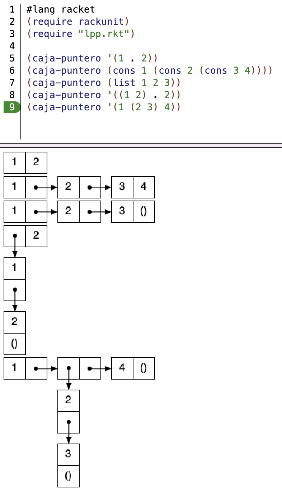
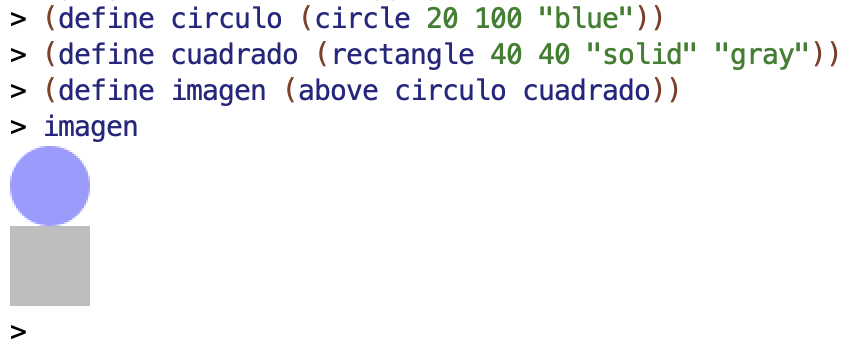
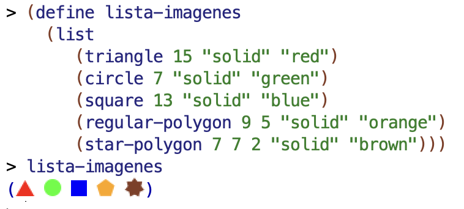
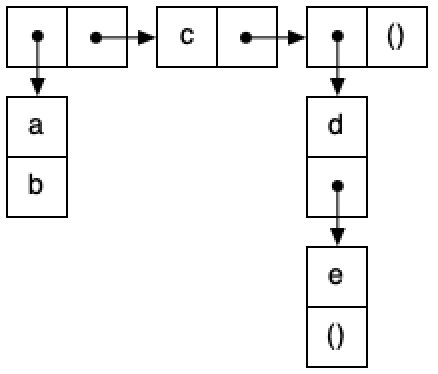
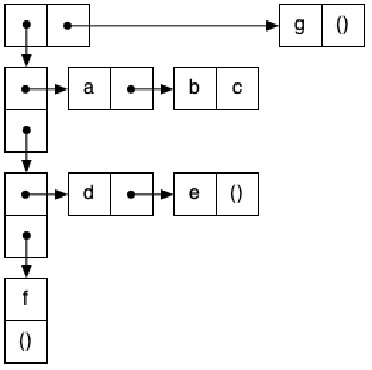

# Práctica 3: Recursión, parejas y diagramas box-and-pointer

## Antes de la clase de prácticas ##

- Antes de empezar esta práctica es importante que revises la solución
  de la práctica 2. Puedes preguntar las dudas al profesor de prácticas.

- Los siguientes ejercicios están basados en los conceptos de teoría
vistos la semana pasada. Antes de la clase de prácticas debes repasar
todos los conceptos y **probar en el DrRacket** todos los ejemplos de
los siguientes apartados del tema 2 [_Programación
Funcional_](../../teoria/tema02-programacion-funcional/tema02-programacion-funcional.md##27-recursion):

    - 2.7 _Recursión_
    - 2.8 _Recursión y listas_ 
    - 3 _Tipos de datos compuestos en Scheme_ 
    - 4 _Listas en Scheme_


## Ejercicios

Abre el DrRacket y crea el fichero `practica3.rkt` en el que deberás
escribir todos los ejemplos y soluciones de los ejercicios que
hagas.

### Función auxiliar para dibujar diagramas caja y puntero ###

Descarga el [fichero `lpp.rkt`](https://raw.githubusercontent.com/domingogallardo/apuntes-lpp/master/src/lpp.rkt),
pulsando el botón derecho del ratón y seleccionando la opción _Guardar
como_ `lpp.rkt`. Guárdalo en la misma carpeta en la que tengas el
fichero `practica3.rkt`. Contiene la definición de una función
auxiliar `(caja-puntero dato)` que te permite crear diagramas caja y
puntero de estructuras de parejas.

El siguiente programa muestra un ejemplo del uso de esta función:

```racket
#lang racket
(require rackunit)
(require "lpp.rkt")

(caja-puntero '(1 . 2))
(caja-puntero (cons 1 (cons 2 (cons 3 4))))
(caja-puntero (list 1 2 3))
(caja-puntero '((1 2) . 2))
(caja-puntero '(1 (2 3) 4))
```

La siguiente imagen muestra la ejecución del programa en el DrRacket.



Puedes mirar el código fuente del fichero `lpp.rkt` para curiosear
cómo está implementada la función `caja-puntero`. Se utiliza la
[librería de imágenes de
Racket](https://docs.racket-lang.org/teachpack/2htdpimage.html) `2htdp/image`.

Para usar la librería hay que incluir la siguiente línea en nuestro
programa:

```racket
#lang racket
(require 2htdp/image)
```

Una cosa muy interesante de esta librería es que define las imágenes
como objetos de primera clase del lenguaje, que pueden asignarse a
variables o pasarse como parámetro para construir otras imágenes. Lo
podemos ver en el siguiente ejemplo:



Incluso podemos incluir imágenes en listas:




### Ejercicio 1 ###

a.1) Implementa la función recursiva `(minimo lista)` que recibe una lista
con números como argumento y devuelve el menor número de la
lista. Suponemos listas de 1 o más elementos.

Para la implementación debes usar la función `menor` definida en la
práctica anterior.

!!! Tip "Pista"

    Podemos expresar el caso general de la recursión de la
    siguiente forma:

    > El mínimo de los elementos de una lista es el menor entre el
    > primer elemento de la lista y el mínimo del resto de la lista.

    Y el caso base:
    
    > El mínimo de una lista con un único número es ese número.
    
    
Ejemplos:

```racket
(minimo '(2)) ; ⇒ 2
(minimo '(1 8 6 4 3)) ; ⇒ 1
(minimo '(1 -1 3 -6 4)) ; ⇒ -6
```

!!! Note "Cómo comprobar el caso base de `minimo`"
    Para el caso base de la función `minimo` debemos comprobar si la
    lista que recibimos tiene un solo elemento. En ese caso el mínimo
    de la lista es el propio elemento. Sería un error llamar a la
    recursión porque no se puede calcular el menor elemento de una
    lista vacía.
    
    La mejor forma de comprobar en Scheme si una lista tiene un solo
    elemento es:
    
    ```racket
    (null? (rest lista))
    ```
    
    Esta forma es más eficiente que llamar a la función `length` que necesita
    recorrer toda la lista. El coste de la instrucción `(null? (rest
    lista))` no depende de la longitud de la lista, es O(1). Sin
    embargo, la instrucción `(length lista)` tiene que recorrer toda
    la lista por lo que tiene una complejidad de O(n).
    
    Muchas veces verás también una expresión equivalente para
    comprobar si una lista tiene un único elemento: :
    
    ```racket
    (null? (cdr lista))
    ```
    
    Es una expresión que suelen usar los programadores de Scheme, algo
    que se conoce como una _expresión idiomática_ del lenguaje.

a.2) Vamos a investigar el funcionamiento de la recursión en la función
`minimo`. Supongamos la siguiente llamada:

```racket
(minimo '(1 8 6 4 3)) ; ⇒ 1
```

- ¿Qué lista se pasa como parámetro a la primera llamada recursiva a
  la función?
- ¿Qué devuelve esa llamada recursiva?
- ¿Con qué argumentos se llama a la función `menor` que devuelve el
  resultado final?

b) Implementa la función recursiva `(concatena lista-chars)` que recibe
una lista de caracteres y devuelve la cadena resultante de
concatenarlos.

Ejemplos:

```racket
(concatena '()) ; ⇒ ""
(concatena '(#\H #\o #\l #\a)) ; ⇒ "Hola"
(concatena '(#\S #\c #\h #\e #\m #\e #\space #\m #\o #\l #\a))  
; ⇒ "Scheme mola"
```

c) Implementa el predicado recursivo `(contiene? lista elemento)` que comprueba si
una lista tiene un elemento determinado. Después úsala para
implementar la función `(str-contiene? cadena char)` que comprueba si
una cadena contiene un carácter. Recuerda que la función `string->list`
que convierte una cadena en una lista de caracteres.

Ejemplos:

```racket
(contiene? '(algo 3 #\A) 3) ; ⇒ #t
(contiene? '(algo 3 #\A) "algo") ; ⇒ #f
(contiene? '(algo 3 #\A) 'algo) ; ⇒ #t
(str-contiene? "Hola" #\o) ; ⇒ #t
(str-contiene? "Esto es una frase" #\space) ; ⇒ #t
(str-contiene? "Hola" #\h) ; ⇒ #f
```

### Ejercicio 2 ###

a) Implementa el predicado recursivo `(todos-iguales? lista)` que
comprueba si todos los elementos de una lista son iguales.


```racket
(todos-iguales? '()) ; ⇒ #t
(todos-iguales? '(a)) ; ⇒ #t
(todos-iguales? '(a a a a a a a)) ; ⇒ #t
(todos-iguales? '((a b) (a b) (a b))) ; ⇒ #t
(todos-iguales? '(a a a a a b)) ; ⇒ #f
```

b) Implementa el predicado recursivo `(todos-distintos? lista)` que
comprueba si todos los elementos de una lista son distintos. Para su
implementación debes usar el predicado del ejercicio 1 `contiene?`.


```racket
(todos-distintos? '(a b c)) ; ⇒ #t
(todos-distintos? '(a b c a)) ; ⇒ #f
```

c) Implementa el predicado recursivo `(solo-dos-iguales? lista)`que
comprueba que solo hay dos elementos iguales en una lista (los únicos
elementos repetidos que hay en la lista se repiten dos veces). Para su
implementación puedes usar los predicados anteriores.

```racket
(solo-dos-iguales? '()) ; ⇒ #f
(solo-dos-iguales' '(a)) ; ⇒ #f
(solo-dos-iguales? '(a b c a)) ; ⇒ #t
(solo-dos-iguales? '(a b c b a a)) ; ⇒ #f
(solo-dos-iguales? '(a b c a a)) ; ⇒ #f
```


### Ejercicio 3 ###

a.1) Dado el siguiente _box & pointer_, escribe la expresión en Scheme
que define `p1` usando el mínimo número de llamadas a `list` y
`cons`. No debes utilizar expresiones con `quote`. Puedes usar la
función gráfica `caja-puntero` para comprobar si tu solución es correcta.



a.2) Escribe las expresiones que devuelven `b` y `d` a partir de
`p1`. Debes usar las funciones sobre listas `first`, `second`, etc. si el argumento es una
lista y `car` y `cdr` si es una pareja que no forma parte de una lista.

b.1) Dado el siguiente diagrama caja y puntero, escribe la expresión en
Scheme que define `p2` usando el mínimo número de llamadas a `list` y `cons`.



b.2) Escribe las expresiones que devuelven `c` y `e` a partir de
`p2`. Debes usar las funciones sobre listas `first`, `second`, etc. si
el argumento es una lista y `car` y `cdr` si es una pareja que no
forma parte de una lista.

### Ejercicio 4 ###

Implementa la función recursiva `(contar-datos-iguales lista-parejas)`
que recibe una lista de parejas y devuelve el número de parejas que
tienen sus dos datos iguales.


```racket
(contar-datos-iguales '((2 . 3) ("hola" . "hola") (\#a . \#a) (true . false))) ; ⇒ 2
(contar-datos-iguales '((2 . "hola") ("hola" . 3) (\#a . true) (\#b . false))) ; ⇒ 0
```

### Ejercicio 5 ###

Vamos a seguir jugando al poker. Esta vez vamos a definir funciones
sobre **manos de cartas**, definidas como listas de 5 símbolos que
representan cartas.

Por ejemplo, las siguientes manos:

```racket
(define mano1 '(1♦ 2♦ 3♣ 4♦ 5♥))
(define mano2 '(K♣ J♦ J♣ J♠ J♥))
```

Copia de la práctica anterior la solución de la función `(valor-carta
carta)` que devuelve el valor numérico de una carta:

```racket
(valor-carta '5♣) ; ⇒ 5
(valor-carta 'K♦) ; ⇒ 12
```

a) Implementa la función `(palo-carta carta)` de forma similar a la
función `valor-carta` para que devuelva el símbolo con la descripción
del palo de la carta.

```racket
(palo-carta 'A♠) ; ⇒ Picas
(palo-carta '2♣) ; ⇒ Tréboles
(palo-carta '3♥) ; ⇒ Corazones
(palo-carta '4♦) ; ⇒ Diamantes
```

Tendrás que usar las funciones `valor-carta` y `palo-carta` para implementar las siguientes
funciones del ejercicio.

b) Implementa la función recursiva `(veces-palo lista palo)` que devuelve el
número de veces que aparece un palo en una lista de cartas.

```racket
(veces-palo '(5♠ 6♣ 7♥ 8♦ 9♠) 'Picas) ; ⇒ 2
(veces-palo '(J♠ Q♣ K♥) 'Diamantes) ; ⇒ 0
(veces-palo '(A♣ 2♥ 3♠) 'Corazones) ; ⇒ 1
(veces-palo '() 'Tréboles) ; ⇒ 0
```

Usando la función anterior, implementa el predicado `color?` que
comprueba si en una mano tenemos todas las cartas del mismo palo:

```racket
(color? '(5♣ J♦ J♣ Q♠ Q♥)) ; ⇒ #f
(color? '(2♦ 5♦ 6♦ J♦ K♦)) ; ⇒ #t
```

c) Implementa el predicado recursivo `escalera?` que recibe una lista
de cartas y comprueba si todas ellas tienen valores consecutivos,
ordenados de menor a mayor.


```racket
(escalera? '(5♣ 4♦ 3♣)) ; ⇒ #f
(escalera? '(8♣ 9♦ J♣ Q♦)) ; ⇒ #t
(escalera? '(8♣ 2♣)) ; ⇒ #f
(escalera? '(A♣ 2♦ 3♣)) ; ⇒ #t
```

Usando las funciones anteriores implementa la función
`(escalera-color? mano)` que comprueba si una mano de cartas es una
escalera de color. Suponemos que las cartas que forman la mano están
ordenadas de menor a mayor.

```racket
(escalera-color? '(5♣ 6♦ 7♣ 8♠ 9♥)) ; ⇒ #f
(escalera-color? '(A♦ 2♦ 3♦ 4♦ 5♦)) ; ⇒ #t
```

### Ejercicio 6 ###

a) Implementa las funciones `(suma-izq pareja n)` y `(suma-der pareja n)`
definidas de la siguiente forma:

- `(suma-izq pareja n)`: devuelve una nueva pareja con la parte izquierda
  incrementada en `n`.
- `(suma-der pareja n)`: devuelve una nueva pareja con la parte derecha
  incrementada en `n`.

Ejemplos:

```racket
(suma-izq (cons 10 20) 3)  ; ⇒ (13 . 20)
(suma-der (cons 10 20) 5)  ; ⇒ (10 . 25)
```

b) Implementa la función recursiva `(suma-impares-pares lista-num)`
que devuelva una pareja cuya parte izquierda sea la suma de los
números impares de la lista y la parte derecha la suma de los números
pares. Debes utilizar las funciones auxiliares definidas en el
apartado anterior. También puedes utilizar las funciones predefinidas
`even?` y `odd?`.

Ejemplos:

```racket
(suma-impares-pares '(3 2 1 4 8 7 6 5)) ; ⇒ (16 . 20)
(suma-impares-pares '(3 1 5))           ; ⇒ (9 . 0)
```

c) Implementa la función recursiva `(cadena-mayor lista)` que recibe un
lista de cadenas y devuelve una pareja con la cadena de mayor longitud
y dicha longitud.  En el caso de que haya más de una cadena con la
máxima longitud, se devolverá la última de ellas que aparezca en la
lista.

En el caso en que la lista sea vacía se devolverá la pareja con la
cadena vacía y un 0 (la longitud de la cadena vacía).

**Pista**: puedes utilizar la función `string-length`

```racket
(cadena-mayor '("vamos" "a" "obtener" "la" "cadena" "mayor")) ; ⇒  ("obtener" . 7)
(cadena-mayor '("prueba" "con" "maximo" "igual")) ; ⇒ ("maximo" . 6)
(cadena-mayor '()) ; ⇒ ("" . 0)
```

## Entrega de la práctica

Sube la solución de los ejercicios al cuestionario de Moodle Entrega
práctica 3 hasta el domingo 19 de febrero a las 21:00 h.

Tal y como hemos comentado al comienzo de la práctica, debes incluir
casos de prueba en todo el código que escribas.

Una vez finalizado el plazo de entrega podrás revisar el cuestionario
y visualizar la solución. Corrige la entrega, comparando la solución
con la tuya. Puedes consultar cualquier duda con tu profesor en la
clase de prácticas de la semana que viene.

----

Lenguajes y Paradigmas de Programación, curso 2022-23  
© Departamento Ciencia de la Computación e Inteligencia Artificial, Universidad de Alicante  
Domingo Gallardo, Cristina Pomares, Antonio Botía, Francisco Martínez
