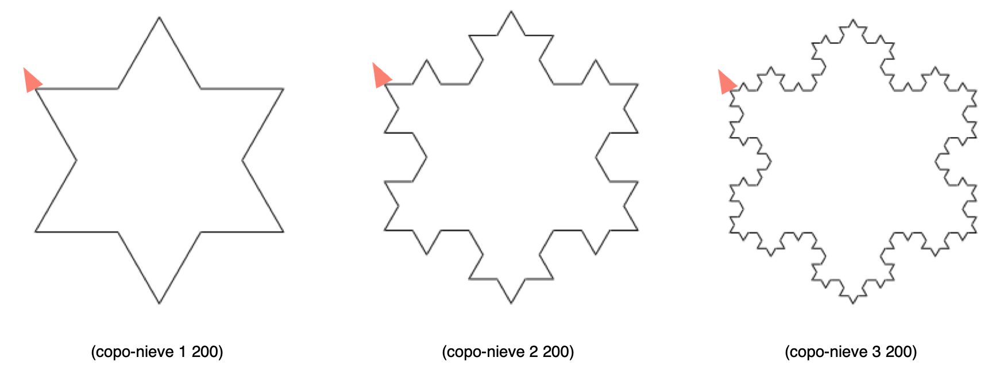

# Práctica 5: Procedimientos recursivos e iterativos

## Entrega de la práctica

Para entregar la práctica debes subir a Moodle el fichero
`practica05.rkt` con una cabecera inicial con tu nombre y apellidos, y
las soluciones de cada ejercicio separadas por comentarios. Cada
solución debe incluir:

- La **definición de las funciones** que resuelven el ejercicio.
- Un conjunto de **pruebas** que comprueben su funcionamiento
  utilizando el API `RackUnit`.


## Ejercicios

### Ejercicio 1  ###

a) Implementa una versión recursiva iterativa de la función
`(concat lista)` que toma como argumento una lista de cadenas
y devuelve una cadena resultante de concatenar todas las palabras de
la lista.

La función `concat` deberá llamar a la función
`concat-iter` que es la que implementa propiamente la versión
iterativa usando recursión por la cola.

Ejemplo:

```racket
(concat  '("hola" "y" "adiós")) ; ⇒ "holayadiós")
(concat-iter '("hola" "y" "adiós") "") ; ⇒ "holayadiós")
```


b) Define utilizando recursión por la cola la función `(min-max
lista)` que recibe una lista numérica y devuelve una pareja con el
mínimo y el máximo de sus elementos.

Ejemplo:

```racket
(min-max '(2 5 9 12 5 0 4)) ; ⇒ (0 . 12)
(min-max-iter '(5 9 12 5 0 4) (cons 2 2)) ; ⇒ (0 . 12)
```


### Ejercicio 2 ###

a) Implementa utilizando recursión por la cola las funciones
`expande-pareja` y `expande-parejas` de la práctica 3.

Ejemplo:

```racket
(expande-pareja (cons 'a 4) ; ⇒ (a a a a)
(expande-parejas '(#t . 3) '("LPP" . 2) '(b . 4))
; ⇒ (#t #t #t "LPP" "LPP" b b b b)
```


b) Implementa utilizando recursión por la cola la función `(rotar k
lista)` que mueve `k` elementos de la cabeza de la lista al
final. **No es necesario utilizar una función iterativa auxiliar**,
puedes hacer que la propia función `rotar` sea iterativa usando el
parámetro `lista` como el parámetro donde acumular el resultado.

Ejemplo:

```racket
(rotar 4 '(a b c d e f g)) ; ⇒ (e f g a b c d)
```


### Ejercicio 3

a) Implementa utilizando recursión por la cola la función
`mi-foldl` que haga lo mismo que la función de orden superior
`foldl`.


```racket
(mi-foldl string-append "****" '("hola" "que" "tal")) ⇒ "talquehola****"
(mi-foldl cons '() '(1 2 3 4)) ; ⇒ (4 3 2 1)
```


b) Implementa una versión con recursión por la cola del predicado
`(prefijo-lista? lista1 lista2)` que comprueba si la primera lista es
prefijo de la segunda. Suponemos que siempre la primera lista será más
pequeña que la segunda.

Ejemplos: 

```racket
(prefijo-lista? '(a b c) '(a b c d e)) ⇒ #t
(prefijo-lista? '(b c) '(a b c d e)) ⇒ #f
```


### Ejercicio 4 ###

Realiza una implementación que utilice la [técnica de la
_memoization_](https://domingogallardo.github.io/apuntes-lpp/teoria/tema03-procedimientos-recursivos/tema03-procedimientos-recursivos.html#soluciones-al-coste-de-la-recursion-memoization)
del algoritmo que devuelve la [serie de
Pascal](https://domingogallardo.github.io/apuntes-lpp/teoria/tema03-procedimientos-recursivos/tema03-procedimientos-recursivos.html#triangulo-de-pascal).

```racket
(define diccionario (crea-diccionario))
(pascal-memo 8 4 diccionario) ; ⇒ 70
(pascal-memo 40 20 diccionario) ; ⇒ 137846528820
```

### Ejercicio 5 ###

a) Usando gráficos de tortuga implementa la figura recursiva conocida
como _curva de Koch_. Debes definir una función recursiva `(koch nivel
trazo)` que dibuje una curva de Koch de nivel `nivel` y de longitud
`trazo`. 

Como pista, para dibujar una curva de Koch de nivel n y longitud l, se
deberán dibujar 4 curvas de Koch de nivel n-1 y longitud l/3. En estas
4 curvas consecutivas, el ángulo de inclinación de la segunda curva
con respecto a la primera es de 60 grados.

Puedes ver ejemplos de las curvas de nivel 1, 2 y 3 en las siguientes
figuras: 


b) Implementa la función `(copo-nieve nivel trazo)` que, usando la
función anterior, dibuje el [_copo de nieve de
Koch_](https://en.wikipedia.org/wiki/Koch_snowflake)
que puedes ver en los siguientes ejemplos.




### Ejercicio 6 ###

Define la función `(alfombra-sierpinski tam)` que construya la
Alfombra de Sierpinski (una variante del Triágulo de Sierpinski que
hemos visto en teoría) de lado `tam` píxeles utilizando gráficos de
tortuga. 

Por ejemplo, la llamada a `(alfombra-sierpinski 500)` debe dibujar la
siguiente figura:


----

Lenguajes y Paradigmas de Programación, curso 2019-20  
© Departamento Ciencia de la Computación e Inteligencia Artificial, Universidad de Alicante  
Domingo Gallardo, Cristina Pomares, Antonio Botía, Francisco Martínez
