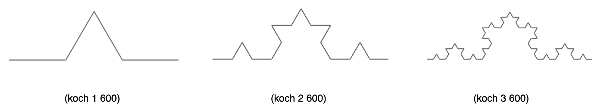
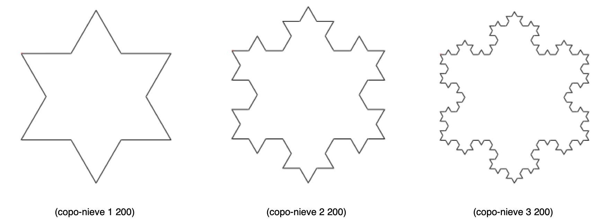
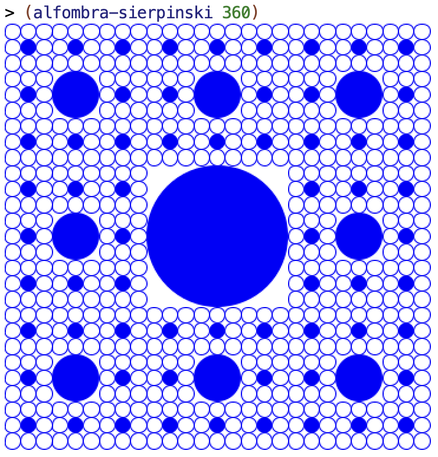

# Práctica 6: Procedimientos recursivos e iterativos

## Antes de la clase de prácticas

- Los siguientes ejercicios están basados en los conceptos de teoría
vistos la semana pasada. Antes de la clase de prácticas debes repasar
todos los conceptos y **probar en el DrRacket** todos los ejemplos de
los siguientes apartados del tema 3 [_Procedimientos recursivos_](../../teoria/tema03-procedimientos-recursivos/tema03-procedimientos-recursivos.md):

    - 1 El coste de la recursión
    - 2 Procesos iterativos
    - 3 Memoization
    - 4 Figuras recursivas

## Ejercicios

Descarga el [fichero
`lpp.rkt`](https://raw.githubusercontent.com/domingogallardo/apuntes-lpp/master/src/lpp.rkt),
pulsando el botón derecho del ratón y seleccionando la opción _Guardar
como_ `lpp.rkt`. Guárdalo en la misma carpeta en la que tengas el
fichero `practica6.rkt`.

El fichero contiene la definición de las funciones
`(crea-diccionario)`, `(put key value dic)` y `(get key dic)`,
necesarias para realizar una implementación de un algoritmo recursivo
con _memoization_ y que necesitarás en el ejercicio 4.

### Ejercicio 1  ###

a) Implementa una versión recursiva iterativa de la función
`(concat lista)` que toma como argumento una lista de cadenas
y devuelve una cadena resultante de concatenar todas las palabras de
la lista.

La función `concat` deberá llamar a la función
`concat-iter` que es la que implementa propiamente la versión
iterativa usando recursión por la cola.

Ejemplo:

```racket
(concat  '("hola" "y" "adiós")) ; ⇒ "holayadiós")
(concat-iter '("hola" "y" "adiós") "") ; ⇒ "holayadiós")
```


b) Define utilizando recursión por la cola la función `(min-max
lista)` que recibe una lista numérica y devuelve una pareja con el
mínimo y el máximo de sus elementos.

Ejemplo:

```racket
(min-max '(2 5 9 12 5 0 4)) ; ⇒ (0 . 12)
(min-max-iter '(5 9 12 5 0 4) (cons 2 2)) ; ⇒ (0 . 12)
```


### Ejercicio 2 ###

a) Implementa utilizando recursión por la cola las funciones
`expande-pareja` y `expande-parejas` de la práctica 3.

Ejemplo:

```racket
(expande-pareja (cons 'a 4)) ; ⇒ (a a a a)
(expande-parejas '(#t . 3) '("LPP" . 2) '(b . 4))
; ⇒ (#t #t #t "LPP" "LPP" b b b b)
```


b) Implementa utilizando recursión por la cola la función `(rotar k
lista)` que mueve `k` elementos de la cabeza de la lista al
final. **No es necesario utilizar una función iterativa auxiliar**,
puedes hacer que la propia función `rotar` sea iterativa usando el
parámetro `lista` como el parámetro donde acumular el resultado.

Ejemplo:

```racket
(rotar 4 '(a b c d e f g)) ; ⇒ (e f g a b c d)
```


### Ejercicio 3 ###

a) Implementa utilizando recursión por la cola la función
`mi-foldl` que haga lo mismo que la función de orden superior
`foldl`.


```racket
(mi-foldl string-append "****" '("hola" "que" "tal")) ⇒ "talquehola****"
(mi-foldl cons '() '(1 2 3 4)) ; ⇒ (4 3 2 1)
```


b) Implementa, utilizando una recursión por la cola, la función
recursiva `(binario-a-decimal lista-bits)` que reciba una lista de
bits que representan un número en binario (el primer elemento será el
bit más significativo) y devuelva el número decimal equivalente.

!!! Hint "Pista"
    La función `(binario-a-decimal lista-bits)` puede llamar a una
    función iterativa pasándole como parámetro la lista de bits
    invertida.

```racket
(binario-a-decimal '(1 1 1 1)) ; ⇒ 15
(binario-a-decimal '(1 1 0)) ; ⇒ 6
(binario-a-decimal '(1 0)) ; ⇒ 2
```


### Ejercicio 4 ###

Realiza una implementación que utilice la [técnica de la
_memoization_](../../teoria/tema03-procedimientos-recursivos/tema03-procedimientos-recursivos.md#soluciones-al-coste-de-la-recursion-memoization)
del algoritmo que devuelve la [serie de
Pascal](../../teoria/tema03-procedimientos-recursivos/tema03-procedimientos-recursivos.md#triangulo-de-pascal).

```racket
(define diccionario (crea-diccionario))
(pascal-memo 8 4 diccionario) ; ⇒ 70
(pascal-memo 40 20 diccionario) ; ⇒ 137846528820
```

### Ejercicio 5 ###

a) Usando la librería de imágenes de Racket `2htdp/image` implementa
la figura recursiva conocida como _curva de Koch_. Debes definir una
función recursiva `(koch nivel trazo)` que dibuje una curva de Koch de
nivel `nivel` y de longitud `trazo`.

Como pista, fíjate en el dibujo. Para construir una imagen de una
curva de Koch de nivel n y longitud l, se deberán juntar 4 curvas de
Koch de nivel n-1 y longitud l/3. La primera y la última imagen son la
curva original y la segunda y tercera están rotadas 60 grados. Fíjate
también en la alineación de las imágenes.

Puedes ver ejemplos de las curvas de nivel 1, 2 y 3 en las siguientes
figuras: 



b) Usando la función anterior, implementa la función `(copo-nieve
nivel trazo)` que dibuje el [_copo de nieve de
Koch_](https://en.wikipedia.org/wiki/Koch_snowflake) que puedes ver en
los siguientes ejemplos. Esta función no es recursiva, se construye
combinando tres veces la curva de Koch anterior.




### Ejercicio 6 ###

Define la función `(alfombra-sierpinski tam)` que construya la
alfombra de Sierpinski (una variante del triángulo de Sierpinski que
hemos visto en teoría) de lado `tam` píxeles.

Por ejemplo, la llamada a `(alfombra-sierpinski 360)` debe dibujar la
siguiente figura:




----

Lenguajes y Paradigmas de Programación, curso 2021-22  
© Departamento Ciencia de la Computación e Inteligencia Artificial, Universidad de Alicante  
Domingo Gallardo, Cristina Pomares, Antonio Botía, Francisco Martínez
