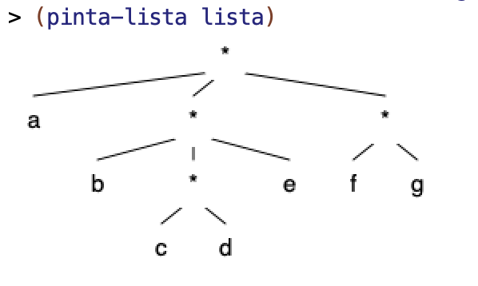
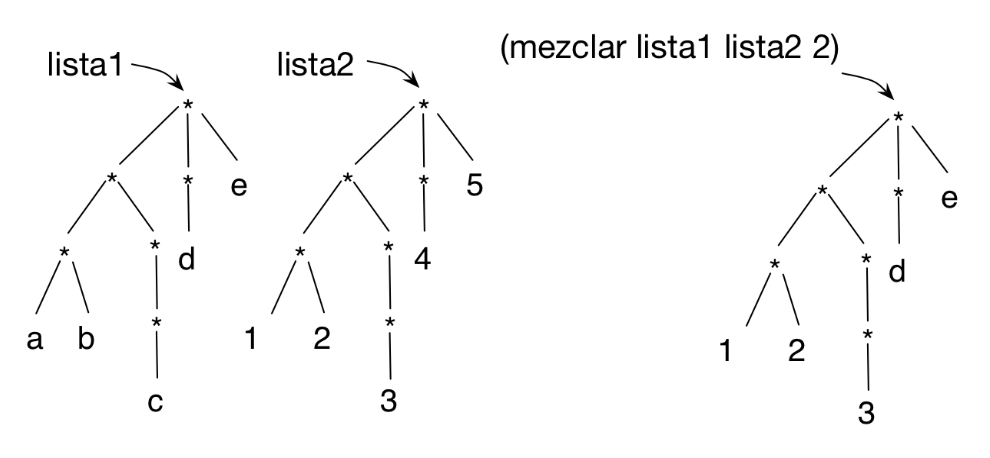

# Práctica 7: Listas estructuradas

## Antes de la clase de prácticas

- Los siguientes ejercicios están basados en los conceptos de teoría
vistos la semana pasada. Antes de la clase de prácticas debes repasar
todos los conceptos y **probar en el DrRacket** todos los ejemplos de
los siguientes apartados del tema 4 [_Estructuras de datos recursivas_](../../teoria/tema04-estructuras-recursivas/tema04-estructuras-recursivas.md)

    - 1 Listas estructuradas

## Ejercicios

Descarga el [fichero
`lpp.rkt`](https://raw.githubusercontent.com/domingogallardo/apuntes-lpp/master/src/lpp.rkt),
pulsando el botón derecho del ratón y seleccionando la opción _Guardar
como_ `lpp.rkt`. Guárdalo en la misma carpeta en la que tengas el
fichero `practica7.rkt`. 

Puedes encontrar también el fichero `lpp.rkt` en el [sitio Moodle
de la asignatura](https://moodle2021-22.ua.es/moodle/mod/resource/view.php?id=130802).

El fichero contiene la definición de la función `(hoja? dato)` y la
función `(pinta-lista lista)` que nos permite dibujar gráficamente una lista estructurada.

Por ejemplo, si definimos una lista estructurada como 

```racket
(define lista '(a (b (c d) e) (f g)))
```

La llamada a `pinta-lista` dibujará lo siguiente:




### Ejercicio 1 ###

a) Escribe la lista estructurada correspondiente a la siguiente
representación gráfica por niveles. Para comprobar si la has definido
correctamente puedes intentar obtener algunos de los elementos de la
lista, como mostramos en el `check-equal?` que hay a continuación.

```text
       *
     / |  \
    |  |    \
    *  d      *
   / \    / /  | \
  a  b   c *   *  h
           |  / \
           e f  g
```

```racket
(define lista-a '(________))
(check-equal? (fourth (third lista-a)) 'h)
```

b) Dibuja la representación en niveles de las siguientes listas
estructurada. Comprueba después con la función `(pinta-lista lista)`
que las has dibujado correctamente.

```racket
(define lista-b1 '((2 (3)) (4 2) ((2) 3)))
(define lista-b2 '((b) (c (a)) d (a)))
```

c) Dada la definición de `cuadrado-estruct` vista en teoría:

```
(define (cuadrado-estruct lista)
  (cond ((null? lista) '())
        ((hoja? lista) (* lista lista ))
        (else (cons
             ①➜(cuadrado-estruct (first lista))
             ②➜(cuadrado-estruct (rest lista))))))
```

1. Indica qué devuelve la expresión `(cuadrado-estruct lista-b1)`. La
lista `lista-b1` es la definida en el apartado anterior.
2. En la evaluación de la expresión anterior, indica cuáles son los
argumentos que se pasan por parámetro en las llamadas recursivas a
`cuadrado-estruct` marcadas con `1` y `2`.
3. En la evaluación de la expresión anterior, indican qué devuelven
las llamadas recursivas marcadas con `1` y `2`.


d) Para entender el funcionamiento de las funciones de orden superior
que trabajan sobre listas estructuradas es muy importante entender qué
devuelve la expresión `map` que se aplica a la lista.

La siguiente función utiliza la función `(nivel-hoja-fos dato lista)`
vista en teoría. Indica qué devuelve la siguiente expresión.  La lista
`lista-b2` es la definida en el apartado anterior. Utiliza el dibujo
que has hecho en el ejercicio anterior para entender el funcionamiento
de la expresión.

```racket
(map (lambda (elem)
         (nivel-hoja-fos 'a elem)) lista-b2)
```

### Ejercicio 2  ###

a) Implementa la función recursiva `(concatena lista)` que recibe una
lista estructurada con símbolos y devuelve la cadena resultante de
concatenar todos los símbolos de la lista estructurada.

Ejemplos:

```racket
(concatena '(a b (c) d)) ; ⇒ "abcd"
(concatena '(a (((b)) (c (d (e f (g))) h)) i)) ; ⇒ "abcdefghi"
```


b) Implementa la función recursiva `(todos-positivos? lista)` que
recibe una lista estructurada con números y comprueba si todos sus
elementos son positivos. Implementa dos versiones de la función, una con
**recursión pura** y otra con **funciones de orden superior**.

Ejemplos:

```racket
(todos-positivos? '(1 (2 (3 (-3))) 4)) ; ⇒ #f
(todos-positivos-fos? '(1 (2 (3 (3))) 4)) ; ⇒ #t
```


### Ejercicio 3 ###

Implementa la función `(cumplen-predicado pred lista)` que devuelva
una lista con todos los elementos de lista estructurada que cumplen un
predicado. Implementa dos versiones, una **recursiva pura** y otra
usando **funciones de orden superior**.

Ejemplo:

```racket
(cumplen-predicado even? '(1 (2 (3 (4))) (5 6))) ; ⇒ (2 4 6)
(cumplen-predicado pair? '(((1 . 2) 3 (4 . 3) 5) 6)) ; ⇒ ((1 . 2) (4 . 3))
```

Utilizando la función anterior implementa las siguientes funciones:

- Función `(busca-mayores n lista-num)` que recibe una lista
  estructurada con números y un número `n` y devuelve una lista plana
  con los números de la lista original mayores que `n`.
  
  ```racket
  (busca-mayores 10 '(-1 (20 (10 12) (30 (25 (15)))))) ; ⇒ (20 12 30 25 15)
  ```

- Función `(empieza-por char lista-pal)` que recibe una lista
  estructurada con símbolos y un carácter `char` y devuelve una lista
  plana con los símbolos de la lista original que comienzan por el
  carácter `char`.
  
  ```racket
  (empieza-por #\m '((hace (mucho tiempo)) (en) (una galaxia ((muy  muy) lejana))))
  ; ⇒ (mucho muy muy)
  ```


### Ejercicio 4 ###

a) Implementa la función `(sustituye-elem elem-old elem-new lista)`
que recibe como argumentos una lista estructurada y dos elementos, y
devuelve otra lista con la misma estructura, pero en la que se ha
sustituido las ocurrencias de `elem-old` por `elem-new`. Puedes
hacerla de forma recursiva o con funciones de orden superior.

Ejemplo:

```racket
(sustituye-elem 'c 'h '(a b (c d (e c)) c (f (c) g)))
; ⇒ (a b (h d (e h)) h (f (h) g))
```


b.1) Implementa la función recursiva `(intersecta lista-1 lista-2)`
que recibe como parámetros dos listas estructuradas y devuelve la
lista estructurada resultante de recorrer ambas listas y colocar una
pareja formada por la hoja de la primera y de la segunda en aquellas
posiciones en las que el recorrido de ambas listas terminen al mismo
tiempo en una hoja.

Por ejemplo, si definimos las dos listas de la siguiente forma:

```racket
(define lista-1 '(a (b c) (d))) 
;     * 
;   / | \ 
;  a  *  *
;    / \  \ 
;   b   c  d

(define lista-2 '((e) (f) (g)))
;     * 
;   / | \ 
;  *  *  * 
; /  /    \ 
;e  f      g
```

La intersección de ambas listas sería:

```racket
(intersecta lista-1 lista-2)
; ⇒ (((b . f)) ((d . g)))
;     *
;     | \
;     *  *
;    /    \
;  (b.f)  (d.g)
```

La función recorrerá al mismo tiempo la primera y la segunda lista. En
la primera lista, en su primer elemento, llegará a la hoja `a`,
mientras que en la segunda lista llegará a una sublista (la que
contiene `e`). Ahí no habrá intersección. Después recorrerá el segundo
elemento de la primera y la segunda lista y llegará a las hojas `b` y
`f` al mismo tiempo, por lo que construirá la pareja `(b
. f)`. Descartará la sublista de la segunda lista formada por la `c`,
por no existir correspondencia en la primera lista. Y, por último,
comprobará que recorriendo el último elemento de ambas listas se
llegará al mismo tiempo a las hojas `d` y `g`, formando la pareja `(d
. g)`.

Debes implementar sólo la versión recursiva. 

Otros ejemplos:

```racket
(intersecta '(a b) '(c d)) ; ⇒ '((a . c) (b . d))
(intersecta '(a (b) (c)) '(d e (f))) ; ⇒ '((a . d) ((c . f)))
```

b.2) Generaliza la función anterior, haciendo que reciba otra función
con la operación a realizar con las hojas: `(intersecta-gen f lista-1
lista-2)`. Escribe tres ejemplos de uso de la función genérica con
distintas funciones a aplicar a las hojas y explica qué devuelve cada caso.

### Ejercicio 5 ###

Dos funciones sobre niveles:

a) Define la función recursiva `(mezclar lista1 lista2 n)` que reciba
dos listas estructuradas con la misma estructura y un número que
indica un nivel. Devuelve una nueva lista estructurada con la misma
estructura que las listas originales, con los elementos de lista1 que
tienen un nivel menor o igual que `n` y los elementos de lista2 que
tienen un nivel mayor que `n`.



```racket
(define lista1 '(((a b) ((c))) (d) e))
(define lista2 '(((1 2) ((3))) (4) 5))
(mezclar lista1 lista2 2) ; ⇒ (((1 2) ((3))) (d) e)
```

b) Implementa la función `(nivel-elemento lista)` que reciba una lista
estructurada y devuelva una pareja `(elem . nivel)`, donde la parte
izquierda es el elemento que se encuentra a mayor nivel y la parte
derecha el nivel en el que se encuentra. Puedes definir alguna
función auxiliar si lo necesitas. Puedes hacerlo con
recursión o con funciones de orden superior.

```racket
(nivel-elemento '(2 (3))) ; ⇒ (3 . 2)
(nivel-elemento '((2) (3 (4)((((((5))) 6)) 7)) 8)) ; ⇒ (5 . 8)
```

----

Lenguajes y Paradigmas de Programación, curso 2022-23  
© Departamento Ciencia de la Computación e Inteligencia Artificial, Universidad de Alicante  
Domingo Gallardo, Cristina Pomares, Antonio Botía, Francisco Martínez
