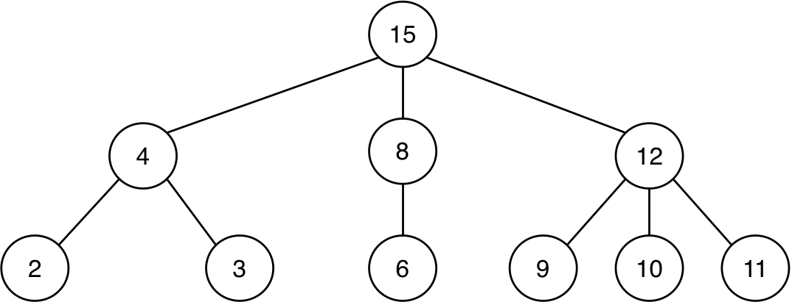
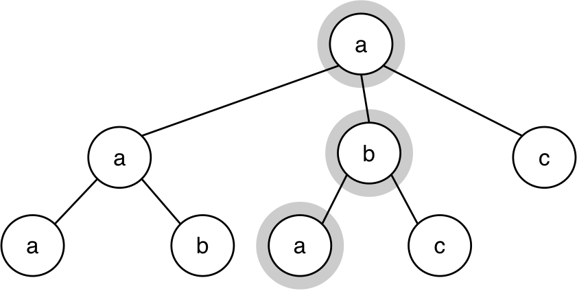
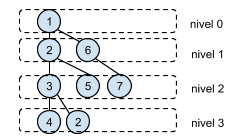

# Práctica 8: Árboles

## Antes de la clase de prácticas

- Los siguientes ejercicios están basados en los conceptos de teoría
vistos la semana pasada. Antes de la clase de prácticas debes repasar
todos los conceptos y **probar en el DrRacket** todos los ejemplos de
los siguientes apartados del tema 4 [_Estructuras de datos recursivas_](../../teoria/tema04-estructuras-recursivas/tema04-estructuras-recursivas.md)

    - 2 Árboles
    - 3 Árboles binarios

## Ejercicios

Descarga el [fichero
`lpp.rkt`](https://raw.githubusercontent.com/domingogallardo/apuntes-lpp/master/src/lpp.rkt),
pulsando el botón derecho del ratón y seleccionando la opción _Guardar
como_ `lpp.rkt`. Guárdalo en la misma carpeta en la que tengas el
fichero `practica7.rkt`. 

El fichero contiene la definición de las funciones de la barrera de
abstracción de árboles y árboles binarios, y las funciones
`(pinta-arbol arbol)` y `(pinta-arbolb arbol-binario)` que nos
permiten dibujar gráficamente árboles y árboles binarios.

### Ejercicio 1 ###

a.1) Escribe la sentencia en Scheme que define el siguiente árbol
genérico y escribe **utilizando las funciones de la barrera de
abstracción de árboles** una expresión que devuelva el número 10.



```text
(define arbol '(------------))
(check-equal? ------------------- 10)
```

a.2) Las funciones que suman los datos de un árbol utilizando
recursión mutua y que hemos visto en teoría son las siguientes:

```racket
(define (suma-datos-arbol arbol)
    (+ (dato-arbol arbol)
       (suma-datos-bosque (hijos-arbol arbol))))

(define (suma-datos-bosque bosque)
    (if (null? bosque)
        0
        (+ (suma-datos-arbol (first bosque)) 
           (suma-datos-bosque (rest bosque)))))
```


Si realizamos la siguiente llamada a la función `suma-datos-bosque`,
siendo `arbol` el definido en el apartado anterior:

```racket
(suma-datos-bosque (hijos-arbol arbol))
```

1. ¿Qué devuelve la invocación a `(suma-datos-arbol (first bosque))` que
  se realiza dentro de la función?
2. ¿Qué devuelve la primera llamada recursiva a `suma-datos-bosque`?

Escribe la contestación a estas preguntas como comentarios en el
fichero de la práctica.

a.3) La función de orden superior que hemos visto en teoría y que
realiza también la suma de los datos de un árbol es:

```racket
(define (suma-datos-arbol-fos arbol)
   (foldr + (dato-arbol arbol) 
       (map suma-datos-arbol-fos (hijos-arbol arbol))))
```	

Si realizamos la siguiente llamada a la función, siendo `arbol` el
definido en el apartado anterior:

```racket
(suma-datos-arbol-fos arbol)
```

1. ¿Qué devuelve la invocación a `map` dentro de la función?
2. ¿Qué invocaciones se realizan a la función `+` durante la ejecución
   de `foldr` sobre la lista devuelta por la invocación a `map`?
   Enuméralas en orden, indicando sus parámetros y el valor devuelto
   en cada una de ellas.


b.1) Escribe la sentencia en Scheme que define el siguiente árbol
binario y escribe **utilizando las funciones de la barrera de
abstracción de árboles binarios** una expresión que devuelva el número 29.


```text
(define arbolb '(------------------))
(check-equal? ---------------------- 29)
```


### Ejercicio 2 ###

a) Implementa dos versiones de la función `(to-string-arbol arbol)` que
recibe un árbol de símbolos y devuelve la cadena resultante de
concatenar todos los símbolos en recorrido preorden. Debes implementar
una versión con recursión mutua y otra (llamada `to-string-arbol-fos`)
con una única función en la que se use funciones de orden superior.

Ejemplo:

```racket
(define arbol2 '(a (b (c (d)) (e)) (f)))
(to-string-arbol arbol2) ; ⇒ "abcdef"
```

b) Implementa dos versiones de la función `(veces-arbol dato arbol)` que
recibe un árbol y un dato y comprueba el número de veces que aparece
el dato en el árbol. Debes implementar una función con recursión mutua
y otra con funciones de orden superior.

```racket
(veces-arbol 'b '(a (b (c) (d)) (b (b) (f)))) ; ⇒ 3
(veces-arbol 'g '(a (b (c) (d)) (b (b) (f)))) ; ⇒ 0
```

### Ejercicio 3 ###

a) Implementa dos versiones de la función `(hojas-cumplen pred arbol)`
que recibe un predicado y un árbol y devuelve una lista con todas
aquellas hojas del árbol que cumplen el predicado. Una función con
recursión mutua y otra con funciones de orden superior. 

Para evitar complicar la función de orden superior, suponemos que el
árbol inicial que pasamos como parámetro no es un árbol hoja.


```racket
(define arbol1 '(10 (2) (12 (4) (2)) (10 (5))))
(define arbol2 '(10 (2) (12 (4) (2)) (10 (6))))
(hojas-cumplen even? arbol1) ; ⇒ '(2 4 2)
(hojas-cumplen even? arbol2) ; ⇒ '(2 4 2 6)
```

b) Implementa dos versiones del predicado `(todas-hojas-cumplen? pred
arbol)` que comprueba si todas las hojas de un árbol cumplen un
determinado predicado. Una función con recursión mutua y otra con
funciones de orden superior.

No debes usar la función anterior, tienes que hacer un recorrido por
todo el árbol. Para la función de orden superior puedes usar la
función `for-all?` implementada en el [tema 2](https://domingogallardo.github.io/apuntes-lpp/teoria/tema02-programacion-funcional/tema02-programacion-funcional.html#funciones-de-orden-superior).

```racket
(todas-hojas-cumplen? even? arbol1) ; ⇒ #f
(todas-hojas-cumplen? even? arbol2) ; ⇒ #t
```

### Ejercicio 4 ###

a) Implementa, utilizando funciones de orden superior, la función
`(suma-raices-hijos arbol)` que devuelva la suma de las raíces de los
hijos de un árbol genérico.

Ejemplo:


```racket
(define arbol3 '(20 (2) (8 (4) (2)) (9 (5))))
(suma-raices-hijos arbol3) ; ⇒ 19
(suma-raices-hijos (second (hijos-arbol arbol3))) ; ⇒ 6
```

b) Implementa dos versiones, una con recursión mutua y otra con
funciones de orden superior, de la función `(raices-mayores-arbol?
arbol)` que recibe un árbol y comprueba que su raíz sea mayor que la
suma de las raíces de los hijos y que todos los hijos (nos referimos a
todos los descendientes) cumplen también esta propiedad.

Ejemplos:

```racket
(raices-mayores-arbol? arbol3) ; ⇒ #t
(raices-mayores-arbol? '(20 (2) (8 (4) (5)) (9 (5)))) ; ⇒ #f
```

c) Define la función `(comprueba-raices-arbol arbol)` que recibe un
arbol y que devuelve otro arbol en el que los nodos se han sustituido
por 1 o 0 según si son mayores que la suma de las raíces de sus hijos
o no.

Ejemplos:

```racket
(comprueba-raices-arbol arbol3) ; ⇒ (1 (1) (1 (1) (1)) (1 (1)))
(comprueba-raices-arbol '(20 (2) (8 (4) (5)) (9 (5)))) 
; ⇒ (1 (1) (0 (1) (1)) (1 (1)))
```


### Ejercicio 5 ###

a) Define la función `(es-camino? lista arbol)` que debe comprobar si
la secuencia de elementos de la lista se corresponde con un camino
del árbol que empieza en la raíz y que termina exactamente en una
hoja. Suponemos que `lista` contiene al menos un elemento

Por ejemplo, la lista `(a b a)` sí que es camino en el siguiente árbol,
pero la lista `(a b)` no.



Ejemplos: suponiendo que `arbol` es el árbol definido por la figura
anterior:


```racket
(es-camino? '(a b a) arbol) ; ⇒ #t
(es-camino? '(a b) arbol) ; ⇒ #f
(es-camino? '(a b a b) arbol) ; ⇒ #f
```


b) Escribe la función `(nodos-nivel nivel arbol)` que reciba un nivel
y un árbol genérico y devuelva una lista con todos los nodos que se
encuentran en ese nivel.



Ejemplos, suponiendo que `arbol` es el árbol definido por la figura anterior:

```racket
(nodos-nivel 0 arbol) ; ⇒ '(1)
(nodos-nivel 1 arbol) ; ⇒ '(2 6)
(nodos-nivel 2 arbol) ; ⇒ '(3 5 7)
(nodos-nivel 3 arbol) ; ⇒ '(4 2)
```

### Ejercicio 6 ###

a) Define la función `(ordenado-entre? arbolb min max)` que comprueba si
un árbol binario está ordenado y sus datos está entre `min` y
`max`. 

Un árbol binario está ordenado cuando sus hijos izquierdos y derecho
están ordenados y cuando la raíz es mayor o igual que todos los
números del hijo izquierdo y menor o igual que todos los números del
hijo derecho.

Por ejemplo, en la siguiente figura, el árbol binario de la izquierda
(`arbolb1`) está ordenado, pero el de la derecha (`arbolb2`) no lo está.


Ejemplo:

```racket
(define arbolb1 '(20 (13 (2 () ())
                         (18 () ()))
                     (40 (25 () () )
                         (43 () ()))))
(define arbolb2 '(20 (13 (2 () ())
                         (22 () ()))
                     (40 (25 () () )
                         (43 () ()))))

(ordenado-entre? arbolb1 0 50) ; ⇒ #t
(ordenado-entre? arbolb2 0 50) ; ⇒ #f
(ordenado-entre? arbolb1 0 30) ; ⇒ #f
```

b) Utilizando la función anterior, define las funciones
`(ordenado-menor? arbolb max)` y `(ordenado-mayor? arbolb min)` que
comprueban si un árbol binario está ordenado y sus datos son menores
o iguales o mayores o iguales que el argumento.

Ejemplos:

```racket
(ordenado-menor? arbolb1 50) ; ⇒ #t
(ordenado-menor? arbolb1 40) ; ⇒ #f
(ordenado-menor? arbolb2 50) ; ⇒ #f
(ordenado-mayor? arbolb1 0)  ; ⇒ #t
(ordenado-mayor? arbolb1 20) ; ⇒ #f
(ordenado-mayor? arbolb2 0) ; ⇒ #f
```

c) Utilizando las funciones anteriores, define la función `(ordenado?
arbolb)` que comprueba si un árbol binario está ordenado.

```racket
(ordenado? arbolb1) ; ⇒ #t
(ordenado? arbolb2) ; ⇒ #f
```

### Ejercicio 7 ###

Dado un árbol binario y un camino definido como una lista de símbolos:
`'(< > = > > =)` en el que:

- `<`: indica que nos vamos por la rama izquierda
- `>`: indica que nos vamos por la rama derecha
- `=`: indica que nos quedamos con el dato de ese nodo.

Implementa la función `(camino-b-tree b-tree camino)` que devuelva una
lista con los datos recogidos por el camino.


```racket
(camino-b-tree b-tree '(= < < = > =)) ; ⇒ '(9 3 4)
(camino-b-tree b-tree '(> = < < =)) ; ⇒ '(15 10)
```

----

Lenguajes y Paradigmas de Programación, curso 2021-22  
© Departamento Ciencia de la Computación e Inteligencia Artificial, Universidad de Alicante  
Domingo Gallardo, Cristina Pomares, Antonio Botía, Francisco Martínez
