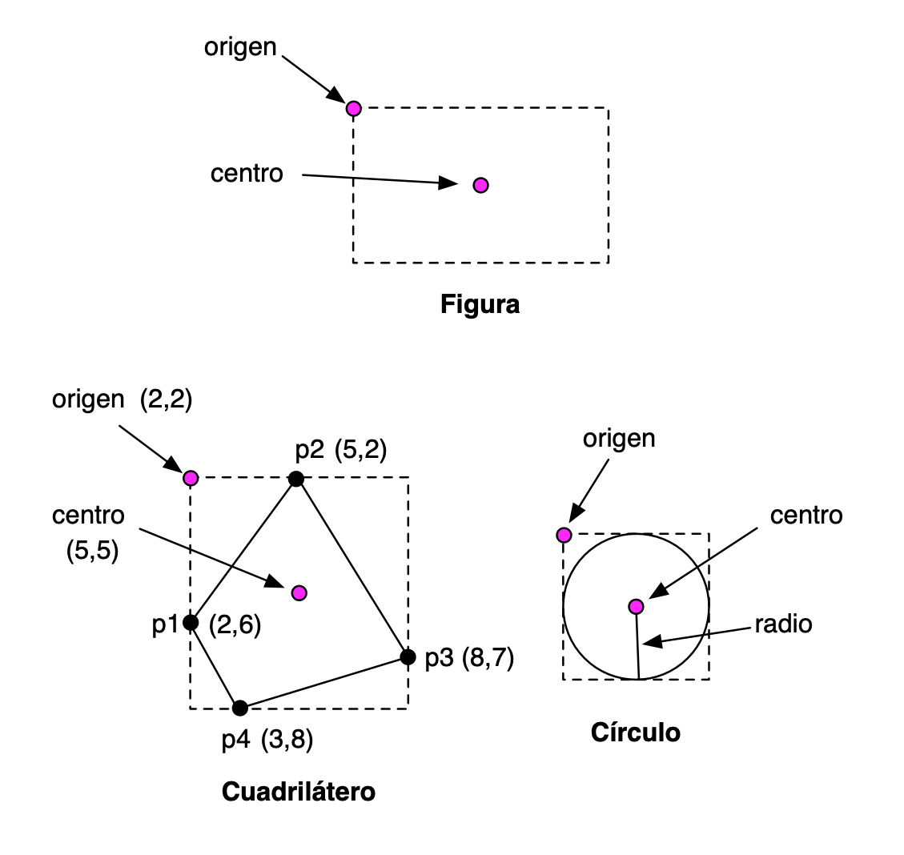

# Práctica 10: Programación Orientada a Objetos en Swift

## Entrega de la práctica

Para entregar la práctica debes subir a Moodle el fichero
`practica10.swift` con una cabecera inicial con tu nombre y apellidos,
y las soluciones de cada ejercicio separadas por comentarios.


### Ejercicio 1 (repaso de clausuras)###

Un ejercicio de repaso del apartado de clausuras del tema anterior. En
este caso, se hace énfasis en las clausuras con estado local mutable.

a) ¿Qué se imprime al ejecutar el siguiente programa? Reflexiona sobre el
funcionamiento del código, compruébalo con el compilador y experimenta
haciendo cambios y comprobando el resultado.


```swift
var x = 0

func construye() -> () -> Int {
  var x = 10
  return {
    x = x + 5
    return x
  }
}


func usa(funcion: () -> Int) {
  var x = 20
  print(funcion())
}

let g = construye()
usa(funcion: g)
usa(funcion: g)
```

b) Completa el siguiente código para que compile y funcione
correctamente e imprima lo indicado. El hueco puede contener más de
una línea de código.

```swift
var array : [() -> Int] = []
 
func foo() -> Void {
   var x = 0
   array.append ___________
}
 
foo()
foo()
print(array[0]()) // Imprime 10
print(array[0]()) // Imprime 20
print(array[1]()) // Imprime 10
```


### Ejercicio 2 ###

a) El siguiente código usa observadores de propiedades y una variable
del tipo (estática). 

¿Qué se imprime al final de su ejecución? Reflexiona sobre el
funcionamiento del código, compruébalo con el compilador y experimenta
haciendo cambios y comprobando el resultado.

```swift
struct Valor {
    var valor: Int = 0 {
        willSet {
            Valor.z += newValue
        }        
        didSet {
            if valor > 10 {
                valor = 10
            }
        }
    }
    static var z = 0
}

var c1 = Valor()
var c2 = Valor()
c1.valor = 20
c2.valor = 8
print(c1.valor + c2.valor + Valor.z)
```


b) Escribe un ejemplo de código en el que definas una relación de
herencia entre una clase base y una clase derivada. Comprueba en el
código que un objeto de la clase derivada hereda las propiedades y
métodos de la clase base.

Investiga sobre el funcionamiento de la herencia en Swift. Escribe
ejemplos en donde compruebes este funcionamiento. Algunos ejemplos de
preguntas que puedes investigar (puedes añadir tú más preguntas):

- ¿Se puede sobreescribir el valor de una propiedad almacenada? ¿Y
calculada? 
- ¿Se puede añadir un observador a una propiedad de la clase base en
  una clase derivada?
- ¿Hereda la clase derivada propiedades y métodos estáticos de la clase base?
- ¿Cómo se puede llamar a la implementación de un método de la clase
  base en una sobreescritura de ese mismo método en la clase derivada?


### Ejercicio 3 ###

Tenemos que escribir un programa que permita definir resultados de
partidos de fútbol y calcular la puntuación de un conjunto de equipos
una vez que se han jugado esos partidos.

Escribe código en Swift que permita resolver el problema, **utilizando structs**.

Un ejemplo de ejecución del código debería ser cómo sigue:

```text
--------------
Puntuación antes de los partidos:
Real Madrid: 0 puntos
Barcelona: 0 puntos
Atlético Madrid: 0 puntos
Valencia: 0 puntos
Athlétic Bilbao: 0 puntos
Sevilla: 0 puntos
--------------
Resultados:
Real Madrid 0 - Barcelona 3
Sevilla 1 - Athlétic Bilbao 1
Valencia 2 - Atlético Madrid 1
--------------
Puntuación después de los partidos:
Real Madrid: 0 puntos
Barcelona: 3 puntos
Atlético Madrid: 0 puntos
Valencia: 3 puntos
Athlétic Bilbao: 1 puntos
Sevilla: 1 puntos
```

----


### Ejercicio 4

En este ejercicio vamos a trabajar con figuras geométricas usando estructuras y clases. 

En el ejercicio deberás usar la función para calcular la raíz
cuadrada y el valor de la constante matemática _pi_.

- Para usar la función `sqrt` debes importar la librería `Foundation`:

```swift
import Foundation
```

- El valor de la constante matemática _pi_ lo puedes obtener con la
  propiedad `Double.pi`.

Suponemos que estamos trabajando con coordenadas
de pantalla, en las que la coordenada (0,0) representa la coordenada
de la esquina superior izquierda de la pantalla. La coordenada Y crece
hacia abajo y la coordenada X crece hacia la derecha. Las coordenadas
se definirán con números decimales (`Double`).

Vamos a definir las siguientes estructuras y clases:

- Estructuras: `Punto`, `Tamaño`
- Clases: `Figura` (clase padre), `Cuadrilátero` y `Circulo` (clases
derivadas). 



Vamos a definir propiedades almacenadas y propiedades calculadas para
todas las figuras geométricas.

**Estructuras `Punto` y `Tamaño`**

Las debes declarar tal y como aparecen en los apuntes.

**Clase padre `Figura`**:

- Constructor:
    - `Figura(origen: Punto, tamaño: Tamaño)`
- Propiedades de instancia almacenadas:
    - `origen` (`Punto`) que define las coordenadas de la esquina
      superior izquierda del rectángulo que define la figura
    - `tamaño` (`Tamaño`) que define el alto y el ancho del rectángulo
      que define la figura.
- Propiedades de instancia calculadas:
    - `area` (`Double`, solo lectura) que devuelve el área del
      rectángulo que engloba la figura.
    - `centro` (`Punto`, propiedad de lectura y escritura). Es el
      centro del rectángulo que define la figura. Si modificamos el
      centro se modifica la posición del origen de la figura.

**Clase derivada `Cuadrilatero`**

Un cuadrilátero se define por cuatro puntos. La figura padre representa el
rectángulo que engloba los cuatro puntos del cuadrilátero (ver imagen arriba).

- Constructor:
    - `Cuadrilatero(p1: Punto, p2: Punto, p3: Punto, p4: Punto)`. Los
      puntos se dan en el orden definido por el sentido de las agujas
      del reloj, aunque no siempre se empezará por el punto que está
      situado más a la derecha. Al crear el cuadrilátero deberemos
      actualizar las propiedades `origen` y `tamaño` de la
      figura. Para calcular estas propiedades deberás obtener las
      coordenadas x e y mínimas y máximas de todos los puntos.
- Propiedades de instancia almacenadas propias:
    - Los puntos del cuadrilátero `p1`, `p2`, `p3` y `p4`.
- Propiedades de instancia calculadas:
    - `centro` (`Punto`, de lectura y escritura), heredada de la clase
      padre. El `setter` modifica la posición de los
      puntos del cuadrilátero y del origen de la figura,
      desplazándolos los mismos incrementos en los que ha sido
      desplazado el centro de la figura.
    - `area` (`Double`, sólo lectura ) que devuelve el [área del
      cuadrilátero](https://www.cuemath.com/coordinate-geometry/area-of-a-quadrilateral/).

**Clase derivada `Circulo`**

Un círculo se define por un centro y un radio. La figura padre
representa el cuadrado más pequeño en el que está inscrito el círculo
(ver imagen arriba).

- Constructor:
    - `Circulo(centro: Punto, radio: Double)`. Al crear el círculo
      deberemos actualizar las propiedades `origen` y `tamaño` de la
      figura.
- Propiedades de instancia almacenadas:
    - `radio` (`Double`) que contiene la longitud del radio.
- Propiedades de instancia calculadas:
    - `centro` (`Punto`, de lectura y escritura), heredada de la clase
      padre. 
    - `area` (`Double`, de lectura y escritura) que devuelve el área
      del círculo. El `setter` modifica el tamaño del círculo (su
      radio), manteniendo el centro en la misma posición.

**Estructura `AlmacenFiguras`**

- Propiedades almacenadas:
    - `figuras`: array de figuras.
- Propiedades calculadas:
    - `numFiguras` (`Int`) que devuelve el número total de figuras añadidas.
    - `areaTotal` (`Double`) que devuelve la suma total de las áreas
      de todas las figuras añadidas.
- Método:
    - `añade(figura:)` que añade una figura al array.
    - `desplaza(incX: Double, incY: Double)`: desplaza todas las
      figuras las dimensiones especificadas `incX` (incremento en la
      coordenada X) e `incY` (incremento en la coordenada Y). Se
      deberán mover los centros de todas las figuras en estas magnitudes.

Implementa las estructuras anteriores y escribe algún ejemplo de
código en el que se creen al menos un cuadrilátero y un círculo, se
prueben sus propiedades, se añadan al almacén de figuras y se prueben
sus métodos.

----
Lenguajes y Paradigmas de Programación, curso 2019-20  
© Departamento Ciencia de la Computación e Inteligencia Artificial, Universidad de Alicante  
Domingo Gallardo, Cristina Pomares, Antonio Botía, Francisco Martínez
