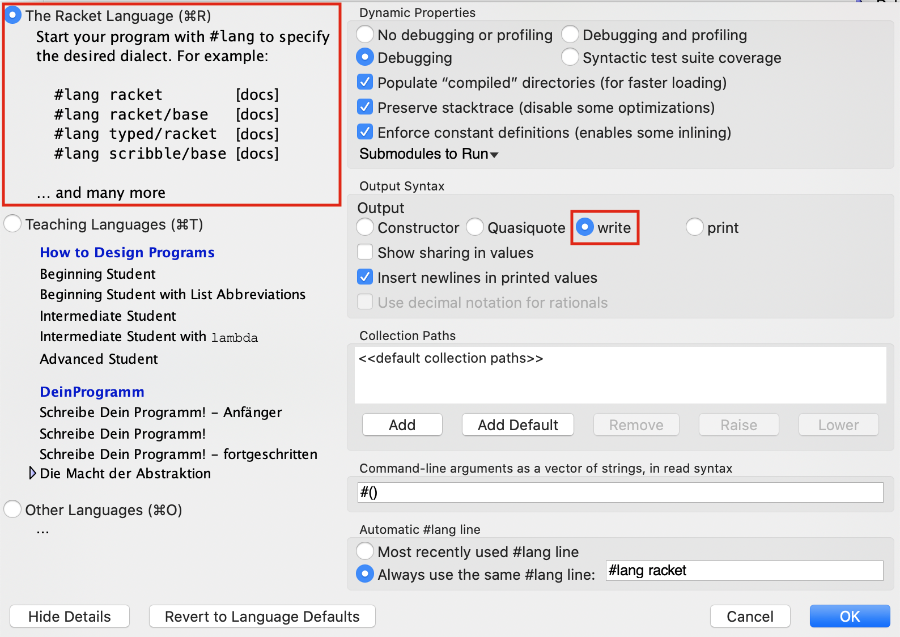
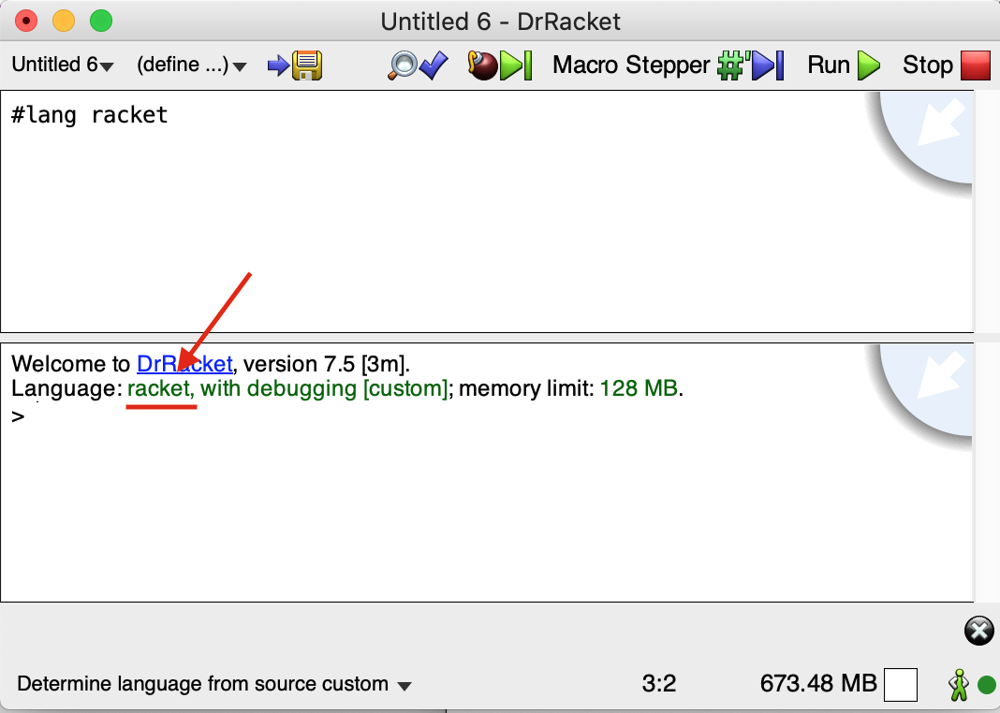

# Seminario 1: Seminario de Scheme

## Bibliografía

Este **seminario** está basado en los siguientes materiales. Os
recomendamos que les echéis un vistazo y, si os interesa y os queda
tiempo, que exploréis también en los enlaces que hemos dejado en los
apuntes para ampliar información.

* [The Racket Guide](https://docs.racket-lang.org/guide/)
* [Simply Scheme](http://www.eecs.berkeley.edu/~bh/ss-toc2.html)

## El lenguaje de programación Scheme

Scheme es un lenguaje de programación que surgió en los laboratorios
del MIT en 1975, cuando Guy L. Steele y Gerarld J. Sussman buscaban un
lenguaje con una semántica muy clara y sencilla. 

Scheme es un dialecto de Lisp, es un lenguaje interpretado, muy
expresivo y soporta varios paradigmas. Estuvo influenciado por el
cálculo lambda. El desarrollo de Scheme ha sido lento, ya que la gente
que estandarizó Scheme es muy conservadora en cuanto a añadirle nuevas
características,porque la calidad ha sido siempre más importante que
la utilidad empresarial. Por eso Scheme es considerado como uno de los
lenguajes mejor diseñados de propósito general. Aprender Scheme hará
que seáis mejores programadores cuando utilicéis otros lenguajes de
programación.

### El lenguaje de programación Racket ###

¿Qué vamos a aprender? ¿Racket o Scheme? La respuesta es: Scheme
trabajando en Racket. 

[Racket](https://en.wikipedia.org/wiki/Racket_(programming_language))
se diseñó en 1995 basándose en Scheme y ampliándolo con nuevas
funcionalidades, como la posibilidad de extenderlo con librerías. El
lenguaje contiene librerías muy útiles (librerías gráficas, de
conexión a servidores HTTP, de conexión a bases de datos, etc.) con
las que se moderniza el lenguaje original y se convierte en un
lenguaje práctico para desarrollar todo tipo de aplicaciones, desde
videojuegos a servidores web.

Sin embargo, nosotros sólo vamos a usar Racket para aprender la parte
que corresponde al núcleo original de Scheme.

### El entorno de programación DrRacket

Veamos una pequeña introducción al entorno de programación que
proporciona DrRacket. Puedes encontrar más información en la
[documentación original](http://docs.racket-lang.org/drracket/index.html).

**Importante**: Antes de empezar a trabajar con Racket debemos
asegurarnos que la sintaxis de la salida tiene activada la opción
`write`, como aparece en la siguiente imagen:



Podemos modificar esa opción con los siguientes menús:

_Language > Choose Language (seleccionamos The Racket Language) > Show
details > Output Syntax > write_

Esta opción determina la sintaxis de la salida del intérprete del
lenguaje, que va a ser uno de los elementos fundamentales para
aprender Scheme.

Cuando lanzamos DrRacket, vemos que tiene tres partes: una fila de
botones arriba, dos paneles de edición en el medio y una barra de
estado abajo.


El panel de edición superior es la ventana de definiciones. Se utiliza
para implementar funciones, como la función `cuadrado` en el ejemplo. El
panel inferior, llamado _ventana de interacción_, se utiliza para
evaluar expresiones interactivamente, usando el intérprete de
Racket. Pulsando el botón _Run_, se evalúa el programa de la _ventana
de definiciones_, haciendo que esas definiciones estén disponibles en
la ventana de interacción. Así, dada la definición de `cuadrado`,
después de pulsar _Run_, podemos teclear la expresión `(cuadrado 2)` en
el intérprete, se evaluará y mostrará el resultado, en este caso 4.

### Cambiar el idioma del entorno

Podemos interactuar con el entorno en el idioma que queramos. Si
queremos tenerlo por ejemplo en español, vamos al menú _Help ->
Interactúa con DrRacket en español_. Nos aparecerá un diálogo que nos
obligará a reiniciar el intérprete para aceptar los cambios.


### Eligiendo un lenguaje

DrRacket soporta muchos lenguajes y dialectos de Scheme. Nosotros
vamos a utilizar el lenguaje por defecto, el lenguaje _Racket_. Para
ello no es necesario realizar nada, sólo asegurarnos de lo siguiente:

1. En la parte inferior de la ventana aparece
   "_Determine language from source_"

2. El fichero que se está editando en el panel de edición comienza con la línea:

    ```scheme
    #lang racket
    ```

3. Finalmente, si pulsamos el botón _Run_ (Ejecutar) comprobaremos que
   se carga ese lenguaje en el intérprete.



## El lenguaje Scheme

### Vamos a empezar probando algunos ejemplos

Scheme es un lenguaje interpretado. Vamos a lanzar DrRacket y teclear
en la ventana de interacción algunas expresiones. El intérprete
analizará la expresión y mostrará el valor resultante de evaluarla.

```racket
2
(+ 2 3)
(+)
(+ 2 4 5 6)
(+ (* 2 3) (- 3 1))
```

Las expresiones en Scheme tienen una forma denominada _notación
prefija de Cambridge_ (el nombre de Cambridge es por la localidad
Cambridge, Massachusets, donde reside el MIT, lugar en el que se ideó
el Lisp), en la que la expresión está delimitada por paréntesis y el
operador va seguido de los operandos. La sintaxis es la siguiente:

```racket
(<función> <arg1> ... <argn>)
```

En Scheme podemos interpretar los paréntesis abiertos ‘(’ como
evaluadores o lanzadores de la función que hay a continuación. La
forma que tiene Scheme de evaluar una expresión es muy sencilla:

1. Evalúa cada uno de los argumentos
2. Aplica la función nombrada tras el paréntesis a los valores
   resultantes de la evaluación anterior

```racket
(+ (* 2 3) (- 3 (/ 12 3)))
⇒ (+ 6 (- 3 (/ 12 3)))
⇒ (+ 6 (- 3 4))
⇒ (+ 6 -1)
⇒ 5
```

En Scheme los términos función y procedimiento significan lo mismo y
se usan de forma intercambiable. Son ejemplos de funciones o
procedimientos: +, -, \*. En Scheme la evaluación de una función
siempre devuelve un valor, a no ser que se produzca un error que
detiene la evaluación:

```racket
(* (+ 3 4) (/ 3 0))
```

### Definiendo variables y funciones

Scheme es un lenguaje multiparadigma pero principalmente funcional, y
una de sus características principales es que los programas se
construyen mediante la definición de funciones.

Podemos utilizar en el intérprete la forma especial `define` para
definir variables y funciones. En clase de teoría veremos cómo es el
funcionamiento del `define`, pero por el momento lo utilizaremos para
definir variables asociadas a valores, y para implementar funciones.

Podemos definir variables en la ventana de interacción para facilitar
la escritura de expresiones:

```racket
(define pi 3.14159)
pi ; ⇒ 3.14159
(sin (/ pi 2)) ; ⇒ 0.9999999999991198
(define a (+ 2 (* 3 4)))
a ; ⇒ 14
```

Para implementar una función también se utiliza define, con la
siguiente sintaxis:

```racket
(define (<nombre-funcion> <args>)
	<cuerpo-funcion>
)
```

Por ejemplo, vamos a implementar una función que toma dos números como
parámetros y devuelve la suma de sus cuadrados:

```racket
(define (suma-cuadrados x y)
	(+ (* x x) (* y y)))
```

Si llamamos a la función pasando el 2 y el 3 como parámetros, la
función devuelve el número 13:

```racket
(suma-cuadrados 2 3)  ; ⇒ 13
```

!!! Note "Nota"
    A diferencia de la mayoría de lenguajes de programación, en Scheme
    no se utiliza la palabra `return` para indicar que una función
    devuelve un valor. Las funciones se definen con una única
    expresión y el resultado calculado en esa expresión es el que
    siempre se devuelve.


### Lenguaje débilmente tipado ###

Vamos a comprobar una característica muy importante de Scheme: ser un
**lenguaje débilmente tipado**. Por esto entendemos, entre otras
cosas, que las variables, funciones y argumentos no tienen un tipo
declarado. Es posible usar valores de distintos tipos de datos para
asignar sucesivamente a una misma variable (en el caso de un lenguaje
imperativo) o para pasar como parámetro a una misma función (en el
caso de un lenguaje funcional). Por ejemplo, JavaScript o PHP son
también lenguajes débilmente tipados imperativos.

Veamos cómo funciona esto en Scheme usando la función anterior como
ejemplo.

```racket
(define (suma-cuadrados x y)
   (+ (* x x) (* y y)))
```

Vemos que los argumentos `x` e `y` no tienen ningún tipo.  Si se
invoca a la función pasando algún dato que no sea un número, el
intérprete no detectará ningún error y permitirá asignar a los
argumentos `x` e `y` esos datos. El error se produce en el momento en
que se intenta evaluar la multiplicación.

Lo podemos comprobar con el siguiente ejemplo:

```racket
> (suma-cuadrados 10 "hola")
*: contract violation
  expected: number?
  given: "hola"
  argument position: 1st
  other arguments...:
```

Veremos más adelante que hay distintos tipos de números que podemos
operar usando la división, la suma y la multiplicación. La función
definida va a funcionar bien para todos ello. 

Podemos pasar a la función números enteros, números reales o incluso fracciones:

```racket
(suma-cuadrados 2 5) ; ⇒ 29
(suma-cuadrados 2.4 5.8)  ; ⇒ 39.4
(suma-cuadrados (/ 2 3) (/ 3 5))  ; ⇒ 181/225
```

En la última expresión también pueden pasarse directamente los
números fracionales, el intérprete de Scheme entiende esa notación:

```racket
(suma-cuadrados 2/3 3/5) ; ⇒ 181/225
```

### Tipos de datos simples

Las primitivas de Scheme consisten en un conjunto de tipos de datos,
formas especiales y funciones incluidas en el lenguaje. A lo largo del
curso iremos introduciendo estas primitivas. Las primitivas básicas
del lenguaje están descritas en las 30 páginas del apartado 11 (_Base
library_) del manual de referencia del R6RS.

Vamos a revisar algunos tipos de datos simples de Scheme, así como
algunas funciones primitivas para trabajar con valores de esos tipos.

* Booleanos
* Números
* Caracteres

#### Booleanos

Un booleano es un valor de verdad, que puede ser verdadero o falso. En
Scheme, tenemos los símbolos `#t` y `#f` para expresar verdadero y falso
respectivamente, pero en muchas operaciones se considera que cualquier
valor distinto de `#f` es verdadero. Ejemplos:

```racket
#t
#f
(> 3 1.5)
(= 3 3.0)
(equal? 3 3.0)
(or (< 3 1.5) #t)
(and #t #t #f)
(not #f)
(not 3)
```

#### Números

La cantidad de tipos numéricos que soporta Scheme es grande,
incluyendo enteros de diferente precisión, números racionales,
complejos e inexactos. Por ejemplo:

```racket
(/ 1 3) ; ⇒ Devuelve la fracción 1/3
(+ 1/3 1/3) ; ⇒ 2/3
(+ 1/3 0.0) ; ⇒ 0.3333333333333333
(sqrt -1) ; ⇒ 0+1i
(+ 3+2i 2-i) ; ⇒ 5+1i
```


##### Algunas primitivas sobre números

```racket
(<= 2 3 3 4 5)
(max 3 5 10 1000)
(/ 22 4)  ; Devuelve una fracción
(div 22 4)
(mod 22 4)
(equal? 0.5 (/ 1 2))
(= 0.5 (/ 1 2))
(abs (* 3 -2))
(sin 2.2) ; relacionados: cos, tan, asin, acos, ata
```

##### Funciones de redondeo

```racket
; (floor x) devuelve el entero más grande no mayor que x
; (ceiling x) devuelve el entero más pequeño no menor que x
; (truncate x) devuelve el entero más cercano a x cuyo valor absoluto no es mayor que el valor absoluto de x
; (round x) devuelve el entero más cercano a x, redondeado
(floor -4.3)    ; ⇒ -5.0
(floor 3.5)     ; ⇒ 3.0
(ceiling -4.3)  ; ⇒ -4.0
(ceiling 3.5)   ; ⇒ 4.0
(truncate -4.3) ; ⇒ -4.0
(truncate 3.5)  ; ⇒ 3.0
(round -4.3)    ; ⇒ -4.0
(round 3.5)     ; ⇒ 4.0
```

##### Predicados sobre números

Se denominan _predicados_ a funciones que devuelven un booleano.

```racket
(number? 1)
(integer? 2.3)
(integer? 4.0)
(real? 1)
(positive? -4)
(negative? -4)
(zero? 0.2)
(even? 2)
(odd? 3)
```

#### Caracteres

Se soportan caracteres internacionales y se codifican en UTF-8.

```racket
#\a
#\A
#\space
#\ñ
#\á
```

##### Operaciones sobre caracteres

```racket
(char<? #\a #\b)
(char-numeric? #\1)
(char-alphabetic? #\3)
(char-whitespace? #\space)
(char-upper-case? #\A)
(char-lower-case? #\a)
(char-upcase #\ñ)
(char->integer #\space)
(integer->char 32) ;#\space
(char->integer (integer->char 5000))
```

### Tipos de datos compuestos

Scheme tiene también un conjunto de tipos de datos compuestos,
que permiten aglutinar elementos simples de los tipos de datos vistos anteriormente.

* Cadenas
* Parejas
* Listas

Estos dos últimos los veremos en detalle en futuras clases de teoría.

#### Cadenas

Las cadenas son secuencias finitas de caracteres.

```racket
"hola"
"La palabra \"hola\" tiene 4 letras"
```

##### Constructores de cadenas

```racket
(make-string 5 #\o) ; ⇒ "ooooo"
(string #\h #\o #\l #\a) ; ⇒ "hola"
```

##### Operaciones con cadenas

```racket
(substring "Hola que tal" 2 4)
(string? "hola")
(string->list "hola")
(string-length "hola")
(string-ref "hola" 0)
(string-append "hola" "adios")
```

##### Comparadores de cadenas

```racket
(string=? "Hola" "hola")
(string=? "hola" "hola")
(string<? "aab" "cde")
(string>=? "www" "qqq")
```

#### Parejas

Elemento fundamental de Scheme. Es un tipo compuesto formado por dos
elementos (no necesariamente del mismo tipo).

```racket
(cons 1 2)        ; cons crea una pareja
(cons #t 3)       ; elementos de tipos diferentes
(car (cons "hola" 2))  ; elemento izquierdo
(cdr (cons "bye" 5))   ; elemento derecho
```

Cuando evaluamos las expresiones anteriores en el intérprete, Scheme
muestra el resultado de construir la pareja con la sintaxis:

```racket
{elemento izquierdo . elemento derecho}
```

Por ejemplo:

```racket
(cons 1 2) ; ⇒ {1 . 2}
```

Scheme es un lenguaje débilmente tipado y las variables y parejas
pueden contener cualquier tipo de dato. Incluso otras parejas:

```racket
(define p1 (cons 1 2)) ; definimos una pareja formada por 1 y 2
(cons p1 3)            ; definimos una pareja formada por la pareja (1 . 2) y 3
                       ; ⇒ {{1 . 2} . 3}
(cons (cons 1 2) 3)    ; igual que la expresión anterior
                       ; ⇒ {{1 . 2} . 3}
```

Hay veces que el trabajo de imprimir una pareja no es tan sencillo
para Scheme. Si la pareja está en la parte derecha de la pareja
principal el intérprete imprime esto, que no se corresponde con lo que
esperamos:

```racket
(cons 1 (cons 2 3)) ; ⇒ {1 2 . 3}
```

Más adelante explicaremos por qué.


#### Listas

Uno de los elementos fundamentales de Scheme, y de Lisp, son las
listas. Es un tipo compuesto formado por un conjunto finito de
elementos (no necesariamente del mismo tipo). Vamos a ver cómo
definir, crear, recorrer y concatenar listas:

Podemos crear una lista con la función `list`:

```racket
(list 1 2 3 4)     ;list crea una lista
```

El intérprete de Scheme R6RS muestra las listas entre llaves:

```racket
(list 1 2 3 4) ;  ⇒ {1 2 3 4}
```
    
La forma más básica de trabajar con una lista es usando las funciones
`car` para obtener su primer elemento y `cdr` para obtener el resto de
la lista. Son las mismas funciones de las parejas, pero ahora se
aplican a listas. También veremos más adelante por qué estas funciones
pueden trabajar tanto sobre parejas como sobre listas.

```racket
(define l1 (list 1 2 3 4)) ; se crea la lista {1 2 3 4} y se guarda en l1
(car l1)  ; ⇒ 1
(cdr l1)  ; ⇒ {2 3 4} 
```

El `cdr` de una lista siempre devuelve otra lista. El `cdr` de una
lista de un elemento es la _lista vacía_, que en Scheme se representa
con `()`:

```racket
(define l2 (list 1 2 3))
(cdr l2) ; ⇒ {2 3} 
(cdr (cdr l2)) ; ⇒ {3} 
(cdr (cdr (cdr l2))) ; ⇒ () lista vacía
```

La función `list` sin argumentos devuelve una lista vacía y la función
`null?` comprueba si una lista es vacía. Es el caso base de gran parte
de funciones recursivas que recorren listas.

```racket
(list) ; ⇒ () 
(null? (list)) ; ⇒ #t
(null? (list 1 2 3)) ; ⇒ #f
```

Podemos construir una nueva lista añadiendo un elemento a la cabeza de
una lista existente usando la función `cons` (la misma función sobre
pareja, ya explicaremos también por qué) usando como parámetro un
elemento y una lista:

```racket
(cons elemento lista) 
```

Por ejemplo:

```racket
(cons 1 (list 2 3 4 5))  ; ⇒ {1 2 3 4 5}
(cons 1 (list))  ; ⇒ {1} 
(cons 1 (cons 2 (list))) ; ⇒ {1 2} 
```

!!! Warning "Importante"
    Cuando queramos añadir un dato a la cabeza de una lista la
    lista siempre debe ser el **segundo parámetro** de la llamada a la
    función. Si nos equivocamos y pasamos la lista como primer
    parámetro y el dato a añadir como segundo, Scheme no da un
    error sino que construye **una pareja** cuyo primer elemento es
    una lista y su segundo elemento es el dato.
    
    Por ejemplo:
    
    ```racket
    (cons (list 1 2 3) 4) ; ⇒ {{1 2 3} . 4}
    ```


También podemos usar la función `append` para concatenar dos o más listas

```racket
(define l3 (list 1))
(define l4 (list 2 3 4))
(define l5 (list 5 6))
(append l3 l4 l5) ; ⇒ {1 2 3 4 5 6}
```

!!! Note "Nota"
    Si queremos añadir un dato **al final** de una lista podemos
    hacerlo convirtiéndolo en una lista y usando `append` para
    concatenar la lista resultante al final de la primera:
    
    ```racket
    ;;; Definimos la función cons-al-final
    (define (cons-al-final x lista)
       (append lista (list x)))
    
    ;;; La probamos
    (cons-al-final 10 (list 1 2 3)) ; ⇒ {1 2 3 10}
    ```

Igual que las parejas, las listas pueden contener distintos tipos de
datos:

```racket
(list "hola" "que" "tal") ; ⇒ {"hola" "que" "tal"} lista de cadenas
(cons "hola" (list 1 2 3 4))  ; ⇒ {"hola" 1 2 3 4} lista de distintos tipos de datos
```

Una lista puede incluso contener otras listas:

```racket
(list (list 1 2) 3 4 (list 5 6))   ; lista que contiene listas
; ⇒ {{1 2} 3 4 {5 6}} 
(cons (list 1 2) (list 3 4 5)) ; nueva lista añadiendo una lista
; ⇒ {{1 2} 3 4 5}}
(list (cons 1 2) (cons 3 4))  ; lista que contiene parejas
; ⇒ {{1 . 2} {3 . 4}}
```

En clase de teoría estudiaremos con más profundidad las listas en
Scheme, cómo están implementadas y cómo se utilizan para crear otras
estructuras de datos más complejas como árboles. Para este seminario
de introducción es suficiente con estas funciones básicas que nos
permiten crear, combinar y obtener elementos de listas.

## Estructuras de control

Como en cualquier lenguaje de programación, las estructuras de control
en Scheme nos permiten seleccionar qué parte de una expresión
evaluamos en función de la evaluación de una expresión
condicional. Las estructuras de control las veremos con más
detenimiento en las clases de teoría, ahora por el momento vamos a ver
ejemplos de funcionamiento.

En Scheme tenemos dos tipos de estructuras de control: `if` y `cond`.

### if

Realiza una evaluación condicional de las expresiones que la siguen,
según el resultado de una condición. Una expresión `if` tiene siempre
cuatro elementos: el propio `if`, la condición, la expresión que se
evalúa si la condición es verdadera y la expresión que se evalúa si la
expresión es falsa:

```racket
(if (> 2 3) "2 es mayor que 3" "2 es menor o igual que 3")
```

Al escribir código en Scheme es habitual colocar el `if` y la
condición en una línea y las otras dos expresiones en las siguientes
líneas:

```racket
(if (> 2 3)
    "2 es mayor que 3"
    "2 es menor o igual que 3")
```

En las expresiones que devuelven el valor cuando la condición es
cierta o falsa se puede escribir cualquier expresión de Scheme,
incluido otro `if`:

```racket
(if (> 2 3)
    (if (< 10 5)
        "2 es mayor que 3 y 10 es menor que 5"
        "2 es mayor que 3 y 10 es mayor o igual que 5")
    "2 es menor o igual que 3")
```

Un ejemplo en el que vemos una función que contiene un `if`. La
siguiente función de tres argumentos devuelve la suma de los últimos
si el primero es positivo o la resta en caso contrario:

```racket
(define (suma-si-x-positivo x y z)
    (if (>= x 0)
        (+ y z)
        (- y z)))

(suma-si-x-positivo 2 3 5) ; ⇒ 8
(suma-si-x-positivo -3 3 5) ; ⇒ -2
```

### cond

Cuando tenemos un conjunto de alternativas o para evitar usar ifs
anidados.  `cond` evalúa una serie de condiciones y devuelve el valor
de la expresión asociada a la primera condición verdadera.

```racket
(cond
    ((> 3 4) "3 es mayor que 4")
	((< 2 1) "2 es menor que 1")
	((> 3 2) "3 es mayor que 2")
	(else "ninguna condicion es cierta"))
```

## Comentarios

Para comentar una línea de código en la ventana de definiciones, se
escribe el símbolo punto y coma `;` al comienzo de la línea.  Si
queremos comentar más de una línea, podemos utilizar el menú de
DrRacket: seleccionamos las líneas a comentar y pinchamos en la opción
Racket -> comentar con punto y coma.

## Ejemplos completos

### Raíz de segundo grado

Vamos a resolver la ecuación de segundo grado en Scheme. Vamos a
implementar el procedimiento `(ecuacion a b c)` que devuelva una
pareja con las dos raíces de la solución. Nos vamos a ayudar de
funciones auxiliares.

Recordamos la fórmula:


<!-- $$x = {-b \pm \sqrt{b^2-4ac} \over 2a}$$ -->

!!! Note "Nota"
    En lugar de definir una función con una expresión muy larga
    compuesta de muchas expresiones anidadas, vamos a implementar la solución de
    forma modular, definiendo **funciones auxiliares**.

Primer definimos la función que define el discriminante:

```racket
(define (discriminante a b c)
	(- (* b b) (* 4 a c)))
```

Después definimos las funciones que devuelven la raíz positiva y la
raíz negativa, usando la función `discriminante` anterior:

```racket
(define (raiz-pos a b c)
	(/ (+ (* b -1) (sqrt (discriminante a b c))) (* 2 a)))

(define (raiz-neg a b c)
	(/ (- (* b -1) (sqrt (discriminante a b c))) (* 2 a)))
```

Por último, definimos la función `ecuacion` que invoca a las funciones
anteriores y devuelve una pareja con los valores resultantes:

```racket
(define (ecuacion a b c)
	(cons (raiz-pos a b c) (raiz-neg a b c)))
```

Lo probamos:

```racket
(ecuacion 1 -5 6)
; ⇒ {3 . 2}
(ecuacion 2 -7 3)
; ⇒ {3 . 1/2}
(ecuacion -1 7 -10)
; ⇒ {2 . 5}
```

### Conversión de grados Celsius a Farenheit

Vamos a definir una función llamada `convertir-temperatura` que
permite realizar una conversión de grados Fahrenheit a Centígrados o
vicerversa.

La función toma dos argumentos, el primero será un número que
representa los grados y el segundo será un carácter (`F` o `C`) que
indica la unidad de medida en la que están expresados los grados.

Las fórmulas de conversión son las siguientes:


<!-- $$C = (F - 32) * 5/9$$ -->
<!-- $$F = (C * 9/5) + 32$$ -->

Primero definimos unas funciones auxiliares que calculan las
expresiones anteriores:

```racket
(define (a-grados-fahrenheit grados-centigrados)
  (+ (* (/ 9 5) grados-centigrados) 32))

(define (a-grados-centigrados grados-fahrenheit)
  (* (/ 5 9) (- grados-fahrenheit 32)))
```

Y ahora ya podemos definir la función principal:

```racket
(define (convertir-temperatura grados tipo)
  (cond ((equal? tipo #\F) (list (a-grados-centigrados grados) "grados centigrados"))
        ((equal? tipo #\C) (list (a-grados-fahrenheit grados) "grados fahrenheit"))
        (else "tipo de cambio incorrecto")))
```

Por ejemplo:

```racket
(convertir-temperatura 50 #\F) ; => {10 "grados centigrados"}
(convertir-temperatura 50 #\C) ; => {122 "grados fahrenheit"}
```

## Función `display`

Para imprimir por pantalla en Scheme se pude usar la función
`display`, similar a la sentencia `print` de muchos otros
lenguajes. 

```racket
#lang r6rs
(import (rnrs))

(display "\nHola mundo!\n")
(display "La suma de 2 + 3 es: ")
(display (+ 2 3))
(display "\n")
```

## Pruebas unitarias en Scheme

Para verificar que las funciones que definimos tienen un
funcionamiento correcto, es decir, _"hacen lo que tienen que hacer"_,
podemos diseñar distintos casos de prueba. Cada **caso de prueba** se
caracteriza por unos datos de entrada de la función y por el resultado
que esperamos que devuelva dicha función con esos valores de entrada.

Por ejemplo, en las pruebas de la función _convertir-temperatura_,
hemos diseñado dos casos de prueba:

| Datos de Entrada |  Resultado Esperado |
| :---------------:| :------------------ |
|   50 ,     #\F   | {10 "grados centigrados"} |
|   50 ,     #\C   | {122 "grados fahrenheit"} |


El resultado esperado a partir de unos valores concretos de entrada,
se determina entendiendo **qué** debe hacer la función. Es decir, se
obtiene a partir de la especificación del problema, antes de
plantearnos **cómo** solucionarlo.

Os aconsejamos tener siempre presente la siguiente idea aunque resulte
obvia:

> Para implementar una función, primero es **imprescindible** entender
> **qué debe hacer la función**. Después, seremos capaces de diseñar
> casos de prueba y ocuparnos de **cómo implementarla**.


En las prácticas de la asignatura, para realizar pruebas usaremos el
**API SchemeUnit**. Para ello, lo primero que tendremos que hacer es
importar esta nueva librería. Por tanto, debemos añadir en nuestros
ficheros de prácticas lo siguiente:

```racket
(import (rnrs)
        (schemeunit))  
```

Una vez importada la librería, ya podemos hacer uso de algunas de sus
funciones. En concreto, utilizaremos las siguientes:

- **check-true**

```racket
(check-true expr)   
;; Comprueba si su argumento es #t.
;; En caso contrario, se imprime un mensaje de error.
```

- **check-false**

```racket
(check-false expr)   
;; Comprueba si su argumento es #f.
;; En caso contrario, se imprime un mensaje de error.
```

- **check-equal?**

```racket
(check-equal? resultado-real resultado-esperado)   
;; Comprueba si sus dos argumentos son iguales.
;; En caso contrario, se imprime un mensaje de error.
```

Con las funciones _check-true_ y _check-false_ validaremos predicados
(recuerda que en Scheme son funciones que devuelven un valor booleano)
que hayamos implementado, comprobando si el resultado esperado es
_true_ o _false_, respectivamente.

Con la función _check-equal?_ podremos validar si el resultado de la
invocación a la función con unos determinados valores de entrada,
representado por el argumento _resultado-real_, es igual al resultado
que esperamos, dado por el argumento _resultado-esperado_.


### Ejemplo de pruebas de la función **ecuacion** definida anteriormente

Las siguientes pruebas no mostrarán ningún mensaje de error, lo que
significa que nuestra función _ecuacion_ es 'CORRECTA' para estas
pruebas, es decir, que con los valores de entrada utilizados, su
resultado se corresponde con el esperado.

```racket
(check-equal? (ecuacion 1 -5 6) (cons 3 2))
(check-equal? (ecuacion 2 -7 3) (cons 3 (/ 1 2)))
(check-equal? (ecuacion -1 7 -10) (cons 2 5))
```

Ahora vamos a suponer que nos hemos equivocado en la definición de la
función _ecuacion_, por ejemplo en el orden de los argumentos al
invocar a la función auxiliar _raiz-pos_, en la llamada que se hace en
la parte izquierda de la pareja resultante.

```racket
(define (ecuacion a b c)
	(cons (raiz-pos b a c) (raiz-neg a b c)))
```

Con esta nueva definición, si ejecutamos la siguiente prueba:

```racket
(check-equal? (ecuacion 1 -5 6) (cons 3 2))
```

el resultado será:

```txt
--------------------
FAILURE
actual:     {-1 . 2}
expected:   {3 . 2}
name:       check-equal?
location:   (#<path:/.../filename.rkt>)
expression: (check-equal? (ecuacion 1 -5 6) (cons 3 2))
--------------------
```

Esta prueba muestra un mensaje de error, lo que significa que la nueva
definición de _ecuacion_ 'FALLA', es decir, que el resultado que
devuelve _{-1 . 2}_ no coincide con el resultado esperado _{3 . 2}_.


## Ejercicios

### Ejercicio 1

Lanza DrRacket y escribe cada una de las siguientes instrucciones en
el intérprete, intentado adivinar el resultado que va devolver. Están
ordenadas por dificultad de arriba abajo y de izquierda a
derecha. ¡¡Piensa en los resultados!!. Intenta entender cómo
interpreta Scheme lo que escribes.


|Instrucción      | Instrucción                                    |
|---------------- | -----------------------------------------------|
|`3`              | `(+ (- 4 (* 3 (/ 4 2) 4)) 3)`                  |
|`(+ 1 2 )`       | `(* (+ (+ 2 3) 4) (* (* 3 3) 2))`              |
|`(+ 1 2 3 4)`    | `(* (+ 2 3 4 5) 3 (- 5 2 1))`                  |
|`(+)`            | `(+ (- (+ (- (+ 2 3) 5) 1) 2) 3)`              |
|`(sqrt 25)`      | `(- (sqrt (* 5 ( + 3 2))) (+ 1 1 1 1))`        |
|`(* (+ 2 3) 5)`  | `(> (* 3 (+ 2 (+ 3 1)) (+ 1 1)) (+ (* 2 2) 3))`|
|`+`              | `(= (* 3 2) (+ 1 (+ 2 2) 1))`                  |
|`#\+`            | `(not (> (+ 3 2) 5))`                          |
|`"+"`            | `(and (even? 2) (odd? (+ 3 2)))`               |
|`"hola"`         | `(mod (+ 6 2) (+ 1 1))`                        |


### Ejercicio 2

Predice lo que devolverá Scheme cuando escribas las siguientes
expresiones. Están ordenadas por dificultad de arriba abajo y de
izquierda a derecha. Después, pruébalas y comprueba si tu predicción
era correcta. Si no lo era, intenta comprender por qué.

|Instrucción                                    |Instrucción                                                               |
|-----------------------------------------------|--------------------------------------------------------------------------|
|`(equal? "hola" "hola")`                       | `(+ (char->integer(integer->char 1200)) (char->integer #\A))`            |
|`(string-ref "pepe" 1)`                        | `(string-length (make-string 7 #\E))`                                    |
|`(substring "buenos dias" 1 4)`                | `(define a 3)` <br/> `(define b (+ a 1))`                                |
|`(= "hola" "hola")`                            | `(+ a b (* a b))`                                                        |
|`(string-ref (substring "buenos dias 2 5) 1)`  | `(= a b)`                                                                |
|`(define pi 3.14159)`                          | `(if (and (> a b) (< b (* a b))) b a)`                                   |
|`pi`                                           | `(cond ((= a 4) 6)`<br/>`((= b 4) (+ 6 7 a))`<br/>`(else 25))`           |
|`"pi"`                                         | `(+ 2 (if (> b a) b a))`                                                 |
|`(+ pi (+ pi pi))`                             | `(* (cond ((> a b) a)` <br/>`((< a b) b)`<br/>`(else -1))`<br/>`(+ a 1))`|
|`(+ (* pi pi) (- 2 pi pi pi pi))`              | `((if (< a b) + -) a b)`                                                 |


### Ejercicio 3

Ejercicios con parejas. Predice lo que hace Scheme cuando escribas las
siguientes expresiones. Están ordenadas por dificultad de arriba abajo
y de izquierda a derecha. Después, pruébalas y comprueba si tu
predicción era correcta. Si no lo era, intenta comprender por qué.

|Instrucción                       | Instrucción                      |
|----------------------------------|----------------------------------|
|`(cons 1 2)`                      | `(car (cons (cons 3 4) 2))`      |
|`(car (cons 1 2))`                | `(cdr (cons (cons 3 4) 2))`      |
|`(cdr (cons 1 2))`                | `(cdr (cons 1 (cons 2 3)))`      |
|`(car (car (cons (cons 1 2) 3)))` | `(cdr (car (cons (cons 1 2) 3)))`|


### Ejercicio 4

Ejercicios con listas. Predice lo que hace Scheme cuando escribas las
siguientes expresiones. Después, pruébalas y comprueba si tu
predicción era correcta. Si no lo era, intenta comprender por qué.

|Instrucción                              | Instrucción                             |
|-----------------------------------------|-----------------------------------------|
|`(list 1 2 3 4)`                         | `(cons 3 (list 1 2 3))`                 |
|`(cdr  (list 1 2 3 4))`                  | `(cdr (cons 8 (list 1 2 3 4)))`         |
|`(car (list 1 2 3 4))`                   | `(car (list (list 1 2) 1 2 3 4))`       |
|`(list 1 (list 2 3) (list 4 (list 5)))`  | `(list 1 (list 2 3) (list 4 (list 5))`) |
|`(car (cdr (list 1 2 3 4)))`             | `(cons (list 1 2 3) (list 4 5 6))`      |
|`(cdr (cdr (list 1 2 3 4)))`             | `(car (cdr (list 1 2 3 4)))`            |
|`(list 1 2 3 4)`                         | `(cdr (cdr (list 1 2 3 4)))`            |

### Ejercicio 5

Los siguientes apartados intenta hacerlos sin utilizar el intérprete
de Scheme.

a) Dada la siguiente lista, indica la expresión correcta para que
Scheme devuelva 5:

```racket
(list 1 2 3 4 5 6 7 8)
```

b) Dada la siguiente lista, indica la expresión correcta para que
Scheme devuelva (8).

```racket
(list 1 2 3 4 5 6 7 8)
```

c) Dada la siguiente lista, indica la expresión correcta para que
Scheme devuelva 8.

```racket
(list 1 2 3 4 5 6 7 8)
```


d) Dada la siguiente expresión, ¿qué devuelve Scheme?

```racket
(car (cdr (cdr (list 1 (list 2 3) (list 4 5) 6))))
```

e) Dada la siguiente expresión, ¿qué devuelve Scheme?

```racket
(cdr (cdr (list 1 (list 2 3) 4 5)))
```

----

Lenguajes y Paradigmas de Programación, curso 2018-19  
© Departamento Ciencia de la Computación e Inteligencia Artificial, Universidad de Alicante  
Domingo Gallardo, Cristina Pomares, Antonio Botía, Francisco Martínez
