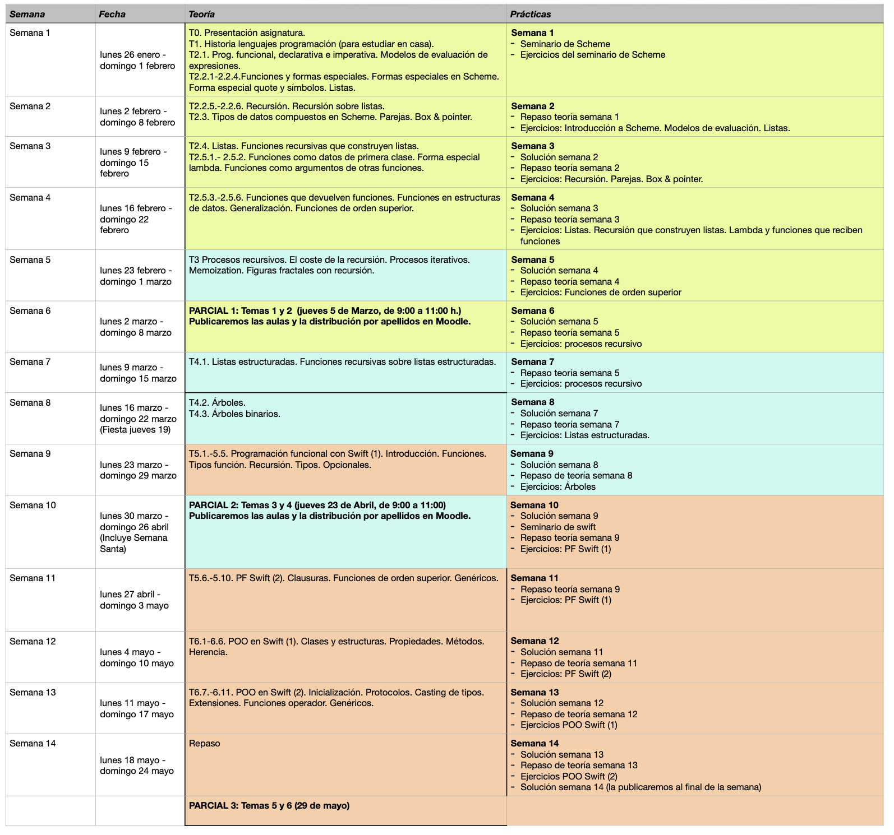
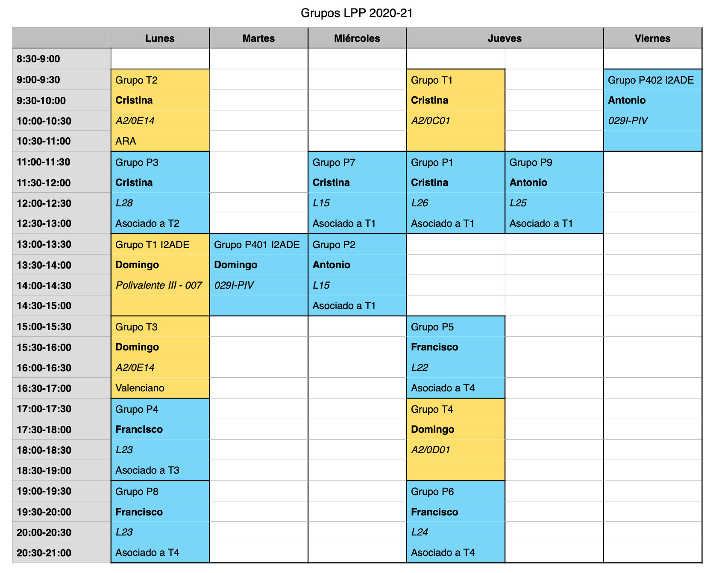

# Lenguajes y Paradigmas de Programación

## Datos académicos de la asignatura

**Departamento de Ciencia de la Computación e Inteligencia Artificial**  
**6 créditos ECTS**: 1 clase de teoría de 2 h. y 1 clase de 
prácticas de 2 h. a la semana  
**Profesores**:  

* Antonio Botía ([e-mail](mailto:abotia@dccia.ua.es)): Grupos de
  prácticas: 2, 9 y 402
* Domingo Gallardo ([e-mail](mailto:domingo.gallardo@ua.es)): Profesor
  coordinador de la asignatura. Grupos de teoría: 3, 4 y 40. Grupos de
  prácticas: 401
* Francisco Martínez ([e-mail](mailto:fmartine@ua.es)): Grupos de
  prácticas: 4, 5, 6 y 8
* Cristina Pomares ([e-mail](mailto:cpomares@ua.es)): Grupos de
  teoría: 1 y 2. Grupos de prácticas: 1, 3 y 7.

## Recursos de la asignatura

* [Ficha de la asignatura](https://cvnet.cpd.ua.es/Guia-Docente/GuiaDocente/Index?wCodEst=C203&wcodasi=34017&wlengua=es&scaca=2020-21)
* [Apuntes de la asignatura (teoría, seminarios y prácticas)](https://domingogallardo.github.io/apuntes-lpp/)
* [Sitio Moodle](https://moodle2020-21.ua.es/moodle/course/view.php?id=8242)
  abierto y accesible a toda la comunidad educativa, contiene los
  apuntes, transparencias, prácticas y otros materiales docentes
* [Foro de consultas y anuncios](https://moodle2020-21.ua.es/moodle/mod/forum/view.php?id=80350)
  en el sitio Moodle (sólo accesible a estudiantes)

## Objetivos y competencias

**Objetivos**:

* ¿Qué elementos son comunes a los lenguajes de programación? 
* ¿Qué familias o paradigmas de lenguajes podemos identificar? 
* ¿Qué es la programación funcional?
* ¿Cómo es un lenguaje multi-paradigma que combina la programación
  funcional y la programación orientada a objetos?
 
Dominando estos contenidos será mucho más fácil aprender nuevos
lenguajes de programación, identificar sus aspectos esenciales e
incluso ser capaz de diseñar lenguajes específicos orientados a
dominios concretos.

**Competencias**:

* Conocer y diferenciar las características de los distintos
  paradigmas de programación (programación funcional, procedural y
  orientada a objetos) e identificarlas en lenguajes de programación
  concretos.
* Diferenciar entre tiempo de ejecución y tiempo de compilación en
  distintos ámbitos: detección de errores o definición, creación o
  ámbito de vida de variables.
* Conocer los principios básicos de la programación funcional:
  recursión, inmutabilidad, funciones como objetos de primera clase,
  funciones de orden superior, expresiones lambda (clausuras).
* Conocer los problemas derivados del uso de la mutación en los
  lenguajes de programación imperativos y la forma de trabajar con
  estructuras inmutables en lenguajes declarativos y funcionales.
* Utilizar la abstracción y la recursión para diseñar correctamente
  procedimientos y estructuras de datos (listas y árboles).
* Ser capaz de diseñar, implementar y corregir programas funcionales,
  en concreto utilizando el lenguaje de programación Scheme.
* Ser capaz de diseñar, implementar y corregir programas funcionales,
  en concreto utilizando el lenguaje de programación Swift.
* Conocer las características de programación orientada a
  objetos y de comprobación estática de tipos del lenguaje de
  programación Swift. Conocer el uso de genéricos y protocolos que
  proporciona el lenguaje.
* Ser capaz de implementar programas en Swift en los que se
  utilicen sus características de programación orientada a objetos,
  genéricos y protocolos.

## Temario

### Bloques temáticos ###

La asignatura se divide en 3 bloques temáticos, todos ellos de igual
duración, en los que se utilizará el lenguaje de programación que
aparece entre paréntesis:

1. Programación funcional (Scheme): temas 1 y 2
2. Procesos y estructuras recursivas (Scheme): temas 3 y 4
3. Programación funcional en Swift y programación orientada a objetos
   (Swift): temas 5 y 6

Los lenguajes de programación se introducirán mediante seminarios
impartidos en las clases de prácticas.

* Seminario 1. **El lenguaje de programación Scheme**:
  Primitivas. Tipos de datos
  básicos. Símbolos. Cadenas. Listas. Definición de funciones. 
* Seminario 2. **El lenguaje de programación Swift**. Intérprete y
  scripts. Tipos de datos básicos. Operadores. Estructuras de
  control. Ámbito de variables. Tipos de datos compuestos: tuplas,
  arrays y colecciones. Recorriendo colecciones. Valores mutables e
  inmutables. Inicialización. Tipos de referencia y valor en Swift.

### Temas ###

* Tema 1. **Lenguajes de programación**: Historia de los lenguajes de
  programación. Elementos de los lenguajes de
  programación. Abstracción. Paradigmas de programación. Compiladores
  e intérpretes.
* Tema 2. **Programación Funcional**: Características e historia del
  paradigma de Programación Funcional. Diferencias con el paradigma
  imperativo. Características declarativas
  del paradigma funcional. Definición de funciones. Funciones como
  datos de primer orden. La forma especial lambda. Ámbito de variables
  y clausuras. Datos compuestos en Scheme: parejas. Construcción,
  recorrido y operaciones sobre listas. Listas con elementos
  compuestos. Listas de listas.
* Tema 3. **Procedimientos recursivos**:  Diseño de
  funciones recursivas. Recursión mutua. Procesos recursivos e
  iterativos. Memoization. Recursión y gráficos de tortuga. 
* Tema 4. **Estructuras recursivas**: Estructuras de datos recursivas:
  listas estructuradas y árboles.
* Tema 5. **Programación funcional en Swift**: Lenguajes
  multiparadigma. Programación funcional en Swift. Valores
  opcionales. Listas. Recursión pura y recursión por la
  cola. Funciones como datos de primer orden. Clausuras y funciones
  anónimas. Funciones de orden superior: mappings y filtros de
  colecciones.
* Tema 6. **Programación Orientada a Objetos en Swift**: Características e
  historia del paradigma de Programación Orientada a
  Objetos. Estructuras y clases en Swift. Herencia. Conceptos
  avanzados de POO en Swift: Extensiones, Protocolos y
  Genéricos.

El calendario de temas, prácticas y exámenes se puede ver en la
siguiente figura.

## Prácticas

Las prácticas son fundamentales en la asignatura y sirven para
comprender, trabajar y profundizar los conceptos y competencias
estudiados en las clases de teoría.

Para el desarrollo de las prácticas utilizaremos los siguientes
lenguajes de programación y entornos de desarrollo:

* [Racket](http://racket-lang.org/) (versión de Scheme, lenguaje de
  programación funcional)
* [Swift](https://swift.org) (lenguaje multiparadigma creado por
  Apple, con conceptos modernos de programación funcional y
  programación orientada a objetos)

Cada práctica consistirá en la resolución de una **hoja de ejercicios**
con 5 o 6 pequeños problemas de programación relacionados con la
teoría vista durante la semana.

Se realizarán 12 sesiones de ejercicios de prácticas de una semana de
duración y 2 seminarios sobre los anteriores lenguajes de programación.

La hoja de ejercicios estará disponible al comienzo de la semana y se
dispondrá de toda la semana siguiente para su realización y su entrega
en Moodle. La entrega se cerrará el último día de la semana. Al día
siguiente se publicará la solución.

En la clase de prácticas resolverán dudas sobre la solución de
la práctica anterior y se trabajará en la hoja de ejercicios publicada
esa semana. Durante la sesión de prácticas el profesor estará
disponible para resolver dudas y dar pistas sobre cómo atacar los
problemas. 

También durante la semana se podrán consultar las dudas que
puedan surgir en el foro de la asignatura (en Moodle) y con tutorías a
los profesores. Es preferible el foro, porque de esta forma las
contestaciones y aclaraciones serán compartidas con el resto de
compañeros.

### Uso del software iTALC ###

Durante el desarrollo de las sesiones prácticas es obligatorio usar el
ordenador del aula y no el portátil personal. El profesor de prácticas
abrirá el programa iTALC, con el que podrá comprobar cómo estáis
desarrollando los ejercicios y podrá haceros recomendaciones cuando lo
considere oportuno. 

## Horarios

La distribución de grupos del curso 2020-21 es la siguiente:

En los turnos de teoría es posible, de forma excepcional, asistir a un
grupo distinto del asignado. Los enlaces a las aulas online en las que se impartirán las clases son los
siguientes:

- [Grupo 1](https://cvnet.cpd.ua.es/Docenciadual/AulaVirtual?eje=382&vac=113472&gac=331683&ts=1611139908) (jueves de 9:00 a 11:00 h.)
- [Grupo 2](https://cvnet.cpd.ua.es/Docenciadual/AulaVirtual?eje=382&vac=113472&gac=331684&ts=1611139908) (lunes de 9:00 a 11:00 h.)
- [Grupo 3](https://cvnet.cpd.ua.es/Docenciadual/AulaVirtual?eje=382&vac=113472&gac=331685&ts=1611141615) (lunes de 15:00 a 17:00 h.)
- [Grupo 4](https://cvnet.cpd.ua.es/Docenciadual/AulaVirtual?eje=382&vac=113472&gac=331686&ts=1611141615) (jueves de 17:00 a 19:00 h.)
- [Grupo I2ADE](https://cvnet.cpd.ua.es/Docenciadual/AulaVirtual?eje=382&vac=113472&gac=1221840&ts=1611141615)
  (lunes de 13:00 a 15:00 h.)

En los turnos de prácticas se debe asistir al grupo al que se ha
asignado. El cambio de turno deberá solicitarse en la Secretaría de la EPS.

## Evaluación

### Convocatoria ordinaria C3 (evaluación continua)

La asignatura se divide en 3 bloques temáticos, todos ellos de igual
duración, en los que se utilizará el lenguaje de programación que
aparece entre paréntesis: 

- Programación funcional (temas 1 y 2, Scheme)
- Recursión y estructuras de datos recursivas (temas 3 y 4, Scheme)
- Programación funcional en Swift y programación orientada a objetos (temas 5 y 6, Swift)

Se realizarán tres exámenes parciales escritos sobre los conceptos de
cada uno de los bloques temáticos (teoría y práctica). Los parciales
tendrán la siguiente ponderación en la nota final: 

- Parcial 1: 35%
- Parcial 2: 30%
- Parcial 3: 35%

No se exige nota mínima en ninguno de los parciales. Los parciales 1 y
2 se realizarán durante el curso. El parcial 3 se realizará en la
fecha del examen oficial de la convocatoria ordinaria de la
asignatura. 
    
!!! Danger "Sobre los dispositivos móviles"
    Durante la realización de los exámenes no está permitido que llevéis encima
    ningún dispositivo con conexión a internet (smartphones, smart
    watches, tablets, etc). Antes de empezar la prueba, se deberán
    dejar dentro de las mochilas, y éstas en el suelo. En caso de no
    cumplir alguna esta norma, la prueba queda invalidada con
    calificación de 0. 
    
### Convocatoria extraordinaria C4

En la convocatoria extraordinaria se realizará un examen final sobre
todos los bloques temáticos cuya calificación representará el 100% de
la nota de la asignatura.

## Consejos para aprender con éxito los contenidos de la asignatura

El consejo fundamental para aprobar la asignatura es **trabajar todas
las semanas e intentar seguir el ritmo de la asignatura**. Los
conceptos de la asignatura se van construyendo de forma progresiva y
lo visto en una semana depende muchas veces de lo aprendido en semanas
anteriores.

¿Cómo estudiar estos conceptos? Con la excepción de algunos temas y
apartados concretos (como la historia de los lenguajes de programación
o las características de los distintos paradigmas) la asignatura es
fundamentalmente práctica. Cuando hablamos de *estudiar* los ejemplos
de código queremos decir **entenderlos, no aprenderlos de
memoria**. No tiene sentido aprender de memoria los ejercicios y los
ejemplos vistos en clase. Hay que *trabajarlos*. Eso significa que,
primero, hay que entenderlos sobre el papel y *muy importante* hay que
**probar todos los ejemplos en el intérprete**. Y *probar*
significa escribir los ejemplos y jugar con ellos, proponiendo
pequeñas variantes, preguntándose *¿qué pasaría si...?* y probándolo.

En cuanto a las prácticas y a los ejercicios propuestos es fundamental
pelearse con ellos e intentar hacerlos por uno mismo **sin ver ninguna
solución**. Es la única forma de aprender: probando, equivocándose y
encontrando la solución por uno mismo.

A la hora de enfrentarse con un problema es fundamental también **usar
lápiz y papel** para probar enfoques y encontrar la solución más
sencilla sobre el papel antes de probarla en el intérprete. Los ejercicios
que proponemos no son excesivamente complicados. Todos se resuelven
con muy pocas líneas de código y su codificación en el ordenador no
tiene dificultad, una vez que se ha encontrado la solución que lo
resuelve. Al usar el lápiz y papel también estarás practicando una
situación similar a la que te vas a encontrar en los exámenes de la
asignatura.

Resumiendo: trabajar todas las semanas, hacer uno mismo todos los
ejercicios y no desanimarse ni descolgarse.

Son muy interesantes algunos comentarios de antiguos estudiantes que
han aprobado la asignatura.

!!! quote "Cómo dominar los conceptos" 
    Para superar la asignatura lo que hice fue estudiar mucho. Hay que practicar y sobre todo
    entender los ejercicios y no sabérselos de memoria. Una vez
    dominados los ejercicios yo mismo me propuse variantes de los
    mismos. Así es como se domina.

!!! quote "El problema del cambio de paradigma"
    El problema principal de la asignatura es enfrentarse a un cambio 
    del paradigma de programación."

!!! quote "Trabajar día a día"
    Lo que hice fue tratar de llevar al día toda la asignatura, además
    de trabajar con material adicional para poder ampliar y
    profundizar conocimientos. LPP es una asignatura de fondo en la
    que tienes que mantener el ritmo de trabajo de principio a fin de cuatrimestre."

!!! quote "No copiar las prácticas"
    El mayor problema que creo que existe es que muchas personas se
    relajan y se copian las prácticas en cuanto les resultan un poco
    difíciles o les lleva algo mas del tiempo que les gustaría. Esta
    asignatura si no haces tu los ejercicios y te peleas con ellos es
    prácticamente imposible de sacar.

!!! quote "No memorizar"
    Otra de las cosas es que tienes que cambiar la forma de estudiar,
    no vale memorizar, ni hacer muchos ejercicios sin más. Tienes que
    entender bien el funcionamiento de la recursión para luego poder
    practicar con ejercicios, sino no sirve. [...] En mi opinión el
    problema de LPP para mucha gente es que para los exámenes se
    memorizan los ejercicios de prácticas de las soluciones que se dan
    en clase.
    
!!! quote "Plantearse uno mismo problemas"
    Los problemas que me encontré a la hora de cursar LPP fue que eran
    dos lenguajes completamente nuevos, otro tipo de programación que
    nunca había visto, otra forma de estudiar distinta. Para poder
    superarla simplemente tienes que hacer ejercicios y también
    plantearte tú mismo nuevos ejercicios.

## Bibliografía

En Moodle se publican los apuntes de la asignatura, con ejercicios,
explicaciones y ejemplos de todos los conceptos estudiados, tanto en
teoría como en práctica.

Para ampliar algunos conceptos se recomiendan las siguientes referencias:

- Harold Abelson y Gerald Jay Sussman, *Structure and Interpretation of Computer Programs*, MIT Press, 1996
    - [Enlace a la edición on-line](http://mitpress.mit.edu/sites/default/files/sicp/full-text/book/book.html)
    - Signatura en la Biblioteca Politécnica: I.06/ABE/STR
- Apple, [_The Swift Programming Language_](https://developer.apple.com/library/ios/documentation/Swift/Conceptual/Swift_Programming_Language/)
- [_The Racket Guide_](https://docs.racket-lang.org/guide/index.html)

----

Lenguajes y Paradigmas de Programación, curso 2020-21  
© Departamento Ciencia de la Computación e Inteligencia Artificial, Universidad de Alicante  
Domingo Gallardo, Cristina Pomares, Antonio Botía, Francisco Martínez
