# Tema 3: Procedimientos recursivos

Ya hemos visto muchos ejemplos de funciones recursivas. Una
función es recursiva cuando se llama a si misma. Una vez que uno se
acostumbra a su uso, se comprueba que la recursión es una forma mucho
más natural que la iteración de expresar un gran número de funciones y
procedimientos.

La formulación matemática de la recursión es sencilla de entender,
pero su implementación en un lenguaje de programación no lo es
tanto. El primer lenguaje de programación que permitió el uso de
expresiones recursivas fue el Lisp. En el momento de su creación
existía ya el Fortran, que no permitía que una función se llamase a si
misma.

Ya hemos visto la utilidad de la recursión en muchos ejemplos para
recorrer listas, para filtrarlas, etc. En este tema veremos algunos
aspectos negativos de la recursión: su coste espacial y
temporal. Veremos que hay soluciones a estos problemas, cambiando el
estilo de la recursión y generando *procesos iterativos* o usando un
enfoque automático llamado *memoization* en el que se guardan los
resultados de cada llamada recursiva. Por último, veremos un último
ejemplo curioso e interesante de la recursión para realizar figuras
fractales con gráficos de tortuga.

## 1. El coste de la recursión

Hasta ahora hemos estudiado el diseño de funciones recursivas. Vamos a
tratar por primera vez su coste. Veremos que hay casos en los que es
prohibitivo utilizar la recursión tal y como la hemos visto. Y veremos
también que existen soluciones para esos casos.

### 1.1. La pila de la recursión

Vamos a estudiar el comportamiento de la evaluación de una llamada a
una función recursiva. Supongamos la función
`mi-length`:

```racket
(define (mi-length items)
   (if (null? items)
      0
      (+ 1 (mi-length (cdr items)))))
```

Examinamos cómo se evalúan las llamadas recursivas:

```text
(mi-length '(a b c d))
(+ 1 (mi-length '(b c d)))
(+ 1 (+ 1 (mi-length '(c d))))
(+ 1 (+ 1 (+ 1 (mi-length '(d)))))
(+ 1 (+ 1 (+ 1 (+ 1 (mi-length '())))))
(+ 1 (+ 1 (+ 1 (+ 1 0))))
(+ 1 (+ 1 (+ 1 1)))
(+ 1 (+ 1 2))
(+ 1 3)
4
```

Cada llamada a la recursión deja una función **en espera de ser
evaluada** cuando la recursión devuelva un valor (en el caso anterior
las funciones suma). Estas llamadas en espera, junto con sus
argumentos, se almacenan en la *pila de la recursión*.

Cuando la recursión devuelve un valor, los valores se recuperan de la
pila, se realiza la llamada y se devuelve el valor a la anterior
llamada en espera. 

Si la recursión está mal hecha y nunca termina se genera un *stack
overflow* porque la memoria que se almacena en la pila sobrepasa la
memoria reservada para el intérprete DrRacket.

### 1.2. Coste espacial de la recursión

El coste espacial de un programa es una función que relaciona la
memoria consumida por una llamada para resolver un problema con alguna
variable que determina el tamaño del problema a resolver.

En el caso de la función `mi-length` el tamaño del problema viene dado
por la longitud de la lista. El coste espacial de `mi-lenght` es
*O(n)*, siendo *n* la longitud de la lista.

### 1.3. El coste depende del número de llamadas a la recursión

Veamos con un ejemplo que el coste de las llamadas recursivas puede
dispararse. Supongamos la famosa [secuencia de Fibonacci]:
0,1,1,2,3,5,8,13,...

[secuencia de Fibonacci]:http://en.wikipedia.org/wiki/Fibonacci_number

Formulación matemática de la secuencia de Fibonacci:

```text
Fibonacci(n) = Fibonacci(n-1) + Fibonacci(n-2)
Fibonacci(0) = 0
Fibonacci(1) = 1
```

Formulación recursiva en Scheme:

```racket
(define (fib n)
   (cond ((= n 0) 0)
      ((= n 1) 1)
      (else (+ (fib (- n 1))
               (fib (- n 2))))))
```

Evaluación de una llamada a Fibonacci:


Cada llamada a la recursión produce otras dos llamadas, por lo que el
número de llamadas finales es 2^n siendo n el número que se pasa a la
función.

El coste espacial y temporal es exponencial, O(2^n). Esto hace
inviable utilizar esta implementación para realizar el cálculo de la
función. Puedes comprobarlo intentando evaluar en el intérprete
`(fib 35)`.

## 2. Soluciones al coste de la recursión: procesos iterativos

Diferenciamos entre procedimientos y procesos: un **procedimiento** es un
algoritmo y un **proceso** es la ejecución de ese algoritmo.

Es posible definir _procedimientos recursivos_ que generen _procesos
iterativos_ (como los bucles en programación imperativa) en los que **no
se dejen llamadas recursivas en espera ni se incremente la pila de la
recursión**. Para ello construimos la recursión de forma que en cada
llamada se haga un cálculo parcial y en el caso base se pueda devolver
directamente el resultado obtenido.

Este estilo de recursión se denomina *recursión por la cola*
([tail recursion](http://en.wikipedia.org/wiki/Tail_call), en inglés).

Se puede realizar una implementación eficiente de la ejecución del
proceso, eliminando la pila de la recursión.

### 2.1. Factorial iterativo

Empezamos a explicar la recursión por la cola con un ejemplo muy
sencillo: la versión iterativa de la típica función `factorial`. Le
pondremos de nombre a la función `factorial-iter`:

```racket
(define (factorial n)
   (fact-iter n n))

(define (fact-iter n result)
   (if (= n 1)
      result
      (fact-iter (- n 1) (* result (- n 1))  )))
```


La función `(fact-iter n result)` es la que define el proceso
iterativo. Su argumento `n` es el valor del que hay que calcular el
factorial y el argumento `result` es un parámetro adicional en el que
se van guardando los resultados intermedios.

En cada llamada recursiva, `n` se va haciendo cada vez más pequeño y
en `result` se va acumulando el cálculo del factorial. Al final de la
recursión el factorial debe estar calculado en `result` y se devuelve.

Veamos la secuencia de llamadas:

```text
(factorial 4)
(factorial-iter 4 4)
(factorial-iter 3 4*3=12)
(factorial-iter 2 12*2=24)
(factorial-iter 1 24*1=24)
24
```

Antes de realizar cada llamada recursiva se realiza el cálculo del
resultado parcial, que se guarda en el parámetro `result`. Después se
realiza la llamada con el nuevo valor calculado de `n` y de `result`.

Al final, cuando `n` vale `1` se devuelve el valor calculado de
`result`. Este valor es el resultado completo de la recursión, ya que
no hay que hacer ninguna operación más con él. A diferencia de los
procesos recursivos, en los que se quedan llamadas en espera en la
pila de la recursión, en los procesos iterativos no hay ninguna
llamada en espera. El resultado devuelto por el caso base es
directamente la solución de la recursión, no queda nada por hacer con
este resultado.

Es importante el valor inicial de `resultado`. La función `factorial`
se encarga de inicializar este parámetro. En este caso es el mismo
valor del número `n` a calcular el factorial. 

La secuencia de llamadas recursivas acumula en la variable `result` el
valor del factorial:

```text
4 * 3 * 2 * 1 = 24
```


### 2.2. Versión iterativa de mi-length

Veamos un segundo ejemplo. ¿Cómo sería la versión iterativa de
`mi-length`, la función que calcula la logitud de una lista?.

Tenemos que añadir un parámetro adicional en el que iremos acumulando
el resultado parcial. En este caso, cada vez que llamemos a la
recursión eliminado un elemento de la lista, incrementaremos en 1 el
valor del resultado. Para que funcione bien este enfoque, debemos
inicializar este resultado a 0.

La solución es la siguiente:

```racket
(define (mi-length lista)
   (mi-length-iter lista 0))

(define (mi-length-iter lista result)
   (if (null? lista)
      result
      (mi-length-iter (cdr lista) (+ result 1))))
```

Fijaros que, al igual que en la versión iterativa de factorial, no hay
ninguna llamada a ningúna función que recoja el resultado de la
llamada recursiva y haga algo con él. Directamente el resultado de la
llamada recursiva es el resultado final de la recursión.

### 2.3. Función `suma-lista` usando recursión por la cola

Veamos otro ejemplo. Supongamos que queremos calcular usando recursión
por la cola la suma de los números de una lista.

Deberíamos añadir un parámetro adicional en el que vamos acumulando
esa suma. Inicializaremos a 0 ese parámetro e iremos en cada llamada
recursiva acumulando el primer elemento de la lista:

```racket
(define (suma-lista lista)
   (suma-lista-iter lista 0))

(define (suma-lista-iter lista result)
   (if (null? lista)
      result
      (suma-lista-iter (cdr lista) (+ result (car lista)))))
```


### 2.4. Características de los procesos iterativos

Un resumen de las características de los procesos iterativos
resultantes de hacer una recursión por la cola:

- La recursión resultante es menos elegante.
- Se necesita una parámetro adicional en el que se van acumulando los
  resultados parciales.
- La última llamada a la recursión devuelve el valor acumulado.
- El proceso resultante de la recursión es iterativo en el sentido de
  que no deja llamadas en espera ni incurre en coste espacial.

### 2.5. Fibonacci iterativo

Cualquier programa recursivo se puede transformar en otro que genera
un proceso iterativo.

En general, las versiones iterativas son menos intuitivas y más
difíciles de entender y depurar.

Veamos, por ejemplo, la formulación iterativa de Fibonacci:

```racket
(define (fib n)
   (fib-iter 1 0 n))

(define (fib-iter a b count)
   (if (= count 0)
      b
      (fib-iter (+ a b) a (- count 1))))
```

La secuencia de llamadas recursivas sería la siguiente:

```text
(fib 6)
(fib-iter 1 0 6)
(fib-iter 1+0=1 1 5)
(fib-iter 1+1=2 1 4)
(fib-iter 2+1=3 2 3)
(fib-iter 3+2=5 3 2)
(fib-iter 5+3=8 5 1)
(fib-iter 8+5=13 8 0)
8
```

En la llamada recursiva `n`, el parámetro `a` guarda el valor de
fibonacci `n+1` y el parámetro `b` guarda el valor de fibonacci `n`,
que es el que se devuelve. Conseguimos `n` llamadas inicializando
`count` a n y decrementando el parámetro en 1 cada vez.

### 2.6. Triángulo de Pascal

El [triángulo de Pascal](https://en.wikipedia.org/wiki/Pascal's_triangle) es el siguiente triángulo de números.

```text
1
1   1
1   2   1
1   3   3   1
1   4   6   4   1
1   5  10   10  5   1
1   6  15  20   15  6   1
1   7  21  35   35  21  7   1
          ...
```

Si numeramos las filas y columnas empezando a contar por 0, la
expresión general del valor en una fila y columna determinada se puede
obtener con la siguiente definición recursiva:

```text
Pascal (n, 0) = 1
Pascal (n, n) = 1
Pascal (fila, columna) = 
    Pascal (fila-1,columna-1) + Pascal (fila-1, columna)
```

La función sólo está definida para valores de `columna` menores o
iguales que `fila`.

En Scheme es fácil escribir una función recursiva que implemente la
definición anterior:

```racket
(define (pascal fila col)
   (cond ((= col 0) 1)
         ((= col fila) 1)
         (else (+ (pascal (- fila 1) (- col 1))
                  (pascal (- fila 1) col) ))))
(pascal 4 2)
; ⇒ 6
(pascal 8 4)
; ⇒ 70
(pascal 27 13)
; ⇒ 20058300
```

Hay que llamar a la función con un valor de `col` menor o igual que
`fila`. En el caso en que se pase un valor `col` mayor que `fila` la
recursión no termina y se entra en un bucle infinito.

La función tiene una formulación sencilla y funciona
correctamente. Sin embargo, el coste de esta recursión es también
exponencial, igual que pasaba en el caso de la secuencia de
fibonacci. Por ejemplo, la última expresión `(pascal 27 13)` tarda un
buen rato en devolver el resultado. Sería imposible calcular el valor
de números de Pascal un poco más grandes, como `(pascal 40 20)`.

Veamos cómo se puede conseguir una versión iterativa.

La idea es definir una función iterativa `pascal-fila` a la que le
pasamos el número de fila `n` y nos devuelve la lista de `n+1` números que
constituyen la fila `n` del triángulo de Pascal:

```text
fila 0 = (1)
fila 1 = (1 1)
fila 2 = (1 2 1)
fila 3 = (1 3 3 1)
fila 4 = (1 4 6 4 1)
...
```

Esta función necesitará un parámetro adicional (`lista-fila`) que se
inicializa con la lista `(1)` y en el que se va guardando cada fila
sucesiva. Esta fila va creciendo hasta que llegamos a la fila que
tenemos que devolver. Hay que hacer la iteración `n` veces, por lo que
vamos decrementando el parámetro `n` hasta que se llega a 0.

Para implementar esta función usamos otra llamada `(pascal-sig-fila
lista-fila)` que recibe una fila del triángulo y devuelve la
siguiente. 

Por ejemplo:

```racket
(pascal-sig-fila '(1 3 3 1))
; ⇒ (1 4 6 4 1)
```

Esta función la implementamos con una función recursiva auxiliar (esta
es recursiva pura) llamada `(pascal-suma-dos-a-dos lista-fila)` que es
la que se encarga de realizar el cálculo de la nueva fila. No es
necesario convertir esta función a iterativa porque no genera un coste
exponencial.

El código completo es el siguiente:

```racket
(define (pascal fila col)
   (list-ref (pascal-fila '(1) fila) col))

(define (pascal-fila lista-fila n)
   (if (= 0 n)
      lista-fila
      (pascal-fila (pascal-sig-fila lista-fila) (- n 1))))
	  
(define (pascal-sig-fila lista-fila)
   (append '(1)
           (pascal-suma-dos-a-dos lista-fila)
           '(1)))

(define (pascal-suma-dos-a-dos lista-fila)
   (if (null? (cdr lista-fila))
      '()
      (cons (+ (car lista-fila) (car (cdr lista-fila)))
            (pascal-suma-dos-a-dos (cdr lista-fila)))))
			
```


Con esta implementación ya no se tiene un coste exponencial y se puede
calcular el valor de números como Pascal(40, 20):

```racket
(pascal 40 20)
; ⇒ 137846528820
```

## 3. Soluciones al coste de la recursión: memoization

Una alternativa que mantiene la elegancia de los procesos recursivos y
la eficiencia de los iterativos es la
[memoization](http://en.wikipedia.org/wiki/Memoization). Si miramos la
traza de `(fib 4)` podemos ver que el coste está producido por
la repetición de llamadas; por ejemplo `(fib 3)` se evalúa 2
veces.

En programación funcional la llamada a `(fib 3)` siempre va a
devolver el mismo valor.

La idea de la _memoization_ es guardar el valor devuelto por la
cada llamada en alguna estructura (una lista de asociación, por
ejemplo) y no volver a realizar la llamada a la recursión las
siguientes veces.

### 3.1. Fibonacci con memoization

Para implementar la _memoization_ necesitamos usar un diccionario con
los métodos `put` y `get` que actualizan su información con mutación.

- La función `(crea-diccionario)` devuelve un diccionario vacío.
- La función `(put key value dic)` asocia un valor a una clave, la
guarda en el diccionario (con mutación) y devuelve el valor.
- La función `(get key dic)` devuelve el valor del diccionario asociado a
una clave. En el caso en que no exista ningún valor se devuelve `#f`.

Ejemplos:

```racket
(define mi-dic (crea-diccionario))
(put 1 10 mi-dic) ; ⇒ 10
(get 1 mi-dic) ; ⇒ 10
(get 2 mi-dic) ; ⇒ #f
```

Estos métodos son imperativos porque modifican (mutan) la estructura
de datos que pasamos como parámetro. La implementación de estas funciones está incluidas en el
[fichero
`lpp.rkt`](https://raw.githubusercontent.com/domingogallardo/apuntes-lpp/master/src/lpp.rkt). 

La función `fib-memo` realiza el cálculo de la serie de Fibonacci
utilizando exactamente la misma definición recursiva original, pero
añadiendo la técnica de _memoization_: lo primero que hacemos para
calcular el número de fibonacci `n`, antes de llamar a la recursión,
es comprobar si está ya guardado en la lista de asociación. En el caso
en que esté, lo devolvemos. Sólo cuando el número no está calculado
llamamos a la recursión para calcularlo.

La implementación se muestra a continuación. Vemos que para devolver
el número de fibonacci `n` se comprueba si ya está guardado en la
lista. Sólo en el caso en que no esté guardado se llama a la recursión
para calcularlo y guardarlo. La función `put` que guarda el nuevo
valor calculado también lo devuelve.

```racket
(define (fib-memo n dic)
  (cond ((= n 0) 0)
        ((= n 1) 1)
        ((not (equal? (get n dic) #f))
         (get n dic))
        (else (put n (+ (fib-memo (- n 1) dic)
                        (fib-memo (- n 2) dic)) dic))))
```

Podemos comprobar la diferencia de tiempos de ejecución entre esta
versión y la anterior. El coste de la función *memoizada* es
O(n). Frente al coste O(2^n) de la versión inicial que la hacía
imposible de utilizar.

```racket
(fib-memo 200 lista)
⇒ 280571172992510140037611932413038677189525
```

## 4. Figuras recursivas

Vamos a terminar el apartado sobre procedimientos recursivos con un
último ejemplo algo distinto de los vistos hasta ahora. Usaremos la
recursión para dibujar figuras fractales usando la [librería de imágenes de
Racket `2htdp/image`](https://docs.racket-lang.org/teachpack/2htdpimage.html).

### 4.1. Librería de imágenes de Racket

Racket incluye una librería de imágenes en la que se proporcionan
funciones para construir imágenes. Con esta librería se pueden crear
imágenes sencillas como rectas, círculos, triángulos u otras figuras
geométricas. También se pueden modificar las imágenes creadas,
rotándolas o escalándolas, y formar otras imágenes mediante la
combinación de imagenes básicas.


#### Construcción de imágenes básicas ####

Veamos algunos ejemplos de las primitivas de la librería para
construir imágenes básicas.

Podemos obtener un círculo, un cuadrado, un rectángulo y un triángulo
equilátero de la siguiente forma:

```racket
#lang racket
(require 2htdp/image)

(circle 30 "solid" "blue")
(square 30 "outline" "black")
(rectangle 80 40 "solid" "gray")
(triangle 40 "solid" "red")
```

Cada instrucción construye la imagen correspondiente. Si lo ejecutamos
en el intérprete obtendremos lo siguiente:


Las imágenes son mapas de bits y su tamaño se expresa en píxeles. En
el caso del círculo se trata del radio, para el cuadrado indicamos su
lado, para el rectángulo la base y la altura y para el triángulo
equilátero su lado.

Debemos indicar también si queremos que la imagen se rellene de
forma sólida o se dibuje solo el borde. Y también su color, mediante
una cadena escogida de una [lista de colores permitidos](https://docs.racket-lang.org/draw/color-database___.html).

Podemos también construir un triángulo isósceles indicando la longitud
de sus lados iguales y el ángulo entre ellos:

```racket
 (isosceles-triangle 60 30 "outline" "black") 
```

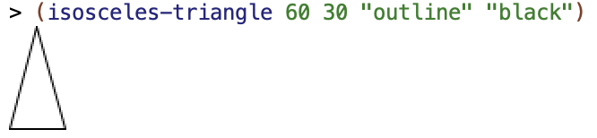

Por último, otra primitiva que vamos a utilizar más adelante es un
trazo de una línea:

```racket
(line 30 30 "black")
```

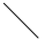

Esta función construye una imagen con una línea hasta la posición
(30,30) (la coordenada _x_ crece hacia la derecha y la _y_ hacia
abajo).

Prueba a construir algunas imágenes usando los comandos anteriores y
cambiando sus parámetros.


#### Operaciones y combinaciones de imágenes ####

En la librería de imágenes se definen también funciones que permiten
transformar y combinar imágenes. Vamos a ver algunos de ellas.

Podemos rotar una imagen un ángulo, expresado en grados sexagesimales
en el sentido contrario de las agujas del reloj.

Por ejemplo, podemos rotar el triángulo isósceles anterior:

```racket
(define triangulo (isosceles-triangle 60 30 "outline" "black"))
(rotate 90 triangulo) 
; ⇒ imagen rotada 90 grados en sentido contrario a las agujas del reloj
(rotate -90 triangulo)
; ⇒ imagen rotada 90 grados en sentido de las agujas del reloj
```


Podemos también combinar imágenes, agrupándolas con las funciones
`above` y `beside`. Las dos funciones reciben un número variable de
argumentos y devuelven una nueva imagen en la que las imágenes se han
colocado unas sobre otras o unas al lado de otras.

Por ejemplo:

```racket
(above (ellipse 70 20 "solid" "gray")
       (ellipse 50 20 "solid" "darkgray")
       (ellipse 30 20 "solid" "dimgray")
       (ellipse 10 20 "solid" "black"))
```

La llamada anterior devuelve la siguiente imagen:

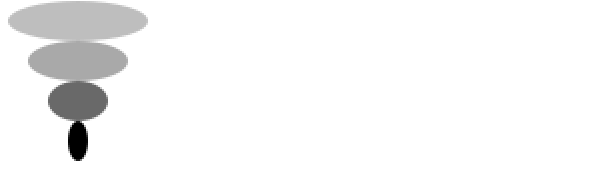

Otro ejemplo:

```racket
(beside (ellipse 20 70 "solid" "gray")
        (ellipse 20 50 "solid" "darkgray")
        (ellipse 20 30 "solid" "dimgray")
        (ellipse 20 10 "solid" "black"))
```

Que produce:

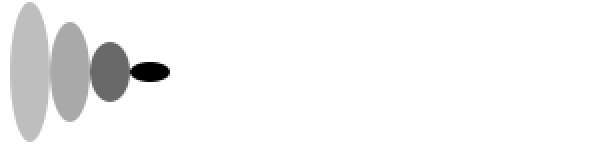

En los dos ejemplos anteriores las imágenes agrupadas se alinean en el
centro. Si queremos otra alineación podemos especificarla usando las
funciones `above/align` y `beside/align`. 

En el caso de `above`, que acumula las imágenes unas sobre otras,
podremos especificar si queremos alinearlas a la izquierda o a la
derecha:

```racket
(above/align "left"
               (ellipse 70 20 "solid" "yellowgreen")
               (ellipse 50 20 "solid" "olivedrab")
               (ellipse 30 20 "solid" "darkolivegreen")
               (ellipse 10 20 "solid" "darkgreen"))
```

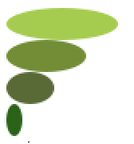

```racket
(above/align "right"
               (ellipse 70 20 "solid" "gold")
               (ellipse 50 20 "solid" "goldenrod")
               (ellipse 30 20 "solid" "darkgoldenrod")
               (ellipse 10 20 "solid" "sienna"))
```

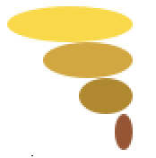

En el caso de `beside`, que acumula las imágenes unas junto a otras,
podemos especificar si queremos alinearla arriba o abajo:

```racket
(beside/align "top"
                (ellipse 20 70 "solid" "mediumorchid")
                (ellipse 20 50 "solid" "darkorchid")
                (ellipse 20 30 "solid" "purple")
                (ellipse 20 10 "solid" "indigo"))
```

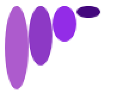

```racket
(beside/align "bottom"
                (ellipse 20 70 "solid" "lightsteelblue")
                (ellipse 20 50 "solid" "mediumslateblue")
                (ellipse 20 30 "solid" "slateblue")
                (ellipse 20 10 "solid" "navy"))
```


Podemos combinar todas las funciones anteriores para construir figuras
complejas. Por ejemplo:

```racket
(rotate 45
        (above (triangle 40 "solid" "orange")
               (beside (rectangle 40 30 "solid" "black")
                       (rectangle 40 30 "solid" "olivedrab"))))
```


Prueba a realizar algunas figuras combinando figuras básicas con las
funciones anteriores.

### 4.2. Triángulo de Sierpinski

Vamos a utilizar las funciones anteriores que construyen imágenes para
construir una figura fractal, el denominado riángulo de Sierpinski,
usando la recursión.


*Triángulo de Sierpinski*

- ¿Ves alguna recursión en la figura?
- ¿Cuál podría ser el parámetro de la función que la dibujara? 
- ¿Se te ocurre un algoritmo recursivo que la dibuje, usando las
  funciones de combinación de imágenes vistas?

La figura es *autosimilar* (una característica de las figuras
fractales). Una parte de la figura es idéntica a la figura total, pero
reducida de escala. Esto nos da una pista de que es posible dibujar la
figura con un algoritmo recursivo.

Para intentar encontrar una forma de enfocar el problema, vamos a
pensarlo de la siguiente forma: supongamos que tenemos tres triángulos
de Sierpinski de anchura _x_. ¿Cómo podríamos construir el triángulo
de Sierpinski de anchura _2*x_?

Lo podríamos hacer combinando las tres imágenes de la siguiente forma:

1. Juntamos 2 triángulos uno junto a otro.
2. Sobre la figura resultante colocamos (alineada en el centro) el
   triángulo restante.

En la siguiente figura se muestra el esquema de esta combinación. Cada
rectángulo representa la imagen de sierpinski de anchura _x_ y la
combinación representa la imagen de anchura _2*x_.

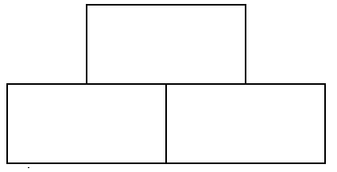

El algoritmo recursivo se basa en la misma idea, pero **hacia
atrás**. Dibujamos un triángulo de anchura _x_ basándonos en 3
llamadas recursivas a triángulos más pequeños (de anchura _x/2_).

En el caso base, cuando _x_ sea menor que un umbral _h_, dibujaremos un
triángulo elemental de base _h_.

Veamos cómo hacerlo con la librería de imágenes de Racket.

#### 4.2.1. Caso base de la recursión ####

Para construir la imagen elemental del triángulo de Sierpinski
necesitamos un triángulo isósceles de ángulo 90 y base _h_. 

Tal y como muestra la siguiente figura, podemos dividir este triángulo
en dos mitades. Si el ángulo superior es 90 grados, su mitad será de
45 grados, por lo que los dos subtriángulos serán triángulos
rectángulos cuyos catetos medirán _h/2_. La hipotenusa de esos
triángulos son los lados del triángulo isósceles original. La altura
del triángulo isósceles original será también _h/2_.

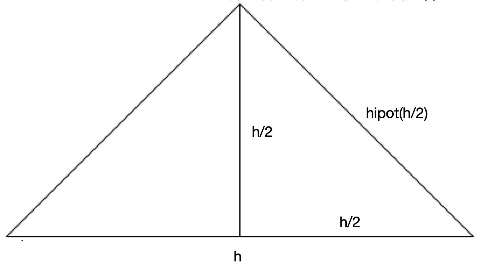

La hipotenusa de un triángulo rectángulo con dos catetos de longitud
_x_ se calcula con la siguiente expresión:

$$hipot(x) = \sqrt{x^2+x^2} = x \sqrt{2}$$

Lo podemos expresar en Racket:

```racket
(define (hipotenusa x)
  (* x (sqrt 2)))
```

Una vez definida la función `hipotenusa` podemos dibujar el triángulo
de Sierpinski elemental de base `h`. Será un triángulo isósceles de
ángulo 90 grados y de longitud de lado `hipotenusa(h/2)`:

```racket
(define (sierpinski-elem base)
  (isosceles-triangle (hipotenusa (/ base 2)) 90 "outline" "black"))
```

Por ejemplo, la llamada a 

```racket
(sierpinski-elem 40)
```

produce la siguiente imagen:

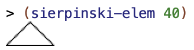


#### 4.2.2. Caso general de la recursión ####

El caso general de la recursión para dibujar el triángulo de
Sierpinski de ancho _x_ se construye llamando a la recursión para que
construya el triángulo de ancho _x/2_ y componiendo la imagen
resultante con el patrón visto anteriormente.

El código de la función completa es el siguiente:

```racket
(define (sierpinski ancho)
  (if (< ancho 10)
      (sierpinski-elem ancho)
      (above (sierpinski (/ ancho 2))
             (beside (sierpinski (/ ancho 2))
                     (sierpinski (/ ancho 2))))))
```

- Si el ancho es menor que un umbral (10) se dibuja el triángulo elemental.
- Si el ancho es mayor o igual a 10 se hacen tres llamadas recursivas a
  `sierpienski` con el _ancho / 2_. Cada llamada recursiva devolverá
  la imagen con el triángulo de sierpinski más pequeño.
- La llamada a `beside` juntará las dos imágenes inferiores.
- La llamada a `above` colocará el tercer triángulo sobre la composición
  anterior, centrado en el centro.

Un ejemplo de la ejecución:

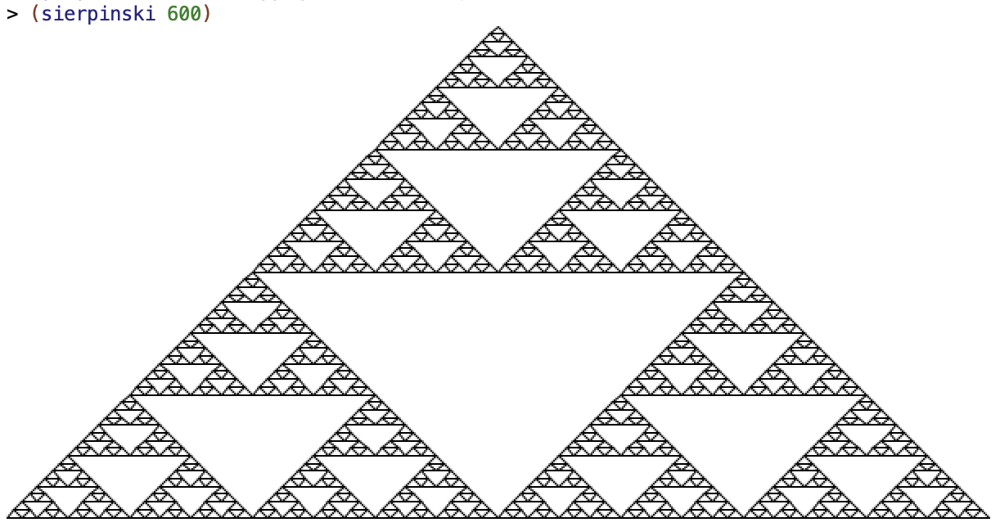


### 4.3. Curva de Hilbert ###

La curva de Hilbert es una curva fractal que tiene la propiedad de
rellenar completamente el plano.


Su dibujo tiene una formulación recursiva:


La imagen H2 se puede componer a partir de cuatro imágenes H1
siguiendo un patrón. Es el mismo patrón con el que se puede componer
la imagen H3 a partir de cuatro imágenes H2.

El patrón se muestra en la siguiente función `(componer imagen)`: 

```racket
(define trazo-horizontal (line 16 0 "black"))
(define trazo-vertical (rotate 90 trazo-horizontal))

(define (componer imagen)
  (beside (above/align "left"
                       (beside/align "bottom" imagen trazo-horizontal)
                       trazo-vertical
                       (rotate -90 imagen))
          (above/align "right"
                       imagen
                       trazo-vertical
                       (rotate 90 imagen))))
```

- La primera llamada a `above/align` compone una imagen juntando la
  imagen original con un trazo horizontal y apilando (con una
  alineación a la izquierda) esta imagen sobre un trazo vertical
  y sobre la imagen original girada 90 grados en el sentido de
  las agujas del reloj.
- La segunda llamada a `above/align` construye otra imagen apilando
  (con una alineación a la derecha) la imagen original, un trazo
  vertical y la imagen rotada 90 grados en sentido contrario a las
  agujas del reloj.
- Por último la llamada a `beside` junta las dos imágenes anteriores.

Podemos ver un ejemplo del funcionamiento de esta composición usando
una imagen base formada por un cuadrado con un triángulo dentro.

```racket
(overlay (triangle 20 "solid" "green")
         (rectangle 20 20 "solid" "black")))
```

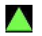

Si llamamos a `componer` con la imagen anterior podemos ver que se
construye el patrón básico de la curva de Hilbert, el que construye la
imagen H2 a partir de H1.

```racket
(define imagen (overlay (triangle 20 "solid" "green")
                        (rectangle 20 20 "solid" "black")))
imagen 
(componer imagen)
```

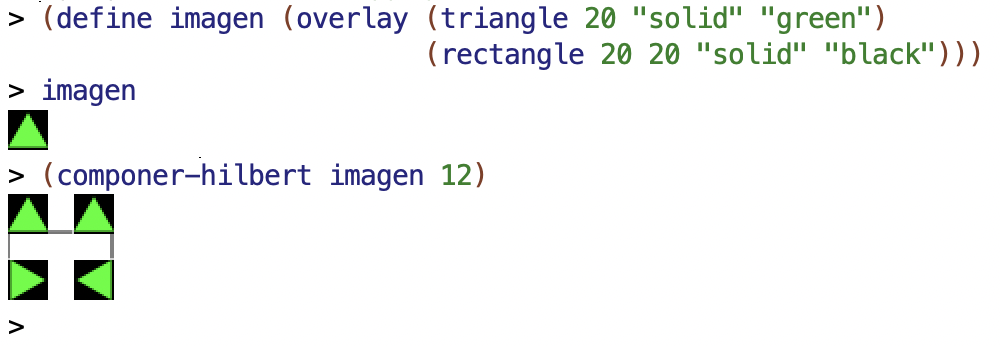

Una vez entendido este patrón de composición, podemos ya formular el
algoritmo recursivo:

```racket
(define (hilbert nivel)
  (if (= 1 nivel)
      (beside/align "top"
                    trazo-vertical
                    trazo-horizontal
                    trazo-vertical)
      (componer (hilbert (- nivel 1)))))

```

- El caso base es el nivel 1, en el que se construye el trazo básico
  de la curva de Hilbert.
- Para cualquier nivel _n_  mayor que 1, se llama a la recursión para
  formar la curva de Hilbert de nivel _n-1_ y, con la imagen
  resultante, se llama a la función `componer`.
  
En la siguiente imagen se muestran distintas llamadas a la función `hilbert`:

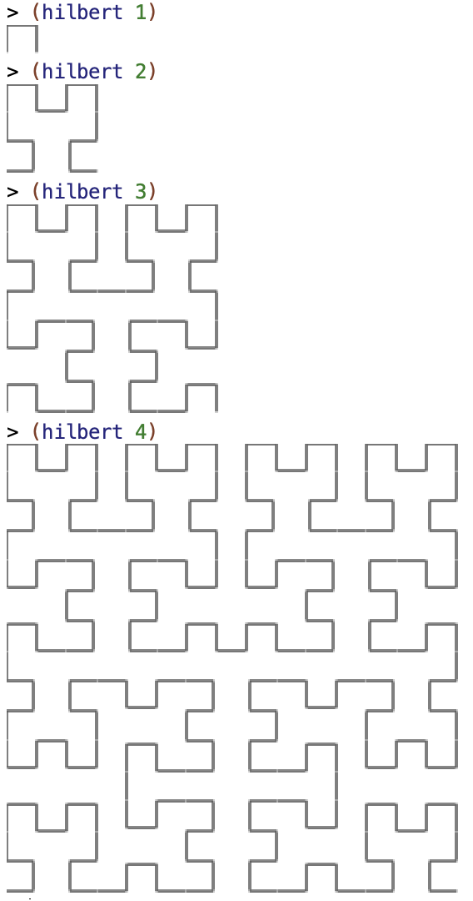

## 5. Bibliografía

Capítulos del libro *Structure and Intepretation of Computer Programs*:

- [1.2 - Procedures and the Processes They Generate](https://mitpress.mit.edu/sites/default/files/sicp/full-text/book/book-Z-H-11.html#%_sec_1.2)
- [1.2.1 - Linear Recursion and Iteration](https://mitpress.mit.edu/sites/default/files/sicp/full-text/book/book-Z-H-11.html#%_sec_1.2.1)
- [1.2.2 - Tree Recursion](https://mitpress.mit.edu/sites/default/files/sicp/full-text/book/book-Z-H-11.html#%_sec_1.2.2)

Manual de Racket:

- [Librería
  image.rkt](https://docs.racket-lang.org/teachpack/2htdpimage.html)
- [Image Guide](https://docs.racket-lang.org/teachpack/2htdpimage-guide.html)

----

Lenguajes y Paradigmas de Programación, curso 2021-22  
© Departamento Ciencia de la Computación e Inteligencia Artificial, Universidad de Alicante  
Domingo Gallardo, Cristina Pomares, Antonio Botía, Francisco Martínez

