# Tema 4: Estructuras de datos recursivas

## 1. Listas estructuradas

Hemos visto que las listas en Scheme se implementan como un estructura
de datos recursiva, formada por una pareja que enlaza en su parte
derecha el resto de la lista y que termina con una parte derecha en la
que hay una lista vacía.

En este apartado vamos a volver a estudiar las listas desde un nivel
de abstracción alto, usando las funciones:

- `(first lista)` para obtener el primer elemento de una lista
- `(rest lista)` para obtener el resto de la lista
- `(cons dato lista)` para construir una nueva lista con el dato como
  primer elemento

En la mayoría de funciones y ejemplos que hemos visto hasta ahora las
listas están formadas por datos y el recorrido por la lista es un
recorrido lineal, iterando por sus elementos.

En este apartado vamos a ampliar este concepto y estudiar cómo
trabajar con *listas que contienen otras listas*.

Veremos que esto cambia fundamentalmente la estructura de las listas y
de las funciones que van a operar con ellas. El cambio fundamental es
que la función `first lista` puede devolver dos tipos de elementos: 

- Un elemento de la lista (del tipo de elementos que hay en la lista)
- Otra lista (formada por el tipo de elementos de la lista)

### 1.1. Definición y ejemplos

Las listas en Scheme pueden tener cualquier tipo de elementos,
incluido otras listas.

Llamaremos **lista estructurada** a una lista que contiene otras
sublistas. Lo contrario de lista estructurada es una **lista plana**,
una lista formada por elementos que no son listas. Llamaremos
**hojas** a los elementos de una lista que no son sublistas.

A las listas estructuradas cuyas hojas son símbolos se les denomina en
el contexto de la programación funcional _expresiones-S_
([S-expression](http://en.wikipedia.org/wiki/S-expression)).

Por ejemplo, la lista estructurada:

```
(a b (c d e) (f (g h)))
```

es una lista estructurada con 4 elementos:

- El elemento `'a`, una hoja
- El elemento `'b`, otra hoja
- La lista plana `(c d e)`
- La lista estructurada `(f (g h))`

Se puede construir con cualquiera de las siguientes expresiones:

```racket
(define lista (list 'a 'b (list 'c 'd 'e) (list 'f (list 'g 'h))))
(define lista '(a b (c d e) (f (g h))))
```

Una lista formada por parejas la consideraremos una lista plana, ya
que no contiene ninguna sublista. Por ejemplo, la lista

```racket
((a . 3) (b . 5) (c . 12))
```

es una lista plana de tres elementos (hojas) que son parejas.

#### 1.1.1. Definiciones en Scheme

Vamos a escribir las definiciones anteriores de `hoja`, `plana` y
`estructurada` usando código de Scheme.

##### 1.1.1.1. Función `(hoja? dato)`

Definimos una hoja como aquellos elementos de una lista estructurada
que no son listas:

```racket
(define (hoja? elem)
   (not (list? elem)))
```

Utilizaremos esta función para comprobar si un determinado elemento de
una lista es o no una hoja. Por ejemplo, supongamos la siguiente
lista:

```racket
((1 2) 3 4 (5 6))
```

Es una lista de 4 elementos, siendo el primero y el último otras
sublistas y el segundo y el tercero hojas. Podemos comprobar si son o
no hojas sus elementos:

```racket
(define lista '((1 2) 3 4 (5 6)))
(hoja? (first lista)) ; ⇒ #f
(hoja? (second lista)) ; ⇒ #t
(hoja? (third lista)) ; ⇒ #t
(hoja? (fourth lista)) ; ⇒ #f
```

La lista vacía no es una hoja

```racket
(hoja? '()) ; ⇒ #f
```

##### 1.1.1.2. Función `(plana? lista)`

Como hemos dicho antes, una lista es plana cuando todos sus elementos
son hojas. Queremos implementar la función `(plana? lista)` que lo
compruebe.

Por ejemplo:

```racket
(plana? '(a b c d e f)) ; ⇒ #t
(plana? (list (cons 'a 1) "Hola" #f)) ; ⇒ #t
(plana? '(a (b c) d)) ; ⇒ #f
(plana? '(a () b)) ; ⇒ #f
```

Una definición recursiva de lista plana:

>Una lista es plana si y solo si el primer elemento es una hoja y el
>resto es plana.

Y el caso base:

>Una lista vacía es plana.

Usando esta definición recursiva, podemos implementar en Scheme la
función `(plana? lista)` que comprueba si una lista es plana:

```racket
(define (plana? lista)
   (or (null? lista)
       (and (hoja? (first lista))
            (plana? (rest lista)))))
```


Se podría también implementar la función `plana?` usando la función de
orden superior `for-all?` que comprueba que todos los elementos de una
lista cumplen una propiedad. En esta caso, ser hoja.

```racket
(define (plana-fos? lista)
  (for-all? hoja? lista))
```


!!! Note "Función `for-all?`"
    Recordemos que la función `(for-all? predicado lista)` se implementa
    de la siguiente forma:

    ```racket
    (define (for-all? predicado lista)
      (or (null? lista)
          (and (predicado (first lista))
               (for-all? predicado (rest lista)))))
    ```


##### 1.1.1.3. Función `(estructurada? lista)`

Una lista es estructurada cuando alguno de sus elementos es otra
lista. Como caso base, una lista vacía no es estructurada.

Queremos implementar la función `(estructurada? lista)` que compruebe
si una lista es estructurada.

```racket
(estructurada? '(1 2 3 4)) ; ⇒ #f
(estructurada? (list (cons 'a 1) (cons 'b 2) (cons 'c 3))) ; ⇒ #f
(estructurada? '(a () b)) ; ⇒ #t
(estructurada? '(a (b c) d)) ; ⇒ #t
```

```racket
(define (estructurada? lista)
   (and (not (null? lista))
        (or (list? (first lista))
            (estructurada? (rest lista)))))
```


Se podría implementar también usando la función de orden superior
`exists?` para consultar si algún elemento de la lista es también otra
lista.

```racket
(define (estructurada-fos? lista)
  (exists? list? lista))
```

!!! Note "Función `exists?`"
    Recordemos que la función `(exists? predicado lista)` se implementa de
    la siguiente forma:

    ```racket
    (define (exists? predicado lista)
      (if (null? lista)
          #f
          (or (predicado (first lista))
              (exists? predicado (rest lista)))))
    ```

Realmente bastaría con haber hecho una de las dos definiciones y
escribir la otra como la negación de la primera:

```racket
(define (estructurada? lista)
   (not (plana? lista)))
```

#### 1.1.2. Ejemplos de listas estructuradas

Las listas estructuradas son muy útiles para representar información
jerárquica en donde queremos representar elementos que contienen otros
elementos.

Por ejemplo, las expresiones de Scheme son listas estructuradas:

```racket
(= 4 (+ 2 2))
(if (= x y) (* x y) (+ (/ x y) 45))
(define (factorial x) (if (= x 0) 1 (* x (factorial (- x 1)))))
```

El análisis sintáctico de una oración puede generar una lista
estructurada de símbolos, en donde se agrupan los distintos elementos
de la oración:

```racket
((Juan) (compró) (la entrada (de la película)) (el viernes por la tarde))
```

Una página HTML, con sus distintos elementos, unos dentro de otros,
también se puede representar con una lista estructurada:

```racket
((<h1> Mi lista de la compra </h1>)
 (<ul> (<li> naranjas </li>)
       (<li> tomates </li>)
       (<li> huevos </li>) </ul>))
```


#### 1.1.3. *Pseudo árboles* con niveles

Las listas estructuradas definen una estructura de niveles, donde la
lista inicial representa el primer nivel, y cada sublista representa
un nivel inferior. Los datos de las listas representan las hojas.

Por ejemplo, la representación en forma de niveles de la lista `((a b
c) d e)` es la siguiente:

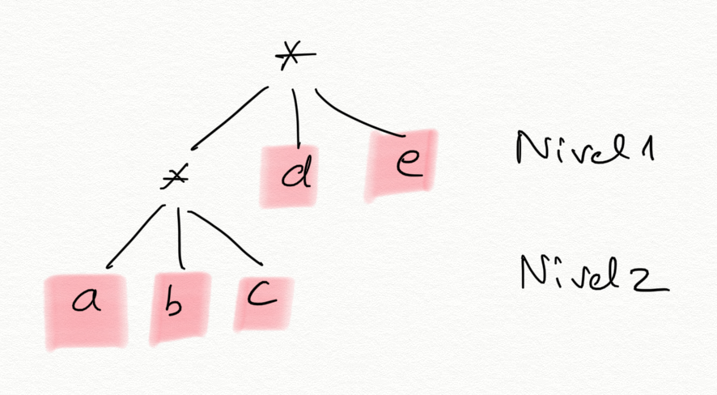

Cada asterisco `*` representa una lista. Las ramas que salen del
asterisco representan los elementos de la lista. En el ejemplo tenemos
en un primer nivel una lista con 3 elementos: la lista `(a b c)`, `d`
y `e`. Y en el segundo nivel se encuentra la lista `(a b c)` cuyos 3
elementos son hojas.

Las hojas `d` y `e` están en el nivel 1 y en las posiciones
2 y 3 de la lista y las hojas `a`, `b` y `c` en el nivel 2.

!!! Warning "Una lista estructurada no es un árbol"
    Una lista estructurada no es un árbol propiamente dicho, porque
    un árbol tiene datos en todos los nodos, mientras que en la lista 
    estructurada los datos están sólo en las hojas.

Las listas estructuradas sirven para agrupar de forma jerárquica
un conjunto de datos en distintos niveles. 

A pesar de ser distintas de los árboles, ambas son estructuras de
datos jerárquicas (con niveles) que se pueden definir de forma
recursiva y sobre las que se pueden definir algoritmos
recursivos. Veremos más adelante cómo definir y trabajar con árboles
en Scheme.

Otro ejemplo. ¿Cuál sería la representación en niveles de la siguiente
lista estructurada?:

```racket
(map (lambda (x) (+ x 10)) (quote (1 2 3 4)))
```

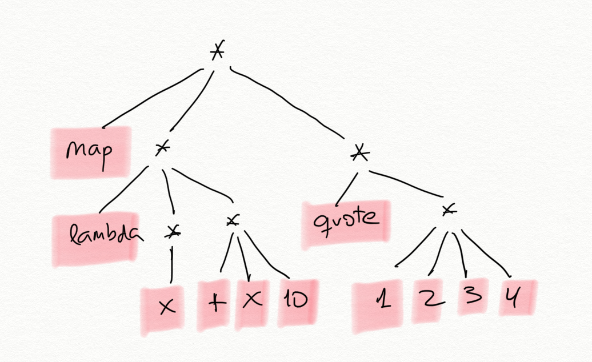

### 1.2. Funciones recursivas sobre listas estructuradas

#### 1.2.1. Número de hojas

Veamos como primer ejemplo la función `(num-hojas lista)` que cuenta
el número de hojas de una lista estructurada.

Por ejemplo:

```racket
(num-hojas '((1 2) (3 4 (5) 6) (7))) ; ⇒ 7
```

Como hemos comentado antes, una cuestión clave en las funciones que
vamos a construir sobre listas estructuradas es que el `first` de una
lista estructurada puede ser a su vez otra lista.

Para calcular el número de hojas de una lista podemos obtener el
primer elemento y el resto de la lista, y contar recursivamente el
número de hojas del primer elemento y del resto. Al ser una lista
estructurada, el primer elemento puede ser a su vez otra lista, por lo
que llamamos a la recursión para contar sus hojas.

La definición de este caso general usando _pseudocódigo_ es:

> El número de hojas de una lista estructurada es la suma del número
> de hojas de su primer elemento (que puede ser otra lista) y del
> número de hojas del resto.

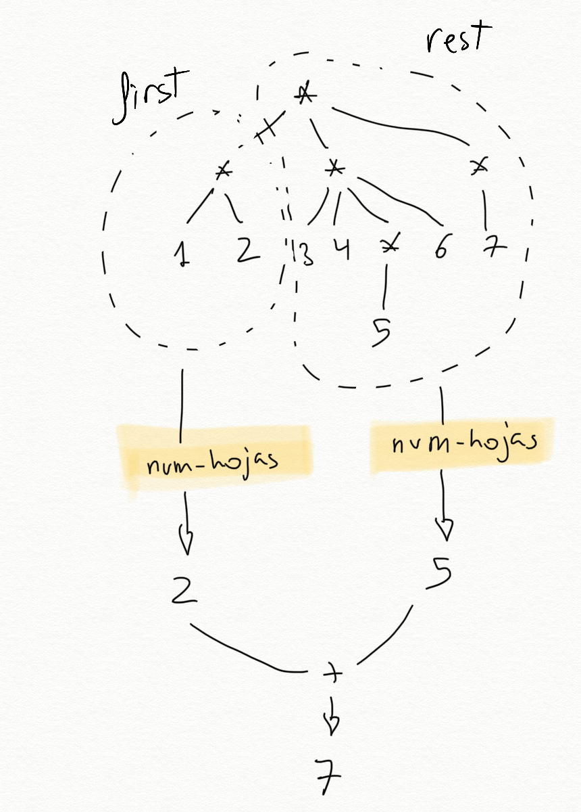

La recursión tiene dos llamadas recursivas. Una que recibe el
elemento de la cabeza de la lista y otra que recibe el resto de la
lista. 

```racket
;Caso general num-hojas
(define (num-hojas lista)
  ; Falta caso base
  (+ (num-hojas (first lista))
     (num-hojas (rest lista))))
```
          

!!! Warning "No hay coste exponencial"
    A pesar de haber dos llamadas recursivas, no pasa lo mismo que en
    Fibonacci o Pascal ya que no se van a repetir llamadas a la recursión
    con los mismos datos. La recursión recorre la lista estructurada y su
    coste será el número de elementos de la lista.

Para considerar el **caso base**, veamos cómo las llamadas recursivas
reciben cada vez un problema más pequeño. 

La llamada recursiva sobre el resto de la lista recibe cada vez una
lista con 1 elemento menos. Al final se llamará a la función con una
lista vacía. Ese será un caso base. El número de elementos de una
lista vacía es 0.

La llamada recursiva sobre la cabeza de la lista es algo
distinta. Recibe una lista en la que se ha descendido un nivel y
tiene, por tanto, un nivel menos. Al final se llamará a la función con
una hoja (un dato). Ese será el otro caso base y habrá que devolver 1.

La definición completa de la función queda de la siguiente forma:

```racket
(define (num-hojas lista)
   (cond
      ((null? lista) 0)
      ((hoja? lista) 1)
      (else (+ (num-hojas (first lista))
               (num-hojas (rest lista))))))
```

!!! Warning "Importante"
    Hay que hacer notar que el parámetro `lista` puede ser tanto una lista
    como un dato atómico. En ese caso la función `(hoja? lista)`
    devuelve `#t`.
    
    En lenguajes de programación fuertemente tipados esto no
    sería posible, porque la lista y el dato serían de distinto
    tipo. En ese caso el código debería ser un poco más largo y antes
    de llamar a la recursión habría que comprobar si el elemento es un
    dato o es otra lista. En el caso de Scheme, podemos aprovecharnos
    de su característica de ser débilmente tipado y podemos hacer el
    código más conciso, llamando siempre a la recursión con el `first`
    de la lista, independientemente de si es un dato u otra lista.
    
    El código de la  versión en la que comprobamos si el elemento es
    una lista antes de llamar a la recursión sería el siguiente:
    
    ```racket
    (define (num-hojas lista)
        (cond
            ((null? lista) 0)
            ((hoja? (first lista))
                (+ 1 (num-hojas (rest lista))))
            (else (+ (num-hojas (first lista))
                     (num-hojas (rest lista))))))
    ```


##### 1.2.1.1. Versión con funciones de orden superior

Podemos usar también las funciones de orden superior `map` y
`foldr` para obtener una versión más concisa.

Una lista estructurada tiene como elementos en un primer nivel hojas o
otras sublistas. Podemos entonces mapear una expresión lambda que se
aplica a cada uno de esos elementos. En la expresión lambda
comprobamos si el elemento (el parámetro `sublista` de la expresión
lambda) es una hoja o una lista. En el primero caso devolvemos 1. En
el segundo aplicaremos _la propia función que estamos definiendo_
sobre la sublista, con lo que se devolverá el número de hojas de esa
sublista.

El resultado del map será una lista de números (el número de hojas de
cada componente), que podemos sumar haciendo un `foldr` con la
función `+`:

```racket
(define (num-hojas-fos lista)
    (if (hoja? lista)
        1
        (foldr + 0 (map num-hojas-fos lista))))
```

Una explicación gráfica de cómo funciona la función sobre la lista `(1
(2 3) (4) (5 (6 7) 8))`:

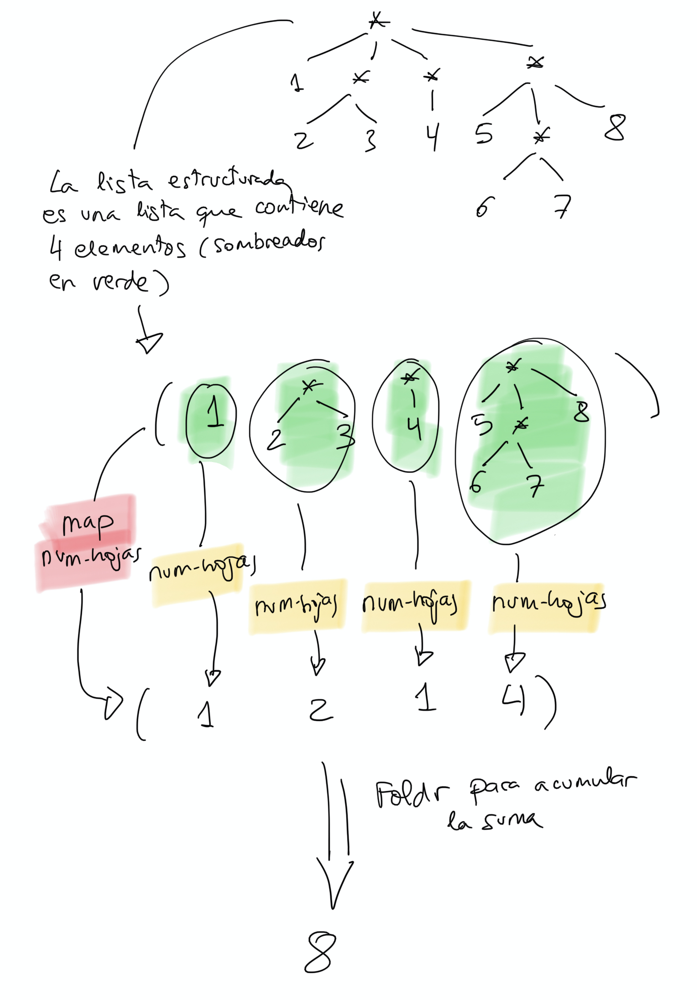

Sería equivalente hacer un `apply` de la suma para sumar los números
de la lista devuelta por el `map`:

```racket
(define (num-hojas-fos lista)
    (if (hoja? lista)
        1
        (apply + (map num-hojas-fos lista))))
```

!!! Note "Nota"
    Es interesante conocer ambas expresiones (la del `foldr` y la del
    `apply`) porque hay lenguajes de programación en los que la función
    `apply` no está definida. Por ejemplo, Swift.

#### 1.2.2. Aplanar lista ####

Veamos otro ejemplo. La función `(aplana lista) ` que devuelve una
lista plana con todas las hojas de la lista. 

Por ejemplo:

```racket
(aplana '(1 2 (3 (4 (5))) (((6)))))
; ⇒ (1 2 3 4 5 6)
```

La solución recursiva es:

```racket
(define (aplana lista)
  (cond
    ((null? lista) '())
    ((hoja? lista) (list lista))
    (else 
     (append (aplana (first lista))
             (aplana (rest lista))))))
```

Con funciones de orden superior:

```racket
(define (aplana-fos lista)
  (if (hoja? lista)
    (list lista)
    (foldr append '() (map aplana-fos lista))))
```

Usando `apply`:

```racket
(define (aplana-fos lista)
  (if (hoja? lista)
    (list lista)
    (apply append (map aplana-fos lista))))
```


#### 1.2.3. Otras funciones recursivas

Vamos a diseñar otras funciones recursivas que trabajan con la
estructura jerárquica de las listas estructuradas.

- `(pertenece-lista? dato lista)`: busca una hoja en una lista
  estructurada.
- `(altura lista)`: devuelve el número de niveles de una lista
  estructurada.
- `(nivel-hoja dato lista)`: devuelve el nivel en el que se encuentra
  un dato en una lista.
- `(cuadrado-estruct lista)`: eleva todas las hojas al cuadrado
  (suponemos que la lista estructurada contiene números).
- `(map-estruct f lista)`: similar a map, aplica una función a todas las
  hojas de la lista estructurada y devuelve el resultado (otra lista
  estructurada).

##### 1.2.3.1. `(pertenece-lista? dato lista)`

Comprueba si el `dato` aparece en la lista estructurada. 

```racket
(pertenece? 'a '(b c (d (a)))) ; ⇒ #t
(pertenece? 'a '(b c (d e (f)) g)) ; ⇒ #f
```

Solución recursiva:

```racket
(define (pertenece? dato lista)
  (cond 
    ((null? lista) #f)
    ((hoja? lista) (equal? dato lista))
    (else (or (pertenece? dato (first lista))
              (pertenece? dato (rest lista))))))
```

Con funciones de orden superior:

```racket
(define (pertenece-fos? dato lista)
  (if (hoja? lista)
    (equal? dato lista)
    (exists? (lambda (elem)
               (pertenece-fos? dato elem)) lista)))
```

##### 1.2.3.2. `(altura lista)` #####

La *altura* de una lista estructurada viene dada por su número de
niveles: una lista plana tiene una altura de 1, la lista `((1 2 3) 4
5)` tiene una altura de 2.

Para calcular la altura de una lista estructurada tenemos que obtener
(de forma recursiva) la altura de su primer elemento, y la altura del
resto de la lista, sumarle 1 a la altura del primer elemento y
devolver el máximo de los dos números.

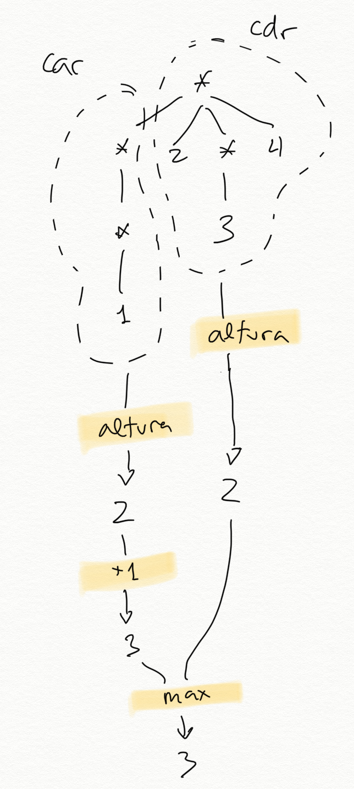

Como casos base, la altura de una lista vacía o de una hoja (dato) es 0.

En Scheme:

```racket
(define (altura lista)
   (cond 
      ((null? lista) 0)
      ((hoja? lista) 0)
      (else (max (+ 1 (altura (first lista)))
                 (altura (rest lista))))))
```
Por ejemplo:

```racket
(altura '(1 (2 3) 4)) ; ⇒ 2
(altura '(1 (2 (3)) 3)) ; ⇒ 3
```

###### 1.2.3.2.1. Versión con funciones de orden superior ######

Y la segunda versión, usando las funciones de orden superior `map`
para obtener la altura de sus elementos del primer nivel (puedes ser
hojas o sublistas) y `foldr` para quedarse con el máximo de la
lista de valores que devuelve el map.

```racket
(define (altura-fos lista)
   (if (hoja? lista)
       0
       (+ 1 (foldr max 0 (map altura-fos lista)))))
```

Podríamos hacerlo también sustituyendo el `foldr` por un `apply`:


```racket
(define (altura-fos lista)
   (if (hoja? lista)
       0
       (+ 1 (apply max (map altura-fos lista)))))
```

##### 1.2.3.3. `(nivel-hoja dato lista)` #####

Veamos una última función `(nivel-hoja dato lista)` que recorre una
lista estructurada buscando el dato y devuelve el nivel en que se
encuentra. Si el dato no se encuentra en la lista, se devolverá -1. Si
el dato se encuentra en más de un lugar de la lista se devolverá el
nivel mayor.

Ejemplos:

```racket
(nivel-hoja 'b '(a b (c))) ; ⇒ 1
(nivel-hoja 'b '(a (b) c)) ; ⇒ 2
(nivel-hoja 'b '(a (b) d ((b)))) ; ⇒ 3
(nivel-hoja 'b '(a c d ((e)))) ; ⇒ -1
```

Solución recursiva:

```racket
(define (nivel-hoja dato lista)
  (cond
    ((null? lista) -1)
    ((hoja? lista) (if (equal? lista dato) 0 -1))
    (else (max (suma-1-si-mayor-igual-que-0 
                    (nivel-hoja dato (first lista)))
               (nivel-hoja dato (rest lista))))))
```

La función auxiliar se define de la siguiente forma:

```racket
(define (suma-1-si-mayor-igual-que-0 x)
  (if (>= x 0)
      (+ x 1)
      x))
```

Con funciones de orden superior:

```racket

(define (nivel-hoja-fos dato lista)
  (if (hoja? lista)
      (if (equal? lista dato) 0 -1)
      (suma-1-si-mayor-igual-que-0
       (foldr max -1 (map (lambda (elem)
                           (nivel-hoja-fos dato elem)) lista)))))
```

##### 1.2.3.4. `(cuadrado-estruct lista)` #####

Vamos ahora a ver un tipo de función distinta. Una que construye una
lista estructurada y la devuelve. 

Queremos implementar la función `(cuadrado-estruct lista)` que recibe
una lista estructurada y devuelve otra lista estructurada con la misma
estructura y sus números elevados al cuadrado.

Por ejemplo:

```racket
(cuadrado-estruct '(2 3 (4 (5)))) ; ⇒ (4 9 (16 (25))
```

La solución recursiva es:

```racket
(define (cuadrado-estruct lista)
  (cond ((null? lista) '())
        ((hoja? lista) (* lista lista ))
        (else (cons (cuadrado-estruct (first lista))
                    (cuadrado-estruct (rest lista))))))
```

Se llama a la recursión con el `first` y con el `rest` de la lista
original. El resultado de ambas llamadas serán las correspondientes
listas estructuradas con sus elementos elevados al cuadrado. Y se
devuelve la lista resultante de insertar la lista devuelta en la
llamada recursiva con el `first` en la primera posición de la lista
devuelta en la llamada recursiva con el `rest`.

Es muy interesante la versión de esta función con funciones de orden
superior:

```racket
(define (cuadrado-estruct-fos lista)
  (if (hoja? lista)
      (* lista lista)
      (map cuadrado-estruct-fos lista)))
```

Como una lista estructurada está compuesta de datos o de otras
sublistas podemos aplicar `map` para que devuelva la lista resultante
de transformar la original con la función que le pasamos como
parámetro.

##### 1.2.3.5. `(map-estruct f lista)` #####

Podemos generalizar la función anterior y definir la función de orden
superior sobre listas estructuradas `(map-estructurada f lista)` que
devuelve una lista estructurada igual que la original con el resultado
de aplicar a cada uno de sus hojas la función f

Por ejemplo:

```racket
(map-estruct (lambda (x) (* x x)) '(2 3 (4 (5)))) ; ⇒ (4 9 (16 (25))
```

La solución recursiva es una generalización de la función anterior,
usando el parámetro `f`:

```racket
(define (map-estruct f lista)
  (cond ((null? lista) '())
        ((hoja? lista) (f lista))
        (else (cons (map-estruct f (first lista))
                    (map-estruct f (rest lista))))))
```
	
Solución con `map`:

```racket
(define (map-estruct-fos f lista)
  (if (hoja? lista)
      (f lista)
      (map (lambda (elem)
             (map-estruct-fos f elem)) lista)))
```


<!--

## 2. Árboles

### 2.1. Definición de árboles en Scheme

#### 2.1.1. Definición de árbol

Un **árbol** es una estructura de datos definida por un valor raíz,
que es el padre de toda la estructura, del que salen otros subárboles
hijos
([Wikipedia](https://en.wikipedia.org/wiki/Tree_(data_structure))).

Un **árbol** se puede definir recursivamente de la siguiente forma:

- Una colección de un **dato** (el valor de la raíz del árbol) y una
  **lista de hijos** que también son árboles.
- Una **hoja** será un árbol sin hijos (un dato con una lista de hijos
  vacía).

Un ejemplo de árbol:


El árbol anterior tiene como dato raíz el número 30 y tiene 3 árboles
hijos:

- El primer hijo es un árbol con raíz 15 y con dos hijos hoja, el 10 y
  el 12
- El segundo hijo es un árbol hoja, con valor 18
- El tercer hijo es un árbol con raíz 25 y con tres hijos hoja, el 19,
  21 y 22.

#### 2.1.2. Representación de árboles con listas

En Scheme la lista es la estructura de datos principal. ¿Cómo
podemos construir un árbol usando listas?

Podemos hacerlo de varias formas, pero escogemos la siguiente: usar
**una lista de _n+1_ elementos** para representar un árbol con _n_ hijos:

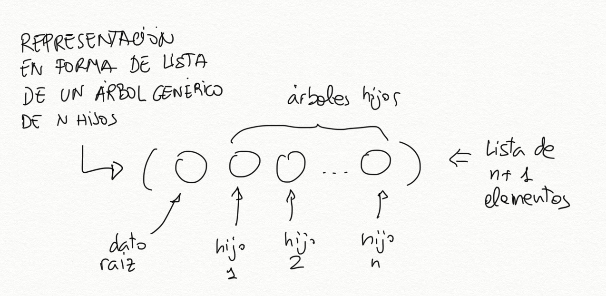

- el primer elemento la lista será el dato de la raíz
- el resto serán los árboles hijos

```text
arbol -> (dato hijo-1 hijo-2 ... hijo-n)
```

Los nodos hoja (datos al final del árbol que no tienen ningún hijo)
son también árboles. Al no tener hijos, se representan como listas con
un único elemento, el propio dato.

```text
Nodo hoja -> (dato)
```

La forma de representar el árbol anterior 

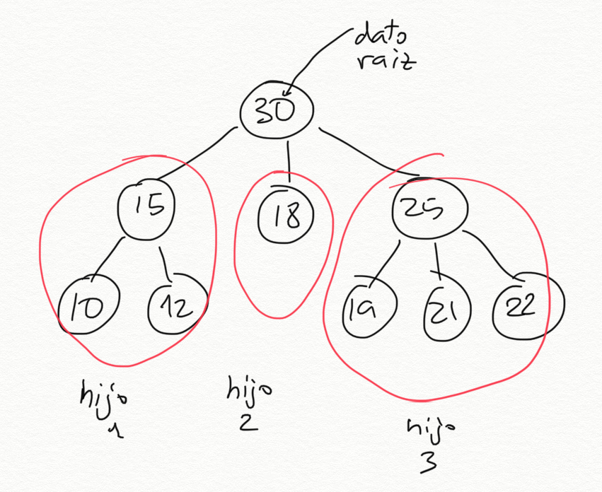

será la siguiente lista:


```racket
(30 (15 (10) (12)) (18) (25 (19) (21) (22)))
```

Los elementos de esta lista son:


- El primer elemento es el número `30`, el dato valor de la raíz del
  árbol
- El segundo elemento es la lista `(15 (10) (12))`, que representa el
  árbol con dato `15` y dos hijos
- El tercer elemento es la lista `(18)` que representa el árbol hoja
  formado por un 18
- El tercer elemento es la lista `(15 (19) (21) (22))`, que representa el
  árbol con un dato `15` y tres hijos

Podríamos definir el árbol con la siguiente sentencia:

```racket
(define arbol1 '(30 (15 (10) (12)) (18) (25 (19) (21) (22))))
```

Otro ejemplo más. ¿Cómo se implementa en Scheme el árbol de la siguiente figura?

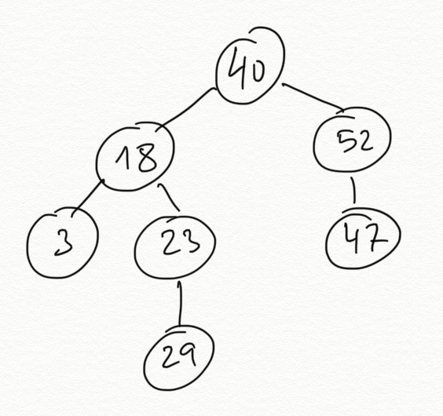

Se haría con la lista de la siguiente sentencia:

```racket
(define arbol2 '(40 (18 (3) (23 (29))) (52 (47))))
```

#### 2.1.3. Barrera de abstracción

Una vez definida la forma de representar árboles, vamos a definir las
funciones básicas para manejarlos. Veremos las funciones para obtener el dato
y los hijos y la función para construir un árbol nuevo. Estas
funciones proporcionan lo que se denomina _barrera de abstracción_
del tipo datos *árbol*.

En todos los nombres de las funciones de la barrera de abstracción
añadimos el sufijo `-arbol`.

Definimos dos conjuntos de funciones: **constructores** para construir un
nuevo árbol y **selectores** para obtener los elementos del árbol. Vamos a
empezar por los selectores.

**Selectores**

Funciones que obtienen los elementos de un árbol:

```racket
(define (dato-arbol arbol) 
    (first arbol))

(define (hijos-arbol arbol) 
    (rest arbol))

(define (hoja-arbol? arbol) 
   (null? (hijos-arbol arbol)))
```

Es importante tener claro los tipos devueltos por las dos primeras
funciones:

- `(dato-arbol arbol)`: devuelve **el dato** de la raíz del árbol.
- `(hijos-arbol arbol)`: devuelve **una lista de árboles** hijos. En
  algunas ocasiones llamaremos *bosque* a una lista de
  árboles. Podremos recorrer esa lista usando las funciones `first` y
  `rest` para obtener los árboles hijos.

Volvemos a mostrar el `arbol1` para comprobar estas funciones.


Las funciones anteriores devuelven los siguientes valores:

```racket
(dato-arbol arbol1) ; ⇒ 30
(hijos-arbol arbol1) ; ⇒ ((15 (10) (12)) (18) (25 (19) (21) (22)))
(hoja-arbol? (first (hijos-arbol arbol1))) ; ⇒ #f
(hoja-arbol? (second (hijos-arbol arbol1))) ; ⇒ #t
```

- La llamada `(dato-arbol arbol1)` devuelve el dato que hay en la raíz
  del árbol, el número `30`.
- La invocación `(hijos-arbol arbol1)` devuelve una lista de tres
  elementos, los árboles hijos:
    - El primer elemento es la lista `(15 (10) (12))`, que representa el árbol
      formado por el `15` en su raíz y las hojas `10` y `12`.
    - El segundo elemento es el árbol hoja `18`, representado por la
      lista `(18)`.
    - El tercero es la lista `(25 (19) (21) (22))`, que representa el
      árbol formado por el `25` en su raíz y las hojas `19`, `21` y `22`.
				   
Es muy importante considerar en cada caso con qué tipo de dato estamos
trabajando y usar la barrera de abstracción adecuada en cada caso:

- La función `hijos-arbol` siempre devuelve una **lista de árboles**, que
  podemos recorrer usando `first` y `rest`.
- El `first` de una lista de árboles (devuelta por `hijos-arbol`) siempre
  es un árbol y debemos de usar las funciones de su barrera de
  abstracción: `dato-arbol` e `hijos-arbol`.
- La función `dato-arbol` devuelve un **dato**, del tipo que
  guardemos en el árbol. En el caso del árbol ejemplo es un número.

Por ejemplo, para obtener el número `12` en el árbol anterior tendríamos
que hacer lo siguiente: acceder al primer elemento de la lista de
hijos, después al segundo hijo de éste y por último acceder a su
dato. Recordemos que `hijos-arbol` devuelve la lista de árboles hijos,
por lo que utilizaremos las funciones `first` y `rest` para recorrerlas y
obtener los elementos que nos interesen:

```racket
(dato-arbol (second (hijos-arbol (first (hijos-arbol arbol1)))))
; ⇒ 12
```


**Constructor**

Definimos una función constructora que abstrae la construcción de un
árbol y encapsula su implementación concreta. Para construir un árbol
necesitamos un dato y una lista de árboles hijos. Si la lista de
árboles hijos es vacía, tendremos un nodo hoja.

```racket
(define (construye-arbol dato lista-arboles)
   (cons dato lista-arboles))
```

Llamaremos a la función `construye-arbol` pasando su dato
(obligatorio) y la lista de arboles hijos. Si se pasa una lista vacía
como parámetro estaremos definiendo un nodo hoja.

Por ejemplo, para definir un nodo hoja con el dato 2:

```racket
(define arbol3 (construye-arbol 2 '()))
```

Y para definir un árbol con 3 hijos:

```racket
(define arbol4 (construye-arbol 10 (list (construye-arbol 2 '())
                                         (construye-arbol 5 '()) 
                                         (construye-arbol 9 '())))
```


El árbol 1 anterior se puede construir con las siguientes llamadas al
constructor. Guardamos los árboles hijos en variables auxiliares para
hacer más entendible la expresión:

```racket
(define arbol-15 (construye-arbol 15 (list (construye-arbol 10 '())
                                           (construye-arbol 12 '()))))
(define arbol-18 (construye-arbol 18 '()))                                             
(define arbol-25 (construye-arbol 25 (list (construye-arbol 19 '())
                                           (construye-arbol 21 '())
                                           (construye-arbol 22 '()))))
(define arbol1b (construye-arbol 30 (list arbol-15 arbol-18 arbol-25)))
arbol1b ; ⇒ (30 (15 (10) (12)) (18) (25 (19) (21) (22)))
```

#### 2.1.4. Barreras de abstracción de árboles y listas estructuradas

Es importante diferenciar la barrera de abstracción de los árboles de
la de las listas estructuradas. Aunque un árbol se implementa en
Scheme con una lista estructurada, a la hora de definir funciones
sobre árboles hay que trabajar con las funciones definidas arriba.

El siguiente esquema resumen las características de los selectores de
la barrera de abstracción de listas y árboles:

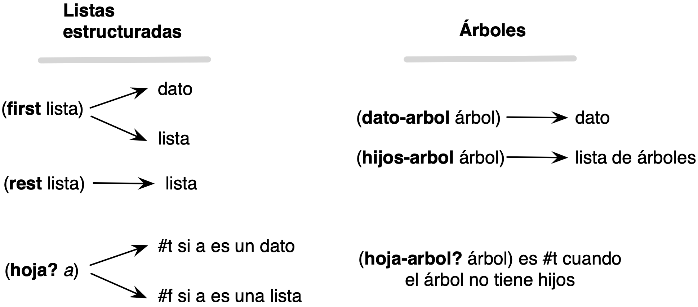

!!! Important "Importante"
    Debemos usar la barrera de abstracción al trabajar con
    árboles porque así separamos nuestro código de la implementación
    subyacente del tipo de dato. De esta forma es posible cambiar la
    implementación del tipo de dato sin afectar a las funciones que hemos
    definido usando la barrera. Lo único que hay que hacer es cambiar la
    implementación de la barrera de abstracción.
    
    Otras ventajas de utilizar la barrera de abstracción, tan
    importantes como la anterior, son:
    
    - El código es mucho más legible. Dado que Scheme es un lenguaje
    débilmente tipado, en una expresión como `(dato-arbol elem)`
    sabemos que el el elemento sobre el que se trabaja es un árbol (no
    es un número, ni un string, ni un booleano).
    
    - El código es trasladable a cualquier lenguaje de
    programación. Si queremos trabajar con árboles en JavaScript, por
    ejemplo, sólo tendremos que implementar la barrera de abstracción
    en este lenguaje. Una vez hecho eso todas las funciones que
    trabajan con árboles, como las que veremos a continuación,
    funcionarán correctamente.

### 2.2. Funciones recursivas sobre árboles

Vamos a diseñar las siguientes funciones recursivas:

* `(suma-datos-arbol arbol)`: devuelve la suma de todos los nodos
* `(to-list-arbol arbol)`: devuelve una lista con los datos del árbol
* `(cuadrado-arbol arbol)`: eleva al cuadrado todos los datos de un
  árbol manteniendo la estructura del árbol original
* `(map-arbol f arbol)`: devuelve un árbol con la estructura del árbol
  original aplicando la función f a subdatos.
* `(altura-arbol arbol)`: devuelve la altura de un árbol

Todas comparten un patrón similar de recursión mutua.

#### 2.2.1. Función suma-datos-arbol

Vamos a implementar una función recursiva que sume todos los datos de
un árbol.

Un árbol siempre va a tener un dato y una lista de hijos (que puede
ser vacía) que obtenemos con las funciones `dato-arbol` e
`hijos-arbol`. Podemos plantear entonces el problema de sumar los datos
de un árbol como la suma del dato de su raíz y lo que devuelva la
llamada a una función auxiliar que sume los datos de su lista de hijos
(llamamos _bosque_ a una lista de hijos):

```racket
(define (suma-datos-arbol arbol)
    (+ (dato-arbol arbol)
       (suma-datos-bosque (hijos-arbol arbol))))
```

Esta función suma los datos de **un** árbol. La podemos utilizar
entonces para construir la siguiente función que suma una lista de
árboles:

```racket
(define (suma-datos-bosque bosque)
   (if (null? bosque)
       0
       (+ (suma-datos-arbol (first bosque)) (suma-datos-bosque (rest bosque)))))
```

Podemos visualizar el funcionamiento de la `suma-datos-bosque` en la
siguiente figura:

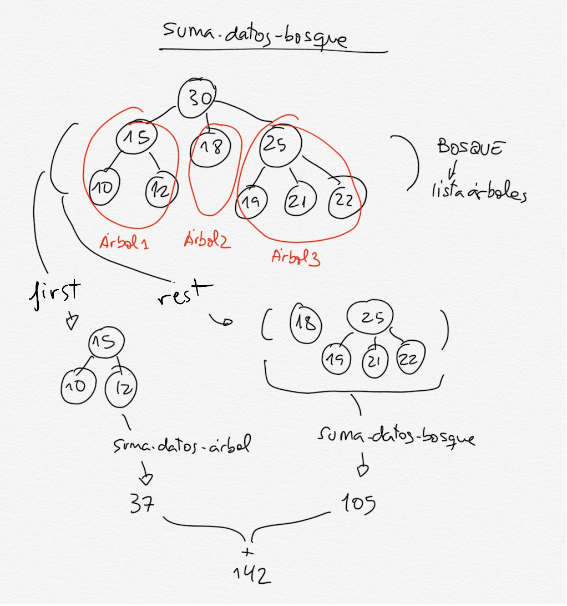

El caso general de la función obtiene el primer árbol de la lista (un
árbol) y llama a la función `suma-datos-arbol` para obtener la suma de
sus datos. También obtiene el resto del bosque (otra lista de árboles)
y llama de forma recursiva a la propia función para sumar todos sus
árboles.

Tenemos una **recursión mutua**: para sumar los datos de una lista de
árboles llamamos a la suma de un árbol individual que a su vez llama a
la suma de sus hijos, etc. La recursión termina cuando calculamos la
suma de un árbol hoja. Entonces se pasa a `suma-datos-bosque` una
lista vacía y ésta devolverá 0.


```racket
(suma-datos-arbol arbol1) ; ⇒ 172
```

**Versión alternativa con funciones de orden superior**

Al igual que hacíamos con las listas estructuradas, es posible
conseguir una versión más concisa y elegante utilizando funciones de
orden superior:

```racket
(define (suma-datos-arbol-fos arbol)
   (foldr + 
          (dato-arbol arbol) 
          (map suma-datos-arbol-fos (hijos-arbol arbol))))
```	

La función `map` aplica la propia función que estamos definiendo
(`suma-datos-arbol-fos`) a cada uno de los árboles hijos (obtenidos
con la función `(hijos-arbol arbol)`). Confiando en que la función
hace su trabajo, devolverá para cada arbol hijo la suma de todos sus
nodos. De esta forma, el resultado de `map` será una lista con la suma
de los nodos de todos los árboles hijos.

La función `foldr` suma todos esos números de la lista y el
número de la raíz.

!!! Note "Nota"
    Puede parecer que a la función anterior le falta un caso
    base. ¿Cuándo termina la recursión? La respuesta está en el
    funcionamiento de `map`, que cuando recibe una lista vacía
    devuelve también una lista vacía. Para comprobarlo, puedes pensar en
    qué pasaría si le pasas a la función un árbol hoja.

Un ejemplo de su funcionamiento sería el siguiente:

```racket
(suma-datos-arbol-fos '(1 (2 (3) (4)) (5) (6 (7)))) ⇒
   (foldr + 
          1 
          (map suma-datos-arbol-fos '((2 (3) (4)) 
                                      (5)
                                      (6 (7))))) ⇒
(foldr + 1 '(9 5 13)) ⇒
28
```

- El árbol que queremos sumar tiene un 1 en la raíz y tres hijos: `(2
(3) (4))`, `(5)` y `(6 (7))`. 
- La aplicación de `map suma-datos-arbol-fos` sobre la lista de hijos
devuelve una lista con la suma de los nodos de cada hijo: `(9 5 13)`.
- La función `foldr` suma esa lista y el valor del nodo raíz (`1`).

Podemos visualizar gráficamente el funcionamiento del `map` con la
siguiente figura:

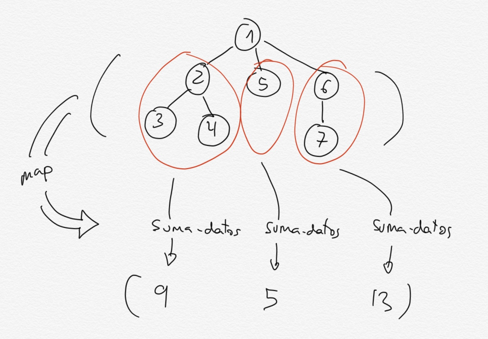

#### 2.2.2. Función to-list-arbol

Queremos diseñar una función `(to-list-arbol arbol)` que devuelva una
lista con los datos del árbol en un recorrido *preorden* (primero el
dato de la raíz y después el dato de sus hijos de izquierda a derecha).

La solución, siguiendo el patrón visto en `suma-datos`, es la siguiente.

```racket
(define (to-list-arbol arbol)
   (cons (dato-arbol arbol)
         (to-list-bosque (hijos-arbol arbol))))

(define (to-list-bosque bosque)
   (if (null? bosque)
       '()
       (append (to-list-arbol (first bosque))
               (to-list-bosque (rest bosque)))))
```

Igual que antes, la función utiliza una *recursión mutua*: para listar
todos los nodos, añadimos el dato a la lista de nodos que nos devuelve
la función `to-list-bosque`. Esta función coge una lista de árboles
(un *bosque*) y devuelve la lista *preorden* de sus nodos. Para ello,
concatena la lista de los nodos de su primer elemento (el primer
árbol) a la lista de nodos del resto de árboles (que devuelve la
llamada recursiva).

Ejemplo:

```racket
(to-list-arbol '(* (+ (5) (* (2) (3)) (10)) (- (12)))) 
; ⇒ (* + 5 * 2 3 10 - 12)
```

Una definición alternativa usando funciones de orden superior:

```racket
(define (to-list-arbol-fos arbol)
    (cons (dato-arbol arbol)
          (foldr append '() (map to-list-arbol-fos (hijos-arbol arbol)))))
```

Esta versión es muy elegante y concisa. Usa la función `map` que
aplica una función a los elementos de una lista y devuelve la lista
resultante. Como lo que devuelve `(hijos-arbol arbol)` es precisamente
una lista de árboles podemos aplicar a sus elementos cualquier función
definida sobre árboles. Incluso la propia función que estamos
definiendo (¡confía en la recursión!).

#### 2.2.3. Función cuadrado-arbol

Veamos ahora la función `(cuadrado-arbol arbol)` que toma un árbol de
números y devuelve un árbol con la misma estructura y sus datos
elevados al cuadrado:

```racket
(define (cuadrado-arbol arbol)
   (construye-arbol (cuadrado (dato-arbol arbol))
                    (cuadrado-bosque (hijos-arbol arbol))))

(define (cuadrado-bosque bosque)
   (if (null? bosque)
       '()
       (cons (cuadrado-arbol (first bosque))
               (cuadrado-bosque (rest bosque)))))
```

Ejemplo:

```racket
(cuadrado-arbol '(2 (3 (4) (5)) (6))) 
; ⇒ (4 (9 (16) (25)) (36))
```

Versión 2, con la función de orden superior `map`:

```racket
(define (cuadrado-arbol-fos arbol)
   (construye-arbol (cuadrado (dato-arbol arbol))
   	                (map cuadrado-arbol-fos (hijos-arbol arbol))))
```

#### 2.2.4. Función `map-arbol`

La función `map-arbol` es una función de orden superior que generaliza
la función anterior. Definimos un parámetro adicional en el que se
pasa la función a aplicar a los elementos del árbol.

```racket
(define (map-arbol f arbol)
   (construye-arbol (f (dato-arbol arbol))
                    (map-bosque f (hijos-arbol arbol))))  

(define (map-bosque f bosque)
   (if (null? bosque)
       '()
       (cons (map-arbol f (first bosque))
             (map-bosque f (rest bosque)))))
```

Ejemplos:

```racket
(map-arbol cuadrado '(2 (3 (4) (5)) (6)))
; ⇒ (4 (9 (16) (25)) (36))
(map-arbol (lambda (x) (+ x 1)) '(2 (3 (4) (5)) (6)))
; ⇒ (3 (4 (5) (6)) (7))
```

Con `map`:

```racket
(define (map-arbol-fos f arbol)
  (construye-arbol (f (dato-arbol arbol))
               (map (lambda (x)
                       (map-arbol-fos f x)) (hijos-arbol arbol))))
```


#### 2.2.5. Función `altura-arbol`

Vamos por último a definir una función que devuelve la altura de un
árbol. 

Recordemos las siguientes definiciones relacionadas con los árboles:

- Longitud de un camino entre dos nodos: número de aristas.
- Altura de un nodo: longitud del camino más largo del nodo a una hoja.
- Profundidad de un nodo: longitud del camino de la raíz al nodo.
- Profundidad de un árbol: profundidad del nodo más profundo.
- Nivel de un nodo: número de predecesores.
- Altura de árbol: altura de la raíz.

Podemos implementar la altura de una forma similar a como hicimos con
las listas estructuradas: calculamos la altura de los árboles hijos,
nos quedamos con la mayor, y sumamos 1 para añadir la arista del
camino de la raíz al hijo.

La mayor altura de los hijos la calculamos con la función
`altura-bosque`.

```racket
(define (altura-arbol arbol)
   (if (hoja-arbol? arbol)
       0
       (+ 1 (altura-bosque (hijos-arbol arbol)))))

(define (altura-bosque bosque)
    (if (null? bosque)
        0
        (max (altura-arbol (first bosque))
             (altura-bosque (rest bosque)))))
```

Ejemplos:


```racket
(altura-arbol '(2)) ;  ⇒ 0
(altura-arbol '(4 (9 (16) (25)) (36))) ; ⇒ 2
```

La solución con funciones de orden superior es similar a la
que vimos con listas estructuradas:

```racket
(define (altura-arbol-fos arbol)
  (if (hoja-arbol? arbol)
      0
      (+ 1 (foldr max 0
                  (map altura-arbol-fos (hijos-arbol arbol))))))
```
	
La función `map` mapea sobre los árboles hijos la propia función, que
calcula la altura de cada hijo (será uno menos que la altura del padre, 0
si se trata de una hoja).

La función `map` devuelve entonces una lista altura de los hijos, de
la que obtenemos el máximo plegando la lista con la función `max`. 

Por último sumamos 1 para devolver la altura del árbol completo (un
nivel más que el nivel máximo de los hijos).

## 3. Arboles binarios

### 3.1. Definición de árboles binarios en Scheme

Los árboles binarios son árboles cuyos nodos tienen 0, 1 o 2
hijos. Por ejemplo, el árbol mostrado en la siguiente figura es un
árbol binario.

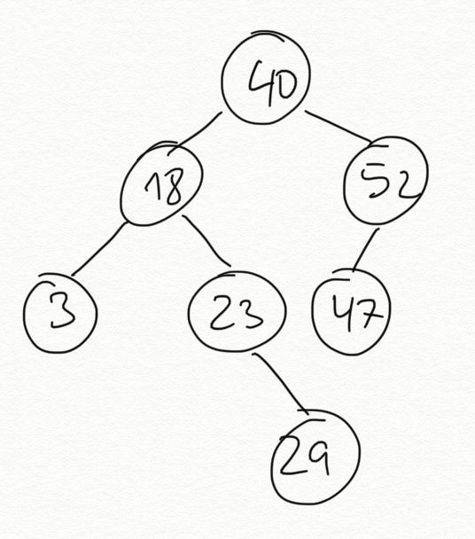

A diferencia de los árboles genéricos vistos anteriormente un árbol
binario no puede tener más de dos hijos.

Los representaremos en Scheme utilizando una lista de tres elementos:

- Dato
- Hijo izquierdo (otro árbol binario)
- Hijo derecho (otro árbol binario)

En el caso en que no exista el hijo izquierdo o el derecho (o ambos)
utilizaremos una lista vacía para indicar un nodo vacío.

De esta manera, un nodo hoja con el dato 10 se representará en Scheme con la lista:

```racket
(10 () ())
```

Por ejemplo, representamos el árbol de la figura anterior con la
siguiente lista:

```racket
(40 (18 (3 () ())
        (23 ()
            (29 () ())))
    (52 (47 () ())
        ()))
```

Visualmente lo podemos representar de la siguiente forma. La no
existencia de un hijo izquierdo o un hijo derecho se representa por
una lista vacía.

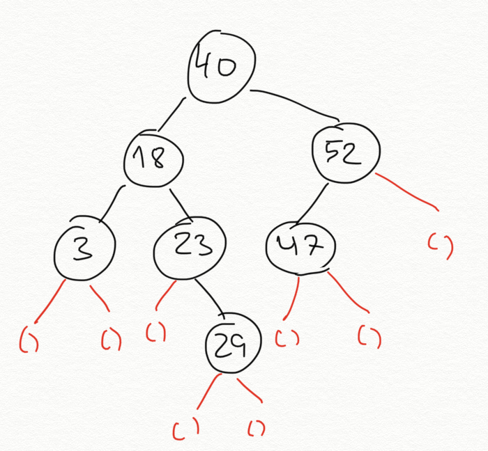

#### 3.1.1. Barrera de abstracción ####

Definimos la siguiente barrera de abstracción para los árboles
binarios. Terminamos todos los nombres de las funciones con el sufijo
`-arbolb` (árbol binario).

**Selectores**

Los selectores de la barrera de abstracción del árbol binario son los
siguientes.

```racket
(define (dato-arbolb arbol)
   (first arbol))
   
(define (hijo-izq-arbolb arbol)
   (second arbol))

(define (hijo-der-arbolb arbol)
   (third arbol))
   
(define arbolb-vacio '())

(define (vacio-arbolb? arbol)
   (equal? arbol arbolb-vacio))

(define (hoja-arbolb? arbol)
   (and (vacio-arbolb? (hijo-izq-arbolb arbol))
        (vacio-arbolb? (hijo-der-arbolb arbol))))
```

Como parte de la barrera de abstracción definimos la constante
`arbolb-vacio`, que toma el valor de una lista vacía.

**Constructor**

```racket
(define (construye-arbolb dato hijo-izq hijo-der)
    (list dato hijo-izq hijo-der))
```

Por ejemplo, para construir un árbol con 10 en la raíz y 8 en su hijo
izquierdo y 15 en su derecho utilizando el constructor de la barrera
de abstracción:

```racket
(define arbolb1
   (construye-arbolb 10 (construye-arbolb 8 arbolb-vacio arbolb-vacio)
                        (construye-arbolb 15 arbolb-vacio arbolb-vacio)))
```

Otro ejemplo, el árbol binario de la figura anterior utilizando el
constructor de la barrera de abstracción:

```racket
(define arbolb2
   (construye-arbolb 40 
                 (construye-arbolb 18
                               (construye-arbolb 3 arbolb-vacio arbolb-vacio)
                               (construye-arbolb 23 
                                             arbolb-vacio
                                             (construye-arbolb 29 
                                                           arbolb-vacio
                                                           arbolb-vacio)))
                 (construye-arbolb 52
                               (construye-arbolb 47 arbolb-vacio arbolb-vacio)
                               arbolb-vacio)))
```

### 3.2. Funciones recursivas sobre árboles binarios

Veamos las siguientes funciones recursivas sobre árboles binarios:

* `(suma-datos-arbolb arbol)`: devuelve la suma de todos los nodos
* `(to-list-arbolb arbol)`: devuelve una lista con los datos del árbol
* `(cuadrado-arbolb arbol)`: eleva al cuadrado todos los datos de un
  árbol manteniendo la estructura del árbol original

Estas funciones utilizan una mezcla de los patrones usados en la
recursión para trabajar con árboles genéricos y la recursión para
trabajar con listas estructuradas. Tenemos un dato en la raíz, que
tenemos que combinar con lo que devuelve la recursión aplicada sobre
el hijo izquierdo y lo que devuelve la recursión aplicada sobre el
hijo derecho.


**suma-datos-arbolb**

```racket
(define (suma-datos-arbolb arbol)
   (if (vacio-arbolb? arbol)
      0
      (+ (dato-arbolb arbol)
         (suma-datos-arbolb (hijo-izq-arbolb arbol))
         (suma-datos-arbolb (hijo-der-arbolb arbol)))))

(suma-datos-arbolb arbolb2) ; ⇒ 212
```

Como el hijo izquierdo y el hijo derecho son también árboles binarios,
podemos llamar a la recursión con esos árboles. Esas llamadas
recursivas nos devolverán la suma de los datos en cada subárbol. Y
sumamos el dato de la raíz.

Para definir el caso base, podemos ver que en cada llamada recursiva
vamos obteniendo el hijo izquierdo y el hijo derecho. Al final
llegaremos a un árbol vacío, en cuyo caso devolvemos 0. 

La siguiente figura representa el funcionamiento del caso general.


**to-list-arbolb**

La función `to-list-arbolb` es similar a la vista con los árboles
genéricos. Recibe un árbol binario y devuelve una lista con los datos
en un recorrido preorden.


```racket
(define (to-list-arbolb arbol)
   (if (vacio-arbolb? arbol)
      '()
      (cons (dato-arbolb arbol)
            (append (to-list-arbolb (hijo-izq-arbolb arbol))
                    (to-list-arbolb (hijo-der-arbolb arbol))))))

(to-list-arbolb arbolb2) ; ⇒ (40 18 3 23 29 52 47)
```

El funcionamiento es similar a la suma: llamamos a la recursión por la
izquierda y por la derecha. El resultado de las llamadas recursivas
serán dos listas que tenemos que concatenar con `append`. Y por
últimos añadimos en cabeza el dato de la raíz con `cons`.


**cuadrado-arbolb**

Por último, la función `cuadrado-arbolb` construye un nuevo árbol
binario elevando al cuadrado el dato de la raíz, su hijo izquierdo y
su hijo derecho. Para construir el árbol binario llamamos al
constructor `construye-arbolb`.

```racket
(define (cuadrado-arbolb arbol)
   (if (vacio-arbolb? arbol)
      arbolb-vacio
      (construye-arbolb (cuadrado (dato-arbolb arbol))
                        (cuadrado-arbolb (hijo-izq-arbolb arbol))
                        (cuadrado-arbolb (hijo-der-arbolb arbol)))))

(cuadrado-arbolb arbolb1) ; ⇒ (100 (64 () ()) (225 () ()))
```


## 4. Bibliografía - SICP

En este tema explicamos conceptos de los siguientes capítulos del libro *Structure and Intepretation of Computer Programs*:

- [2.2.2 - Hierarchical Structures](https://mitpress.mit.edu/sites/default/files/sicp/full-text/book/book-Z-H-15.html#%_sec_2.2.2)

-->

----

Lenguajes y Paradigmas de Programación, curso 2023-24  
© Departamento Ciencia de la Computación e Inteligencia Artificial, Universidad de Alicante  
Domingo Gallardo, Cristina Pomares, Antonio Botía, Francisco Martínez

