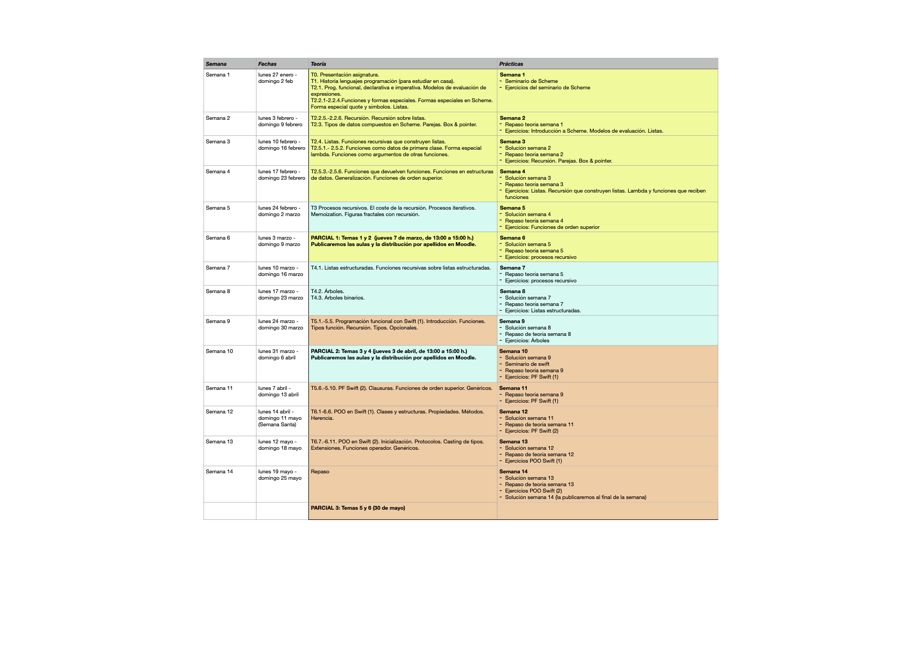
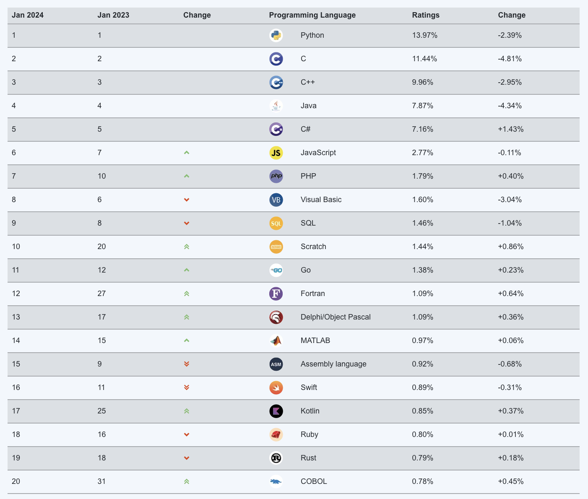
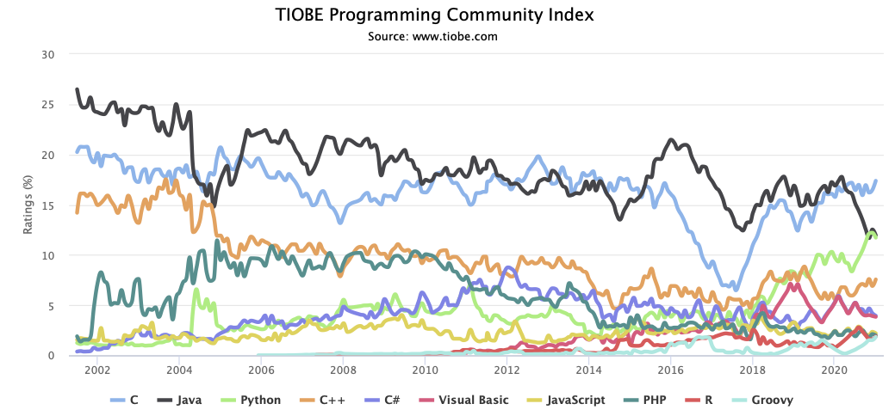
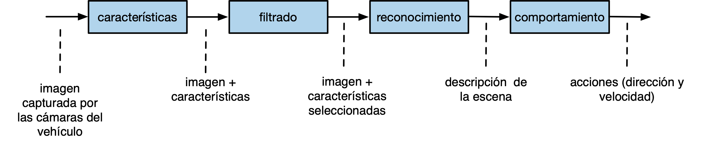

# Semana 1

Notas de clase de la semana 1 de LPP.

---
# Tema 0: Presentación de la asignatura
---

<p style="margin-bottom:2cm;"></p>

- Usamos
  [Moodle](https://moodle2024-25.ua.es/moodle/course/view.php?id=4543)
  para mostrar la planificación semanal, subir prácticas,
  etc. 
- Utilizaremos el foro para enviar avisos. También lo podéis usar
  vosotros para plantear dudas, consultas, etc. Así todos nos
  enteremos de las contestaciones.
- Los apuntes y prácticas están en la web de apuntes de la asignatura: [https://domingogallardo.github.io/apuntes-lpp/](https://domingogallardo.github.io/apuntes-lpp/).

<p style="margin-bottom:2cm;"></p>

### Temario

- 3 bloques temáticos:

    1. Programación funcional (Scheme): temas 1 y 2
    2. Procesos y estructuras recursivas (Scheme): temas 3 y 4
    3. Programación funcional en Swift y programación orientada a
       objetos avanzada (Swift): temas 5 y 6

- Temas:
    - T1. Lenguajes de programación
    - T2. Programación Funcional
    - T3. Procedimientos recursivos
    - T4. Estructuras recursivas
    - T5. Programación funcional en Swift
    - T6. Programación Orientada a Objetos Avanzada en Swift

<p style="margin-bottom:2cm;"></p>

### Planificación  ###



<p style="margin-bottom:2cm;"></p>

### Horarios ###


En los turnos de teoría es posible, de forma excepcional, asistir a un
grupo distinto del asignado. 

En los turnos de prácticas se debe asistir al grupo al que se ha
asignado. El cambio de turno deberá solicitarse en la Secretaría de la EPS.

<p style="margin-bottom:2cm;"></p>

### Prácticas  ###

- 2 seminarios: Scheme y Swift
- 12 hojas de ejercicios semanales en Scheme (temas 1-4) y Swift
  (temas 5-6).
- Disponibles al comienzo de la semana y se realizarán en las sesiones
  de prácticas y en casa. Al final de la semana se entregarán en
  Moodle y se publicará la solución.

!!! danger "No sirve de nada mirar las soluciones si no has trabajado" 
    El objetivo de publicar la solución de los ejercicios es
    que corrijas tu propia solución comparándola con la publicada.
    En la clase de prácticas podrás preguntar a tu profesor cualquier
    duda que te pueda surgir de esta revisión. Esta es la forma
    correcta de aprender a programar. No sirve de nada aprender de
    memoria las soluciones si no has trabajado previamente los
    ejercicios.
    
<p style="margin-bottom:2cm;"></p>

### Evaluación

La asignatura se divide en 3 bloques temáticos, todos ellos de igual
duración, en los que se utilizará el lenguaje de programación que
aparece entre paréntesis: 

- Programación funcional (temas 1 y 2, Scheme)
- Recursión y estructuras de datos recursivas (temas 3 y 4, Scheme)
- Programación funcional en Swift y programación orientada a objetos (temas 5 y 6, Swift)

Se realizarán tres exámenes parciales escritos sobre los conceptos de
cada uno de los bloques temáticos (teoría y práctica). Los parciales
tendrán la siguiente ponderación en la nota final: 

- Parcial 1: 35%
- Parcial 2: 30%
- Parcial 3: 35%

No se exige nota mínima en ninguno de los parciales. Los parciales 1 y
2 se realizarán durante el curso. El parcial 3 se realizará en la
fecha del examen oficial de la convocatoria ordinaria de la
asignatura. 

!!! danger "Sobre los dispositivos móviles"
    Durante la realización de los exámenes no está permitido que llevéis encima
    ningún dispositivo con conexión a internet (smartphones, smart
    watches, tablets, etc). Antes de empezar la prueba, se deberán
    dejar dentro de las mochilas, y éstas en el suelo. En caso de no
    cumplir esta norma, la prueba queda invalidada con
    calificación de 0. 

<p style="margin-bottom:2cm;"></p>

### Consejos para aprender con éxito ###

- Consejos:
     - Trabajar todas las semanas y seguir el ritmo de la asignatura.
     - Trabajar todos los ejemplos de teoría, probándolos en el
       ordenador y entendiéndolos (no aprenderlos de memoria).
     - Usar lápiz y papel para enfrentarse con los problemas.

- Algunos comentarios:

!!! quote "Cómo dominar los conceptos" 
    Para superar la asignatura lo que hice fue estudiar mucho. Hay que practicar y sobre todo
    entender los ejercicios y no sabérselos de memoria. Una vez
    dominados los ejercicios yo mismo me propuse variantes de los
    mismos. Así es como se domina.

!!! quote "No copiar las prácticas"
    El mayor problema que creo que existe es que muchas personas se
    relajan y se copian las prácticas en cuanto les resultan un poco
    difíciles o les lleva algo mas del tiempo que les gustaría. Esta
    asignatura si no haces tu los ejercicios y te peleas con ellos es
    prácticamente imposible de sacar.

!!! quote "No memorizar"
    Otra de las cosas es que tienes que cambiar la forma de estudiar,
    no vale memorizar, ni hacer muchos ejercicios sin más. Tienes que
    entender bien el funcionamiento de la recursión para luego poder
    practicar con ejercicios, sino no sirve. [...] En mi opinión el
    problema de LPP para mucha gente es que para los exámenes se
    memorizan los ejercicios de prácticas de las soluciones que se dan
    en clase.

<p style="margin-bottom:2cm;"></p>

---
# Tema 1: Lenguajes de programación.

Tema no presencial para estudiar en casa.

---

<p style="margin-bottom:2cm;"></p>

### Algunos lenguajes importantes y su fecha de creación

| 1950-1960   | 1970  | 1980 | 1990 | 2000 |
| :---------: | :---: | :---: | :---: | :---: |
| 1957 FORTRAN | 1970 Pascal     | 1980 Smalltalk-80   |  1990 Haskell   | 2000 C#  |  
| 1958 ALGOL |  1972 Prolog  | 1983 Objective-C   | 1991 Python   | 2003 Scala  |  
| 1960 Lisp | 1972 C | 1983 Ada   |  1993 Ruby  | 2003 Groovy  |  
| 1960 COBOL | 1975 Scheme | 1986 C++  | 1995 Java  | 2009 Go  |  
| 1962 APL |  1975 Modula   | 1986 Eiffel   | 1995 Racket  |  2014 Swift |  
| 1964 BASIC |      | 1987 Perl   |    |   |  
| 1967 SIMULA |      |    |    |   |  


<p style="margin-bottom:2cm;"></p>

### Genealogía de los lenguajes de programación


<p style="margin-bottom:2cm;"></p>

### Lista TIOBE ###

La [lista
TIOBE](http://www.tiobe.com/index.php/content/paperinfo/tpci/index.html)
se publica cada año indicando los lenguajes de programación más
populares.





<p style="margin-bottom:2cm;"></p>

### Paradigmas de programación  ###

* Paradigmas más importantes de programación:
    * Paradigma funcional (Lisp, Scheme, Haskell, Racket)
    * Paradigma lógico (Prolog)
    * Paradigma imperativo o procedural (FORTRAN, BASIC, C, JavaScript)
    * Paradigma orientado a objetos (Modula, Java, C++)

---
# Tema 2: Programación funcional 

### Veremos hoy

1. El paradigma de Programación Funcional  
2. Programación declarativa vs. imperativa  
3. Evaluación de expresiones en Scheme  
4. Definición y composición de funciones  
5. Modelo de computación de sustitución  
   - Orden aplicativo  
   - Orden normal  
6. Scheme: funciones y formas especiales  
   - `define`, `if`, `cond`  
   - `quote`, símbolos y listas  
---

<p style="margin-bottom:2cm;"></p>

### Definición de programación funcional

!!! note "Un programa funcional es"
    Un conjunto de funciones matemáticas que convierten
    unas entradas en unas salidas, sin ningún estado interno y ningún
    efecto lateral.

- Es posible utilizar este paradigma en muchos lenguajes de
  programación, aunque no sean estrictamente funcionales.

<p style="margin-bottom:2cm;"></p>

### Principales características del paradigma funcional ###

- Definiciones de funciones matemáticas puras, sin estado interno ni
  efectos laterales
- Valores inmutables
- Uso profuso de la recursión en la definición de las funciones
- Uso de listas como estructuras de datos fundamentales
- Funciones como tipos de datos primitivos: expresiones lambda y
  funciones de orden superior

<p style="margin-bottom:2cm;"></p>

### Lenguajes de programación funcional

Lenguajes modernos principalmente funcionales:

- [Clojure](https://en.wikipedia.org/wiki/Clojure)
- [Erlang](https://en.wikipedia.org/wiki/Erlang_(programming_language))

Lenguajes multi-paradigma en los que se puede usar POO y PF:

- [Ruby](https://en.wikipedia.org/wiki/Ruby_(programming_language))
- [Python](https://en.wikipedia.org/wiki/Python_(programming_language))
- [Groovy](https://en.wikipedia.org/wiki/Groovy_(programming_language))
- [Scala](https://en.wikipedia.org/wiki/Scala_(programming_language))
- [Swift](https://en.wikipedia.org/wiki/Swift_(programming_language))

Lenguaje funcional puro más importante:

- [Haskell](https://en.wikipedia.org/wiki/Haskell_(programming_language))


<p style="margin-bottom:2cm;"></p>

!!! note "Ventajas del paradigma funcional"
    - Facilita la programación de sistemas concurrentes, con múltiples hilos de
      ejecución o con múltiples computadores ejecutando procesos conectados.
    - Permite la definición y composición de múltiples operaciones sobre *streams*
      de forma muy concisa y compacta, aplicable a la programación de sistemas
      distribuidos en Internet.
    - Favorece una programación interactiva y evolutiva.

!!! note "Aplicaciones prácticas de la programación funcional"
    - Paradigma muy popular en la actualidad.
    - Artículos y charlas recomendadas:
    - Lupo Montero - [Introducción a la programación funcional en JavaScript](https://medium.com/laboratoria-how-to/introducción-a-la-programación-funcional-en-javascript-parte-1-e0b1d0b2142e) (Blog)
    - Andrés Marzal - [Por qué deberías aprender programación funcional ya mismo](https://www.youtube.com/watch?v=jG4QuREv5fE) (Charla en YouTube)
    - Mary Rose Cook - [A practical introduction to functional programming](https://maryrosecook.com/blog/post/a-practical-introduction-to-functional-programming) (Blog)
    - Ben Christensen - [Functional Reactive Programming in the Netflix API](https://www.infoq.com/presentations/Netflix-API-rxjava-hystrix) (Charla en InfoQ)


<p style="margin-bottom:2cm;"></p>


## Programación declarativa vs. imperativa

### Programación declarativa

- La PF es un estilo de **programación declarativa**, frente a la programación tradicional imperativa.
- Se **declaran** valores y objetivos o características de los elementos de programa.  
- No hay pasos intermedios. 
- Modelo matemático.  
- Ejecución "instantánea", sin pasos de ejecución

Ejemplos:

- Hoja de cálculo  
- Programación lógica (Prolog)
- Programación funcional  

Otro ejemplo de programación declarativa: SwiftUI.


### Programación imperativa

- Pasos de ejecución  
- Asignación  
- Mutación  
- Estado local mutable  

#### Pasos de ejecución

Pasos de ejecución en C:

```c
int a = cuadrado(8);
int b = doble(a);
int c = cuadrado(b);
return c;
```

En programación funcional, en lugar de pasos de ejecución se utiliza la **composición de funciones**. El ejemplo anterior se expresa de la siguiente forma en **programación funcional**:

```racket
(cuadrado (doble (cuadrado 8)))
```

#### Mutación 

Asignación destructiva o mutación:

```java
int x = 10;
x = x + 1;
```

En **programación funcional** los valores definidos son **inmutables**:

```racket
#lang racket

(define a 12)
(define a 200)
```

tendremos el siguiente error:

```text
module: identifier already defined in: a
```

<p style="margin-bottom:2cm;"></p>

#### Mutación y efectos laterales

- Referencias + mutación = efectos laterales (_side effect_ en inglés)

Ejemplo de mutación:

```java
Point2D p1 = new Point2D(3.0, 2.0); // la coord x de p1 es 3.0
p1.getCoordX(); // la coord x de p1 es 3.0
p1.setCoordX(10.0);
p1.getCoordX(); // la coord x de p1 es 10.0
```

Ejemplo de efecto lateral:

```java
Point2D p1 = new Point2D(3.0, 2.0); // la coord x de p1 es 3.0
p1.getCoordX(); // la coord x de p1 es 3.0
Point2D p2 = p1;
p2.setCoordX(10.0);
p1.getCoordX(); // la coord x de p1 es 10.0, sin que ninguna sentencia haya modificado directamente p1
```

- Los efectos laterales permiten definir estructuras de datos más eficientes, pero también generan _bugs_ complicados de depurar. Sobre todo cuando se están programando sistemas concurrentes con múltiples hilos de ejecución.


<p style="margin-bottom:2cm;"></p>

#### Estado local mutable

Función con estado local mutable en lenguaje imperativo (Java):


```java
public class Contador {
   	int c;
    
    public Contador(int valorInicial) {
        c = valorInicial;
    }
    
    public int valor() {
        c++;
        return c;
    }
}

Contador cont = new Contador(10);
cont.valor(); // 11
cont.valor(); // 12
cont.valor(); // 13
```

En C:

```c
int function contador () {
    static int c = 0;
	
	c++;
	return c;
}
	
contador(); // 1
contador(); // 2
contador(); // 3
```	

**Por el contrario**, los lenguajes funcionales puros tienen la propiedad
de *transparencia referencial*: si se sustituye una expresión por su valor el resultado final no debe cambiar. -> funciones no modifican estado.

<p style="margin-bottom:2cm;"></p>

### Resumen

**Características de la programación declarativa**

* Variable = nombre dado a un valor (declaración)
* No existe asignación ni cambio de estado
* No existe mutación, se cumple la *transparencia referencial*: dentro
  de un mismo ámbito todas las ocurrencias de una variable y las
  llamadas a funciones devuelven el mismo valor

**Características de la programación imperativa**

* Variable = nombre de una zona de memoria
* Asignación
* Referencias
* Pasos de ejecución


## Evaluación de expresiones en Scheme

- En la asignatura usaremos Scheme como primer lenguaje en el que exploraremos la programación funcional.

- Vamos a empezar a ver un ejemplo concreto de programación funcional viendo cómo se evalúan expresiones y cómo se definen funciones en Scheme.

<p style="margin-bottom:2cm;"></p>

### Evaluación de expresiones

```racket
2 ⇒ 2
(+ 2 3) ⇒ 5
(+) ⇒ 0
(+ 2 4 5 6) ⇒ 17
(+ (* 2 3) (- 3 1)) ⇒ 8
```

Se dice "**evaluar una expresión**" en lugar de "**ejecutar una expresión**". La evaluación se realiza de dentro a fuera.

Por ejemplo, ¿cuál es la evaluación de la siguiente expresión?:

```racket
(+ (* 2 3) (- 3 (/ 12 3)))
```

<p style="margin-bottom:3cm;"></p>

## Definición de funciones en Scheme

```racket
(define (cuadrado x)
  (* x x))
```

- No existe `return`  
- El cuerpo es una expresión  

Uso:

```racket
(cuadrado 10) ⇒ 100
(cuadrado (+ 10 (cuadrado (+ 2 4)))) ⇒ 2116
```

<p style="margin-bottom:2cm;"></p>

### Funciones auxiliares y composición

- Lo habitual en programación funcional es definir funciones muy pequeñas e ir construyendo funciones cada vez de mayor nivel usando las anteriores.

- No demasiado bien:

```racket
(define (suma-cuadrados x y)
   (+ (* x x) (* y y)))
```

- Mucho más correcto:

```racket
(define (cuadrado x)
   (* x x))

(define (suma-cuadrados x y)
   (+ (cuadrado x) (cuadrado y)))
```

<p style="margin-bottom:2cm;"></p>

### Composición de funciones

- Una idea fundamental de la programación funcional es la composición de
funciones que transforman unos datos de entrada en otros de salida. 
- Ejemplo: procesamiento de imágenes en vehículos autónomos:



- En un lenguaje de programación funcional como Scheme (cuidado: la evaluación
  se hace de dentro a afuera):

```racket
(define (conduce-vehiculo imagenes)
    (obten-acciones 
        (reconoce 
            (filtra 
                (obten-caracteristicas imagenes)))))
```


<p style="margin-bottom:2cm;"></p>


## Modelo de computación de sustitución

- El **modelo de sustitución** es un modelo muy sencillo que permite definir la semántica de la evaluación de expresiones en lenguajes
funcionales como Scheme. 

- Basado en la reescritura de unos términos por otros

!!! note "Reglas del modelo de sustitución"
    1. Si *e* es un valor primitivo (por ejemplo, un número), devolvemos ese
       mismo valor.
    2. Si *e* es un identificador, devolvemos su valor asociado con un
       `define` (se lanzará un error si no existe ese valor).
    3. Si *e* es una expresión del tipo *(f arg1 ... argn)*, donde *f* es
       el nombre de una función primitiva (`+`, `-`, ...), evaluamos uno a
       uno los argumentos *arg1* ... *argn* (con estas mismas reglas) y
       evaluamos la función primitiva con los resultados.
   
La regla 4 tiene dos variantes, dependiendo del orden de
evaluación que utilizamos.

!!! note "Orden aplicativo"
    4. Si *e* es una expresión del tipo *(f arg1 ... argn)*, donde *f*
       es el nombre de una función definida con un `define`, tenemos
       que evaluar primero los argumentos _arg1_ ... _argn_ y después
       **sustituir _f_ por su cuerpo**, reemplazando cada parámetro
       formal de la función por el correspondiente **argumento
       evaluado**. Después evaluaremos la expresión resultante usando
       estas mismas reglas.

!!! note "Orden normal"
    4. Si *e* es una expresión del tipo *(f arg1 ... argn)*, donde *f*
       es el nombre de una función definida con un `define`, tenemos
       que **sustituir _f_ por su cuerpo**, reemplazando cada
       parámetro formal de la función por el correspondiente
       **argumento sin evaluar**. Después evaluar la expresión
       resultante usando estas mismas reglas.

- Ambas formas de evaluación darán el mismo resultado en programación
funcional. Scheme utiliza el orden aplicativo.

- En el orden aplicativo se realizan las evaluaciones antes de realizar
las sustituciones, lo que define una evaluación de *dentro a fuera* de
los paréntesis. Cuando se llega a una expresión primitiva se
evalúa.

- En el orden normal se realizan todas las sustituciones hasta que se
tiene una larga expresión formada por expresiones primitivas; se
evalúa entonces.

- Comprobamos las sustituciones en cada tipo de orden.

```racket
(define (doble x) 
    (+ x x))
    
(define (cuadrado y) 
    (* y y))

(define a 2)

(doble (cuadrado a))
```


Orden aplicativo:

```text
(doble (cuadrado a)) ⇒       ; Sustituimos a por su valor (R2)
(doble (cuadrado 2)) ⇒       ; Sustitumos cuadrado por su cuerpo (R4)
(doble (* 2 2)) ⇒            ; Evaluamos (* 2 2) (R3)
(doble 4) ⇒                  ; Sustituimos doble por su cuerpo (R4)
(+ 4 4) ⇒                    ; Evaluamos (+ 4 4) (R3)
8
```


Orden normal:

```text
(doble (cuadrado a)) ⇒            ; Sustituimos doble por su cuerpo (R4)
(+ (cuadrado a) (cuadrado a) ⇒    ; Sustituimos cuadrado por su cuerpo (R4)
(+ (* a a) (* a a)  ⇒             ; Sustitumos a por su valor (R2)
(+ (* 2 2) (* 2 2)  ⇒             ; Evaluamos (* 2 2) (R3)
(+ 4 (* 2 2))  ⇒                  ; Evaluamos (* 2 2) (R3)
(+ 4 4)  ⇒                        ; Evaluamos (+ 4 4) (R3)
8
```

- Scheme utiliza orden aplicativo.
- Repasar un ejemplo algo más complicado en los apuntes.

!!! note
    En funciones puras ambos órdenes producen el mismo resultado.
    
Ejemplo de resultado distinto con funciones no puras:

```racket
(define (zero x) (- x x))
(zero (random 10))
```

<p style="margin-bottom:2cm;"></p>

## Funciones y formas especiales en Scheme 

- Primitivas de Scheme: funciones y formas especiales
- Las funciones se evalúan con el modelo de evaluación visto. 
- Las *formas especiales* son expresiones primitivas de Scheme que
tienen una forma de evaluarse propia.


<p style="margin-bottom:2cm;"></p>

### Forma especial `define`

**Sintaxis**

```racket
(define <identificador> <expresión>)
```

**Evaluación**

1. Evaluar *expresión*
2. Asociar el valor resultante con el *identificador*

**Ejemplo**

```racket
(define base 10)   ; Asociamos a 'base' el valor 10
(define altura 12) ; Asociamos a 'altura' el valor 12
(define area (/ (* base altura) 2)) ; Asociamos a 'area' el valor 60
```

<p style="margin-bottom:2cm;"></p>

### Forma especial `define` para definir funciones

**Sintaxis**

```text
(define (<nombre-funcion> <argumentos>)
	<cuerpo>)
```

**Evaluación**

1. Crear la función con el *cuerpo*
2. Dar a la función el nombre *nombre-función*

**Ejemplo**

```racket
(define (doble x)
    (+ x x))
```

<p style="margin-bottom:2cm;"></p>

### Forma especial `if`

**Sintaxis**

```racket
(if <condición> <expresión-true> <expresión-false>)
```

**Evaluación**

1. Evaluar *condición*
2. Si el resultado es `#t` evaluar la *expresión-true*, en otro
   caso, evaluar la *expresión-false*

**Ejemplo**

```racket
(if (> 10 5) (substring "Hola qué tal" (+ 1 1) 4) (/ 12 0))

;; Evaluamos (> 10 5). Como el resultado es #t, evaluamos 
;; (substring "Hola qué tal" (+ 1 1) 4), que devuelve "la"

```

<p style="margin-bottom:2cm;"></p>

### Forma especial `cond`

**Sintaxis**

```racket
(cond 
	(<exp-cond-1> <exp-consec-1>)
	(<exp-cond-2> <exp-consec-2>)
	...
	(else <exp-consec-else>))
```

**Evaluación**

1. Se evalúan de forma ordenada todas las expresiones hasta que una de
   ellas devuelva `#t`
2. Si alguna expresión devuelve `#t`, se devuelve el valor del
   consecuente de esa expresión
3. Si ninguna expresión es cierta, se devuelve el valor resultante de
   evaluar el consecuente del `else`


**Ejemplo**

```racket
(cond
   ((> 3 4) "3 es mayor que 4")
   ((< 2 1) "2 es menor que 1")
   ((= 3 1) "3 es igual que 1")
   ((> 3 5) "3 es mayor que 2")
   (else "ninguna condición es cierta"))

;; Se evalúan una a una las expresiones (> 3 4),
;; (< 2 1), (= 3 1) y (> 3 5). Como ninguna de ella
;; es cierta se devuelve la cadena "ninguna condición es cierta"
```

<p style="margin-bottom:2cm;"></p>

## Forma especial `quote`, símbolos y listas

**Sintaxis**

```racket
(quote <identificador>)
```

**Evaluación**

- Se devuelve el identificador sin evaluar (un símbolo). 
- Se abrevia en con el carácter `'`.

**Ejemplo**

```racket
(quote x) ; el símbolo x
'hola ; el símbolo hola
```

- En Scheme los *identificadores* (nombres que se les da a las
variables) son datos del lenguaje de tipo **symbol**. 

- Los símbolos son distintos de las cadenas. Una cadena es un tipo de
dato compuesto formado por caracteres. Un
símbolo es un tipo atómico, es sólo un identificador.

Ejemplos de funciones Scheme con símbolos:

```racket
(define x 12)
(symbol? 'x) ; ⇒ #t
(symbol? x) ; ⇒ #f ¿Por qué?
```

Un símbolo es un identificador que puede asociarse o ligarse (*bind*) a un valor (cualquier dato *de primera clase*).

Cuando escribimos un símbolo en el prompt de Scheme el intérprete lo evalúa y devuelve su valor:

```racket
(define e 2.71828)
e
⇒2.71828
```

<p style="margin-bottom:2cm;"></p>

### Símbolos como tipos primitivos

Los símbolos son tipos primitivos del lenguaje: pueden pasarse como
parámetros o ligarse a variables.

```racket
(define x 'hola)
x
⇒ hola
```

<p style="margin-bottom:2cm;"></p>

### Forma especial `quote` y expresiones

**Sintaxis**

```racket
(quote <expresión>)
```

**Evaluación**

Si `quote` recibe una expresión correcta de Scheme (una expresión
entre paréntesis) se devuelve la lista o pareja definida por la
expresión (sin evaluar sus elementos).

**Ejemplos**

```racket
'(1 2 3)
'(a b c)
'(* (+ 1 2) 5)
```

<p style="margin-bottom:2cm;"></p>

### Listas ###

- En el seminario de Scheme vemos que una de sus características
principales es el uso de listas. 

- Repasamos las funciones más importantes y explicamos el uso de la
  forma especial `quote` para construir listas.

<p style="margin-bottom:2cm;"></p>

### Función `list` y forma especial `quote`

- Función `list`

```racket
(define a 1)
(define b 2)
(define c 3)

(list a b c) ; ⇒ (1 2 3)
(list 'a 'b 'c) ⇒ (a b c)
(list 1 2 3 4) ⇒ (1 2 3 4)
(list 1 (+ 1 1) (* 2 (+ 1 2))) ⇒ (1 2 6)
```

- La forma especial `quote` delante de una expresión entre paréntesis
  convierte la expresión en una lista y la devuelve:

```racket
'(1 2 3 4) ; ⇒ (1 2 3 4)
'(a b c) ; ⇒ (a b c)
'(1 (+ 1 1) (* 2 (+ 1 2))) ; ⇒ (1 (+ 1 1) (* 2 (+ 1 2)))
```

La última lista tiene 3 elementos:

- El número 1
- La lista (+ 1 1)
- La lista (* 2 (+ 1 2))

- Otro ejemplo sobre la diferencia entre `list` y `quote`:

```racket
(list 1 (/ 2 3) (+ 2 3)) ; ⇒ (1 2/3 5)
```

```racket
'(1 (/ 2 3) (+ 2 3)) ; ⇒ (1 (/ 2 3) (+ 2 3))
```

!!! warning "Cuidado"
    `list` evalúa.  
    `'(...)` no evalúa.

<p style="margin-bottom:2cm;"></p>

### Funciones `cons` y `append`

- La función `cons` crea una nueva lista en la que se añade un
  elemento a la cabeza de la lista que pasamos como parámetro:

```racket
(cons 1 '(1 2 3 4)) ; ⇒ (1 1 2 3 4)
(cons 'hola '(como estás)) ; ⇒ (hola como estás)
(cons '(1 2) '(1 2 3 4))  ; ⇒ ((1 2) 1 2 3 4)
```

- La función `append` crea una nueva lista que en la que se concatenan
  dos o más listas que se pasan como parámetro:

```racket
(define list1 '(1 2 3 4))
(define list2 '(hola como estás))
(append list1 list2) ; ⇒ (1 2 3 4 hola como estás)
```

!!! danger "Diferencias entre cons y append"
    Es muy importante diferenciar `cons` y `append`. En ambos
    casos el resultado es una lista y ambas funciones tienen dos parámetros,
    siendo el segundo la lista en la que se añade el primero. La diferencia
    entre ambas funciones es el tipo del primer parámetro. En `cons` es un
    elemento que se añade a la lista, mientras que en `append` es otra lista que
    se concatena con la segunda.


