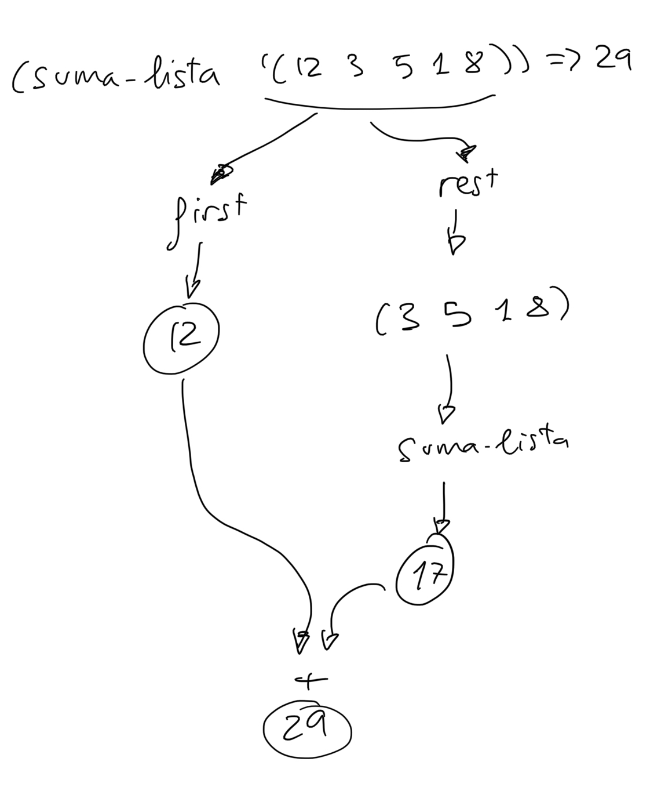
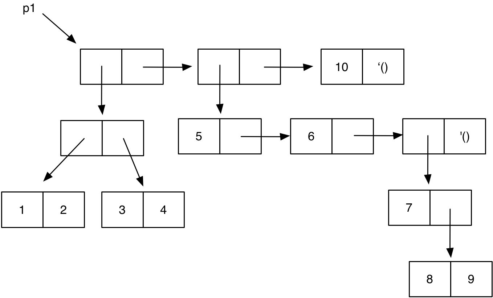

## Semana 2

Notas de clase de la semana 2 de LPP.


## Tema 2: Programación funcional 

### Veremos hoy

- 1. El paradigma de Programación Funcional
- 2. Scheme como lenguaje de programación funcional
	- 2.1. Funciones y formas especiales
	- 2.2. Formas especiales en Scheme: `define`, `if`, `cond`
	- 2.3. Forma especial `quote` y símbolos
	- 2.4. Listas
    - **2.5. Recursión**
- **3. Tipos de datos compuestos en Scheme**
	- **3.1 El tipo de dato pareja**
	- **3.2 Las parejas son objetos de primera clase**
	- **3.3  Diagramas caja-y-puntero**
- **4. Listas en Scheme**
    - **4.1 Implementación de listas en Scheme**
    - **4.2 Listas con elementos compuestos**

---

### Recursión ###

- La recursión es una característica básica de la programación funcional.
- Veremos varios ejemplos de cómo **diseñar** funciones recursivas.

### Confía en la recursión

- En programación funcional las iteraciones se realizan con recursión.
- En una definición recursiva siempre tenemos un caso general y un caso
base. 
- El caso base define el valor que devuelve la función en el caso
elemental en el que no hay que hacer ningún cálculo. 
- El caso general
define una expresión que contiene una llamada a la propia función que
estamos definiendo.

Ejemplo: 

Por ejemplo, podemos definir la función `(suma-hasta x)` que devuelve
la suma de los números hasta el parámetro `x` cuyo valor pasamos en la
invocación de la función.

`(suma-hasta 5)` devolverá `0+1+2+3+4+5 = 15`.

Definición recursiva:

```racket
(define (suma-hasta x)
   (if (= 0 x)
      0
      (+ (suma-hasta (- x 1)) x)))
```

!!! Note "Importante"
    Para entender la recursión no es conveniente utilizar el depurador, ni
    hacer trazas, ni *entrar en la recursión*, sino que hay que
    suponer que **la llamada recursiva se ejecuta y devuelve el valor
    que debería. ¡Debemos confiar en la recursión!**.

El caso general del ejemplo anterior indica lo siguiente:

```text
Para calcular la suma hasta x: 
    Llamamos a la recursión para que calcule la suma hasta x-1 
    (confiamos en que la implementación funciona bien y esta llamada 
    nos devolverá el resultado hasta x-1) y a ese resultado le sumamos
    el propio número x.
```

Un ejemplo concreto, cuando `x` vale 5, `(suma-hasta 5)`:

```text
(+ (suma-hasta (- 5 1)) 5)
``` 

Evaluación:

```text
(+ (suma-hasta (- 5 1)) 5) ⇒
(+ (suma-hasta 4) 5) ⇒ (confiamos en la recursión: (suma-hasta 4) = 10)
(+ 10 5) ⇒
15
```

- La llamada recursiva debe trabajar sobre un caso más sencillo que la
llamada general.


### Diseño de la función `(suma-hasta x)`


Generalizamos este ejemplo y lo expresamos en Scheme de la siguiente
forma:

```racket
(define (suma-hasta x)
   (+ (suma-hasta (- x 1)) x))
```

- Nos falta el caso base de la recursión. Debemos preguntarnos **¿cuál
es el caso más sencillo del problema, que podemos calcular sin hacer
ninguna llamada recursiva?**. En este caso podría ser el caso en el
que `x` es 0, en el que devolveríamos 0.

- Podemos ya escribirlo todo en Scheme:

```racket
(define (suma-hasta x)
   (if (= 0 x)
      0
      (+ (suma-hasta (- x 1)) x)))
```


### Otro ejemplo de función recursiva `(alfabeto-hasta char)`

Como antes, veamos un ejemplo concreto:

```racket
(alfabeto-hasta #\h) ; ⇒ "abcdefgh"
```

¿Cómo plantear el caso general? Tenemos que hacer una llamada
recursiva que haga casi todo el trabajo y nos devuelva la cadena con
el alfabeto casi calculada. 

<p style="margin-bottom:3cm;"></p>

¿Podríamos llamar a la recursión para que nos devuelva el alfabeto
hasta el carácter anterior a la `#\h` (el carácter `\#g`)? 

Si confiamos en la recursión:

```racket
(alfabeto-hasta #\g) ; ⇒ "abcdefg"
```

Sólo faltaría entonces añadir la `#\h` al final de la cadena:

```text
"abcdefg" + \#h ⇒ "abcdefgh"
```

¿Cómo lo expresamos en Scheme?

<p style="margin-bottom:3cm;"></p>

El caso general:

```racket
(define (alfabeto-hasta char)
    (string-append (alfabeto-hasta (anterior char)) (string char)))
```

Función `(anterior char)`:

```racket
(define (anterior char)
  (integer->char (- (char->integer char) 1)))
```

Nos faltaría únicamente el caso base.

El caso base sería aquel en el que nos piden lo más sencillo: el
alfabeto hasta el carácter `#\a`, en el que habría que devolver la
cadena "a".

Solución final:

```racket
(define (alfabeto-hasta char)
  (if (equal? char #\a)
      "a"
      (string-append (alfabeto-hasta (anterior char)) (string char))))
```


### Repaso: Selección de elementos de una lista: `car` y `cdr`

- Primer elemento: función `car`
- Resto de elementos: función `cdr`

Ejemplos:

```racket
(define lista1 '(1 2 3 4))
(car lista1) ⇒ 1
(cdr lista1) ⇒ (2 3 4)
(define lista2 '((1 2) 3 4))
(car lista2) ⇒ (1 2)
(cdr lista2) ⇒ (3 4)
```


### Recursión y listas: Función `(suma-lista lista-nums)`

Supongamos que queremos definir una función `suma-lista` que reciba
como parámetro una lista de números y devuelva la suma de todos ellos.

Ejemplo:

```racket
(suma-lista '(12 3 5 1 8)) ; ⇒ 29
```

- En este caso podemos pensar que para sumar la lista de
números `(12 3 5 1 8)` podemos obtener un problema más sencillo (una
lista más pequeña) haciendo el `cdr` de la lista de números y llamando
a la recursión con el resultado. 

- La llamada recursiva devolverá la suma de esos números (confiamos en
la recursión) y a ese valor basta con sumarle el primer número de la
lista. Lo podemos representar en el siguiente dibujo:



- Podemos generalizar este ejemplo y expresarlo en Scheme de la siguiente forma:

```racket
(define (suma-lista lista)
    (+ (car lista) (suma-lista (cdr lista))))
```

- Falta el caso base, que es el caso más sencillo en que podemos
devolver un valor sin llamar a la recursión. En este caso, podría ser
cuando le pesamos a la función una lista sin elementos, en donde hay
que devolver 0.

Con todo junto, quedaría la recursión como sigue

```racket
(define (suma-lista lista)
   (if (null? lista)
       0
	   (+ (car lista) (suma-lista (cdr lista)))))
```
   
### Función recursiva `veces`

Como último ejemplo vamos a definir la función `(veces lista id)` que
cuenta el número de veces que aparece un identificador en una lista.

- ¿Cómo planteamos el caso general? Llamaremos a la recursión con el
resto de la lista. Esta llamada nos devolverá el número de veces que
aparece el identificador en este resto de la lista. Y después sumamos
al valor devuelto 1 si el primer elemento de la lista coincide con el
identificador.

El caso general en Scheme:

```racket
(if (equal? (car lista) id)
    (+ 1 (veces (cdr lista) id))
    (veces (cdr lista) id))
```

Como caso base, si la lista es vacía devolvemos 0.

La versión completa:

```racket
(define (veces lista id)
  (cond
    ((null? lista) 0)
    ((equal? (car lista) id) (+ 1 (veces (cdr lista) id)))
    (else (veces (cdr lista) id))))

(veces '(a b a a b b) 'a) 
⇒ 3 
```


### Tipos de datos compuestos en Scheme ###

- El tipo pareja
- Las parejas son objetos de primera clase
- Diagramas caja-y-puntero


### El tipo de dato pareja

- Ya lo hemos visto en el seminario
- `cons` para construir parejas:

```racket
(cons 1 2) ; ⇒ (1 . 2)
(define c (cons 1 2))
```


### Funciones de acceso `car` y `cdr`

- `car` y `cdr` devuelven la parte izquierda y derecha:

```racket
(define c (cons 1 2))
(car c) ; ⇒ 1
(cdr c) ; ⇒ 2
```


### Definición declarativa


```racket
(car (cons x y)) = x
(cdr (cons x y)) = y
```


### Función pair?


```racket
(pair? 3) ; ⇒ #f
(pair? (cons 3 4)) ; ⇒ #t
```


### Las parejas pueden contener cualquier tipo de dato

```racket
(define c (cons 'hola #f))
(car c) ; ⇒ 'hola
(cdr c) ; ⇒ #f
```

### Las parejas son objetos inmutables

- En programación funcional una vez creada una parea no está permitido modificar (mutar) su contenido.
- En Scheme hay funciones para mutar parejas, pero no las veremos hasta ver el paradigma de programación imperativa


### Las parejas son objetos de primera clase

En un lenguaje de programación un elemento es de primera clase cuando puede:

* Asignarse a variables
* Pasarse como argumento
* Devolverse por una función
* Guardarse en una estructura de datos mayor

Las parejas son objetos de primera clase.


### Asignación a una variable (1)

Una pareja puede asignarse a una variable:

```racket
(define p1 (cons 1 2))
(define p2 (cons #f "hola"))
```

### Paso como argumento y devolverse como resultado de una función (2 y 3)

```racket
(define (suma-parejas p1 p2)
    (cons (+ (car p1) (car p2))
          (+ (cdr p1) (cdr p2))))
```

Lo probamos ...

<p style="margin-bottom:2cm"></p>


### Ejemplo de función que recibe distintos tipos de datos

- Scheme es débilmente tipado
- Podemos pasar cualquier tipo de dato en los parámetros de las funciones, por ejemplo a la siguiente función `suma`

```racket
(define (suma x y)
  (cond 
    ((and (number? x) (number? y)) (+ x y))
    ((and (pair? x) (pair? y)) (suma-parejas x y))
    ((and (string? x) (string? y)) (string-append x y))
    (else 'error)))
```

Lo probamos ...


<p style="margin-bottom:3cm;"></p>


### Formar parte de otras parejas (4)

- El resultado de un `cons` puede usarse como parámetro de nuevas llamadas a `cons`.


```racket
(define p1 (cons 1 2))
(define p2 (cons 3 4))
(define p (cons p1 p2))
```

### Diagramas caja-y-puntero

```racket
(define p (cons (cons 1 2)
                (cons 3 4)))
```


Diagramas *caja-y-puntero* (*box-and-pointer* en inglés):


### Ejemplos de diagramas caja-y-puntero

- Es conveniente indentar correctamente los `cons`:

```racket
(define p (cons (cons 1
                      (cons 3 4))
                2))
```

- Es importante recordar que las expresiones se evalúan *de dentro a afuera*.
- ¿Qué estructura se construye con la sentencia anterior? Dibuja el diagrama *box-and-pointer*.

<p style="margin-bottom:3cm;"></p>

- ¿Cuál sería el diagrama resultante de la siguiente expresión?


```racket
(define p2 (cons 5 (cons p 6)))
```

<p style="margin-bottom:4cm;"></p>

- ¿Cómo sería la expresión formada por `car` y `cdr`s que devolviera 3 a partir de la variable `p2`?

<p style="margin-bottom:4cm;"></p>


### Funciones c????r

- Al trabajar con estructuras de parejas anidades es muy habitual realizar llamadas del tipo:

```racket
(cdr (cdr (car p)))
```

- Es equivalente a la función `cadar` de Scheme:

```racket
(cddar p)
```

- El nombre de la función se obtiene concatenando a la letra "c", las letras "a" o "d" según hagamos un car o un cdr y terminando con la letra "r".

- Hay definidas 2^4 funciones de este tipo: `caaaar`, `caaadr`, …, `cddddr`.


### Listas en Scheme 

- Hemos comprobado que las listas y las parejas tienen las mismas
  funciones: `car`, `cdr` y `cons`. ¿Por qué? ¿Qué relación hay entre
  las parejas y las listas?


### Repaso: función cons con listas

- La función `cons` crea una lista nueva resultante de añadir un elemento
al comienzo de la lista:

```racket
(cons 1 '(1 2 3 4)) ⇒ (1 1 2 3 4)
(cons 'hola '(como estás)) ⇒ (hola como estás)
(cons '(1 2) '(1 2 3 4))  ⇒ ((1 2) 1 2 3 4)
```


### Relación entre listas y parejas en Lisp y Scheme

- Hagamos algunas pruebas.

¿Una pareja es una lista?
Lo probamos ...

```racket
(define p1 (cons 1 2))
(pair? p1) 
(list? p1) 
```

<p style="margin-bottom:2cm;"></p>

¿Una lista vacía es una lista? ¿Es una pareja?
Lo probamos ...

```racket
(list? '())
(pair? '())
```

<p style="margin-bottom:2cm;"></p>

¿Una lista es una pareja?
Lo probamos ...

```racket
(define lista '(1 2 3))
(list? lista)
(pair? lista)
```

<p style="margin-bottom:2cm;"></p>

¿Una pareja con una lista vacía como parte derecha es una lista?
Lo probamos ...

```racket
(define p1 (cons 1 '()))
(pair? p1)
(list? p1)
```
<p style="margin-bottom:2cm;"></p>

Con estos ejemplos ya tenemos pistas para deducir la relación entre listas y parejas en Scheme (y Lisp). Vamos a explicarlo.


### Definición de listas con parejas

Una lista es (definición recursiva):

* Una **pareja** que contiene:
    * *En su parte izquierda*: el primer elemento de la lista
    * *En su parte derecha*: el resto de la lista (volvemos a aplicar la definición)
* Un **símbolo especial** `'()` que denota la lista vacía.


### Ejemplo más sencillo: `(1)`

```racket
(cons 1 '())
```
	
La pareja cumple las condiciones anteriores: 

* La parte izquierda de la pareja es el primer elemento de la lista (el número 1)
* La parte derecha es el resto de la lista (la lista vacía)


- Es al mismo tiempo una pareja y una lista:

```racket
(define l (cons 1 '()))
(pair? l)
(list? l)
```


### Otro ejemplo: `(1 2 3 4)`

```racket
(cons 1
      (cons 2
            (cons 3
                  (cons 4 
                        '()))))
```

- La primera pareja cumple las condiciones de ser una lista:

* Su primer elemento es el 1
* Su parte derecha es la lista '(2 3 4)


### Lista vacía

La lista vacía es una lista:

```racket
(list? '())
```

No es un símbolo ni una pareja:

```racket
(symbol? '())
(pair? '())
```

Función `null?`:

```racket
(null? '())
```	

### Listas con elementos compuestos

- *Lista de asociación*, listas cuyos elementos son parejas (*clave*, *valor*):

```racket
(list (cons 'a 1)
      (cons 'b 2)
      (cons 'c 3))
```

¿Cuál sería el diagrama *box and pointer* de la estructura anterior?

<p style="margin-bottom:4cm;"></p>

- Expresión equivalente utilizando *conses* es:

```racket
(cons (cons 'a 1)
      (cons (cons 'b 2)
            (cons (cons 'c 3)
                  '())))
```


### Listas de listas

```racket
(define lista (list 1 (list 1 2 3) 3))
```

Definición con `quote`:

```racket
(define lista '(1 (1 2 3) 3))
```

¿Cuál sería el diagrama *box and pointer* de la estructura anterior?

<p style="margin-bottom:4cm;"></p>


### Ejemplo inverso  ###

Un último ejemplo. Supongamos el siguiente diagrama caja y puntero:




¿Cuál sería la expresión en Scheme (usando llamadas a `list` y `cons`) que lo
construye?

<p style="margin-bottom:4cm;"></p>

Solución: 

```racket
(define p1 (list (cons (cons 1 2)
                       (cons 3 4))
                 (list 5 6 (cons 7
                                 (cons 8 9)))
                 10))
```


### Impresión de listas y parejas por el intérprete de Scheme

El intérprete de Scheme siempre intenta mostrar una lista cuando
encuentra una pareja cuyo siguiente elemento es otra pareja.

Por ejemplo, si tenemos la siguiente estructura:

```racket
(define p (cons 1 (cons 2 3)))
```

Cuando se evalúe `p` el intérprete imprimirá por pantalla lo
siguiente:

```racket
(1 2 . 3)
```

Si queremos comprobar la estructura de parejas podemos utilizar la
función `print-pareja` definida en los apuntes, que imprimiría lo
siguiente:

```racket
(print-pareja p) ; ⇒ (1 . (2 . 3))
```


### Distintos niveles de abstracción

- Una vez que conocemos la implementación de listas con parejas, no va a a ser necesario casi nunca *bajar* a este nivel de implementación
- Podemos volver a la *abstracción* inicial en la que las funciones `car` y `cdr` trabajan sobre listas:
    - `(car lista)`: devuelve el primer elemento de la lista
    - `(cdr lista)`: devuelve el resto de la lista
    - `(list-ref lista n)`: devuelve la posición `n` de la lista
    - `(cons dato lista)`: devuelve una nueva lista con `dato` en su primera posición y `lista` como su resto

<p style="margin-bottom:4cm;"></p>


