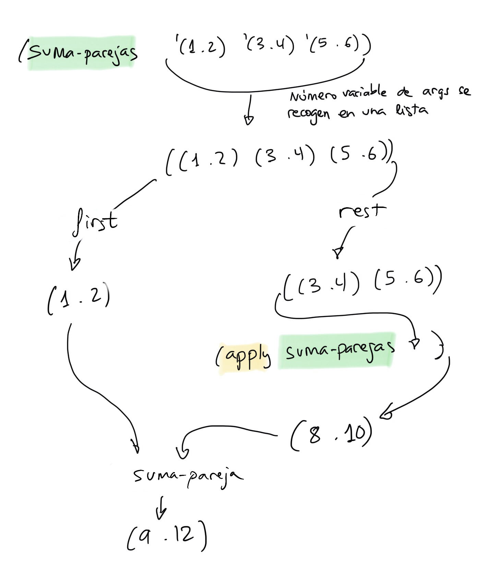

## Semana 3

Notas de clase de la semana 3 de LPP.


## Tema 2: Programación funcional

### Veremos hoy


- 1. El paradigma de Programación Funcional
- 2. Scheme como lenguaje de programación funcional
- 3. Tipos de datos compuestos en Scheme
- 4. Listas en Scheme
    - 4.1 Implementación de listas en Scheme
    - 4.2 Listas con elementos compuestos
    - **4.3. Funciones recursivas para construir listas**
    - **4.4. Funciones con número variable de argumentos**
- **5. Funciones como tipos de datos de primera clase**
    - **5.1. Forma especial `lambda`**
    - **5.2. Funciones como argumentos de otras funciones**
    - 5.3. Funciones que devuelven otras funciones
    - 5.4. Funciones en estructuras de datos
    - 5.5. Generalización
    - 5.6. Funciones de orden superior

### Funciones recursivas para construir listas

Vamos a ver cómo se implementan de forma recursiva:

- Funciones de Scheme que trabajan con listas (para no solapar con las
  definiciones de Scheme pondremos el prefijo `mi-` en todas ellas):
    - Función `mi-append`
    - Función `mi-reverse`
- Otras funciones recursivas
    - Función `lista-desde`
    - Función `filtra-pares`
- Ejemplo completo: usamos las funciones anteriores para comprobar si
  un número es primo
    - Función `primo?`


### Recordatorio: Diseño de funciones recursivas

¿Cómo diseñamos una *definición recursiva* de una función? 

- Es recomendable comenzar por el **caso general**.
- Debemos buscar una forma de resolver el problema principal haciendo
  una llamada a la recursión con una versión más pequeña del problema,
  **confiar en que la recursión funciona correctamente** devolviendo
  lo que tiene que devolver y obtener con este valor devuelto la
  solución al problema principal. Es recomendable probar con un
  **ejemplo concreto**.
- Una vez formulado el caso general, buscamos el **caso base de la
  recursión**: el caso más sencillo posible en el que no es necesario
  hacer una llamada recursiva para devolver la solución.


### Función `mi-append` 

- Queremos conseguir una implementación recursiva de la función
  `append` que construye una lista resultante de la unión de dos. Por
  ejemplo:

    ```racket
    (mi-append '(a b c) '(d e f)) ; ⇒ (a b c d e f)
    ```

- ¿Cómo formulamos el ejemplo de forma recursiva? 

<p style="margin-bottom: 1cm;"></p>

- ¿Funcionaría si llamamos a la recursión con el resto de la primera
lista y el resto de la segunda lista? ¿Podríamos conseguir a partir de
la lista a resultante de esa llamada recursiva la lista que queremos?
Vamos a probarlo:

    <p style="margin-bottom: 1cm;"></p>

    ```racket
    (mi-append '(b c) '(e f)) => '(b c e f)
    ```
    
    <p style="margin-bottom: 1cm;"></p>

    ¿Podemos conseguir la lista `(a b c d e f)` a partir de la lista `(b c
    e f)` y de `a` y `d`? No, no hay una forma fácil de hacerlo.

<p style="margin-bottom: 1cm;"></p>

- ¿Funcionaría si llamamos a la recursión con la primera lista y el
  resto de la segunda? 

    <p style="margin-bottom: 1cm;"></p>
  
    Vamos a probarlo:

    ```text
    (mi-append '(a b c) '(e f)) => '(a b c e f)
    ```
    
    <p style="margin-bottom: 1cm;"></p>

    ¿Podemos conseguir la lista `(a b c d e f)` a partir de la lista `(a
    b c e f)` y `d`? No, no hay una forma fácil de hacerlo.

<p style="margin-bottom: 1cm;"></p>

- ¿Cuál es la forma correcta de hacerlo? 

    <p style="margin-bottom: 1cm;"></p>

    ```text
    (mi-append '(b c) '(d e f)) => '(b c d e f)
    ```
    
    <p style="margin-bottom: 1cm;"></p>

    Y después hacer un `cons` de `a` y la lista resultante de la llamada a
    la recursión:

    ```text
    (cons 'a (mi-append '(b c) '(d e f))) = 
    (cons 'a (b c d e f)) = 
    (a b c d e f)
    ```
<p style="margin-bottom: 1cm;"></p>

- En general:

    ```racket
    (define (mi-append lista1 lista2) 
        (cons (first lista1) (mi-append (rest lista1) lista2)))
    ```

- El caso base es aquel en el que `lista1` es `null?`. En ese caso
  devolvemos `lista2`:

    ```racket
    (mi-append '() '(a b c)) ;⇒ '(a b c)
    ```

- La formulación recursiva completa queda como sigue:

    ```racket
    (define (mi-append l1 l2)
        (if (null? l1)
            l2
            (cons (first l1)
                  (mi-append (rest l1) l2))))
    ```


### Función `mi-reverse`

- Ejemplo

    ```racket
    (mi-reverse '(1 2 3 4 5 6)) ; ⇒ (6 5 4 3 2 1)
    ```

- La idea es sencilla: llamamos a la recursión para hacer la inversa
  del `rest` de la lista y añadimos el primer elemento a la lista
  resultante.

- Podemos definir una función auxiliar `(añade-al-final dato lista)`
  que añade un dato al final de una lista usando `append`:

    ```racket
    (define (añade-al-final dato lista)
        (append lista (list dato)))
    ```

- La función `mi-reverse` quedaría entonces como sigue:

    ```racket
    (define (mi-reverse lista)
        (if (null? lista) '()
            (añade-al-final (first lista) (mi-reverse (rest lista)))))
    ```


### Función `lista-desde`

- La función `(lista-desde x)` devuelve una lista con los
  números desde x hasta 1:

    ```racket
    (lista-desde 5) ; ⇒ (5 4 3 2 1)
    ```

- ¿Cómo formulamos el ejemplo de forma recursiva?

<p style="margin-bottom: 3cm;"></p>

- Solución:

    ```text
    (lista-desde 5) = 
    (cons 5 (lista-desde 4) =
    (cons 5 (4 3 2 1)) = 
    (5 4 3 2 1)
    ```

- En general:

    ```text
    Para construir una lista desde x hasta 1:
       construyo la lista desde x-1 hasta 1 y le añado 
       en cabeza el número x
    ```

- El caso base de la recursión es el caso en el que x es 1, entonces
  devolvemos '(1)

- Ya podemos realizar la definición Scheme:

    ```racket
    (define (lista-desde x)
        (if (= x 1)
            '(1)
            (cons x
                  (lista-desde (- x 1)))))
    ```


### Función `filtra-pares`

- Es muy habitual recorrer una lista y comprobar condiciones de sus
  elementos, construyendo una lista con los que cumplan una
  determinada condición.

- La función `filtra-pares` construye una lista con los números pares
  de la lista que le pasamos como parámetro:

    ```racket
    (filtra-pares '(1 2 3 4 5 6)) ;⇒ (2 4 6)
    ```

- ¿Cómo la definimos de forma recursiva?

<p style="margin-bottom:3cm;"></p>


- Solución en Scheme

    ```racket
    (define (filtra-pares lista)
        (cond
            ((null? lista) '())
            ((even? (first lista))
                (cons (first lista) (filtra-pares (rest lista))))
            (else (filtra-pares (rest lista)))))
    ```


### Ejemplo final: Función `primo?`

- El uso de listas es uno de los elementos fundamentales de la
  programación funcional.

- Veamos un algoritmo sencillo que permite calcular si un número es
  primo, usando alguna de las funciones anteriores sobre
  listas. Calcularemos la lista de divisores del número y
  comprobaremos si su longitud es dos:

    ```racket
    (divisores 8) ;⇒ (1 2 4 8) longitud = 4, no primo
    (divisores 9) ;⇒ (1 3 9) longitud = 3, no primo
    (divisores 11) ;⇒ (1 11) longitud = 2, primo
    ```

- En Scheme:

    ```racket
    (define (primo? x)
        (=  2 
        (length (divisores x))))
    ```


### Función `(divisor? x y)`

```racket
(define (divisor? x y)
      (= 0 (remainder y x)))
```


### Función recursiva `(filtra-divisores lista x)`

- Función que filtra aquellos números `lista` que son divisores del número `x`

    ```racket
    (define (filtra-divisores lista x)
       (cond
          ((null? lista) '())
          ((divisor? (first lista) x)
             (cons (first lista)
                   (filtra-divisores (rest lista) x)))
          (else (filtra-divisores (rest lista) x))))
    ```


### Función `(divisores x)` 

- Una vez definidas las funciones auxiliares anteriores, se puede
  implementar de una forma muy sencilla una función `(divisores x)`
  que devuelve una lista de todos los divisores del número `x`:

    ```racket
    (define (divisores x)
        (filtra-divisores (lista-desde x) x))
    ```

- Por ejemplo, para calcular los divisores de 10:

    ```racket
    (filtra-divisores '(10 9 8 7 6 5 4 3 2 1) 10) ;⇒ (10 5 2 1)
    ```

- Y, una vez definida esta función, ya funciona correctamente la
  función `primo?` con la primera definición que vimos:

    ```racket
    (define (primo? x)
        (=  2 
        (length (divisores x))))
    ```


<p style="margin-bottom:1cm;"></p>
----
<p style="margin-bottom:1cm;"></p>


### Funciones con número variable de argumentos

- Definición de número variable de argumentos con la notación de
  punto:

    ```racket
    (define (funcion-dos-o-mas-args x y . lista-args) 
        <cuerpo>)
    ```

- Podemos llamar a la función anterior con dos o más argumentos:

    ```racket
    (funcion-dos-o-mas-args 1 2 3 4 5 6)
    ```
	
- En la llamada, los parámetros `x` e `y` tomarán los valores 1 y 2.
- El parámetro `lista-args` tomará como valor una lista con los
  argumentos restantes `(3 4 5 6)`.
- También es posible permitir que todos los argumentos sean opcionales
  no poniendo ningún argumento antes del punto:

    ```racket
    (define (funcion-cualquier-numero-args . lista-args) 
        <cuerpo>)
    ```
	
- Ejemplo:

    ```racket
    (define (mi-suma x y . lista-nums)
        (if (null? lista-nums)
            (+ x y)
            (+ x (+ y (suma-lista lista-nums)))))
    ```
¿Las funciones con número variable de argumentos pueden ser recursivas? 

<p style="margin-bottom:1cm;"></p>
----
<p style="margin-bottom:1cm;"></p>


### Funciones como tipos de datos de primera clase

Recordemos que un tipo de primera clase es aquel que:

1. Puede ser asignado a una variable
2. Puede ser pasado como argumento a una función
3. Puede ser devuelto como resultado de una invocación a una función
4. Puede ser parte de un tipo mayor

Con funciones:

1. Una función se puede asignar a una variable
2. Una función se puede pasar como parámetro de otras funciones 
3. Una función se puede devolver como resultado de una invocación a otra función
4. Una función se puede guardar en tipos de datos compuestos como listas

- Las funciones son objetos de primera clase en lenguajes funcionales
  y en muchos lenguajes multi-paradigma con características funcionales como
  [JavaScript](http://helephant.com/2008/08/19/functions-are-first-class-objects-in-javascript/),
  [Python](https://thenewcircle.com/static/bookshelf/python_fundamentals_tutorial/functional_programming.html),
  [Swift](https://developer.apple.com/library/ios/documentation/Swift/Conceptual/Swift_Programming_Language/Closures.html)
  o incluso en la última versión de Java, [Java
  8](http://docs.oracle.com/javase/tutorial/java/javaOO/lambdaexpressions.html),
  (donde se denominan *expresiones lambda*).

### Forma especial `lambda`

- Cualquier objeto de primera clase de un lenguaje debe poderse
  crear de forma anónima, sin asignarle un nombre. Por ejemplo, en la
  expresión:
  
    ```racket
    (string-append "hola" "adiós")
    ```

    las cadenas `"hola"` y `"adiós"` se han creado directamente,
    sin darles nombre, y se han pasado como parámetros a la función
    `string-append`.

- La forma especial `lambda` permite hacer lo mismo con las funciones:
  crear funciones anónimas en tiempo de ejecución.


### Sintaxis de la forma especial `lambda`

- La sintaxis de la forma especial `lambda` es:

    ```text
    (lambda (<arg1> ... <argn>) 
        <cuerpo>)
    ```

- El cuerpo del lambda define un *bloque de código* y sus argumentos
  son los parámetros necesarios para ejecutar ese bloque de
  código. Llamamos a la función resultante una *función anónima*.

- Una función anónima que suma dos parejas:

    ```racket
    (lambda (p1 p2)
        (cons (+ (car p1) (car p2))
              (+ (cdr p1) (cdr p2))))
    ```

- Una función anónima que devuelve el mayor de dos números:

    ```racket
    (lambda (a b)
        (if (> a b)
            a
            b))
    ```


### Semántica de la forma especial `lambda`

- La invocación a la forma especial `lambda` construye una función
  anónima en tiempo de ejecución.

    ```racket
    (lambda (x) (* x x)) ; ⇒ #<procedure>
    ```

- El procedimiento construido es un bloque de código que devuelve el
  cuadrado de un número.

- ¿Qué podemos hacer con este procedimiento? 


### Podemos asignar el procedimiento a un identificador (símbolo)

```racket
(define f (lambda (x) (* x x)))
```

- Se evalúa la expresión lambda y el resultado (un procedimiento) se
  guarda en `f`
- Si escribimos `f` en el intérprete, Scheme lo evalúa y muestra el
  procedimiento:

    ```racket
    f ; ⇒ #<procedure:f>
    ```

- Podemos usar el identificador `f` de la forma que habitualmente
  invocamos a una función:

    ```racket
    (f 3) ; ⇒ 9
    ```


### Podemos invocar a la función anónima directamente


```racket
((lambda (x) (* x x)) 3) ; ⇒ 9
```

- La llamada a `lambda` crea un procedimiento y el paréntesis a su
izquierda lo invoca con el parámetro 3:

    ```racket
    ((lambda (x) (* x x)) 3) ; => (#<procedure> 3) ⇒ 9
    ```

- Es importante remarcar que con `lambda` estamos creando una función
  en *tiempo de ejecución*.


### Expresiones lambda en distintos lenguajes de programación

**Java 8**

```java
Integer x -> {x*x}
```

**Scala**

```scala
(x:Int) => {x*x}
```

**Objective C**

```objective-c
^int (int x)
{
   x*x
};
```

**Swift**

```swift
{ (x: Int) -> Int in return x*x }
```


### Identificadores y funciones

- En Scheme una función está ligada al símbolo que define su nombre:

    ```racket
    + ; ⇒ <procedure:+>
    ```

- Podemos asignar funciones ya existentes a nuevos identificadores
  usando `define`, como en el ejemplo siguiente:

    ```racket
    + ;⇒ <procedure:+>
    (define suma +)
    (suma 1 2 3 4) ; ⇒ 10
    ```


### La forma especial `define` para definir una función no es más que azucar sintáctico

- La forma especial `define` para definir funciones siempre se
  convierte internamente en una llamada a `lambda` y una asociación de
  la función a su nombre:

    ```text
    (define (<nombre> <args>)
        <cuerpo>)
    ```

    ```text
    (define <nombre> 
        (lambda (<args>)
            <cuerpo>))
    ```

- Ejemplo:

    ```racket
    (define (cuadrado x)
        (* x x))
    ```

    ```racket
    (define cuadrado 
        (lambda (x) (* x x)))
    ```


### Predicado `procedure?`

- Podemos comprobar si algo es una función utilizando el predicado de
  Scheme `procedure?`.

    ```racket
    (procedure? (lambda (x) (* x x)))
    ; ⇒ #t
    (define suma +)
    (procedure? suma)
    ; ⇒ #t
    (procedure? '+)
    ; ⇒ #f
    ```


### Funciones argumentos de otras funciones

- Ya hemos visto que una función se pueda asignar a una variable. Para
  seguir comprobando que es un objeto de primera clase, vamos a
  comprobar que se puede pasar como parámetro de otra función.


### Función `(aplica f x y)`

- La función `(aplica f x y)` recibe una función como argumento y dos
  parámetros. Devuelve el resultado de evaluar la función `f` con los
  argumentos `x` e `y`
  
    ```racket
    (define (aplica f x y)
       (f x y))
    ```

- Ejemplos:

    ```racket
    (aplica + 2 3) ; ⇒ 5
    (aplica * 4 5) ; ⇒ 10
    (aplica string-append "hola" "adios") ; ⇒ "holaadios"

    (define (string-append-con-guion s1 s2)
        (string-append s1 "-" s2))

    (aplica string-append-con-guion "hola" "adios") ; ⇒ "hola-adios"
    ```

- Podemos pasar la función creándola con una expresión lambda:

    ```racket
    (aplica (lambda (x y) (sqrt (+ (* x x) (* y y)))) 3 4) ; ⇒ 5
    ```

### Función `aplica-2` 

- La función `aplica-2` toma dos funciones `f` y `g` y un argumento
  `x` y devuelve el resultado de aplicar `f` a lo que devuelve la
  invocación de `g` con `x`:

    ```racket
    (define (aplica-2 f g x)
       (f (g x)))
    ```

- Ejemplos de invocación

    ```racket
    (define (suma-5 x)
       (+ x 5))
    (define (doble x)
       (+ x x))
    (aplica-2 suma-5 doble 3) ; ⇒ 11
    
    (aplica-2 (lambda (x) (* x 2))
              (lambda (x) (+ x 5)) 10) ; ⇒ 30
    ```

### Función `apply` ###

La función `(apply funcion lista)` de Scheme permite aplicar una función de
aridad `n` a una lista de datos de n datos, haciendo que cada uno de
los datos se pasen a la función en orden como parámetros.

La función `apply` recibe una función y una lista y devuelve el
resultado de aplicar la función a los datos de la lista, tomándolos
como parámetros.

Ejemplo:

```racket
(apply + '(1 2 3 4)) ; ⇒ 10
```

Podemos pasar a `apply` una expresión lambda:

```racket
(apply (lambda (x y) (+ x (* 2 y))) '(2 5)) ; ⇒ 12
```

La lista que pasamos como argumento de `apply` debe tener tantos
elementos como parámetros tenga la función que aplicamos. En caso
contrario, se produce un error:

```racket
(apply cons '(a b c)) ; ⇒ error
cons: arity mismatch;
 the expected number of arguments does not match the given number
  expected: 2
  given: 3
  arguments...:
```

La forma correcta de hacerlo:

```racket
(apply cons '(a b)) ; ⇒ (a . b)
```

### Función `apply` y funciones recursivas ###

Usando `apply` podemos definir funciones recursivas con número
variable de argumentos.

Por ejemplo, supongamos que queremos definir la función `suma-parejas`
que suma un número variable de parejas:

```racket
(suma-parejas '(1 . 2) '(3 . 4) '(5 . 6)) ; ⇒ '(9 . 12)
```

Recordemos la definición de la función que suma dos parejas:

```racket
(define (suma-pareja p1 p2)
  (cons (+ (car p1) (car p2))
        (+ (cdr p1) (cdr p2))))
```

¿Cómo podríamos, usando `apply`, resolver el problema de sumar un
número variable de parejas?

```racket
(define (suma-parejas . parejas)
  (if (null? parejas)
      '(0 . 0)
      (suma-pareja ???  (apply ???))))
```

<p style="margin-bottom:3cm;"></p>

Solución:

```racket
(define (suma-parejas . parejas)
  (if (null? parejas)
      '(0 . 0)
      (suma-pareja (first parejas) (apply suma-parejas (rest parejas)))))
```

Una representación gráfica de cómo funciona la recursión:


