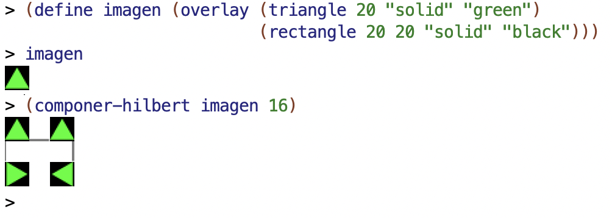

## Semana 5

Notas de clase de la semana 5 de LPP.

## Tema 3: Procedimientos recursivos

- El coste de la recursión
- Soluciones al coste de la recursión: procesos iterativos
- Soluciones al coste de la recursión: memoization
- Figuras recursivas

----

### El coste de la recursión

- Vamos a analizar el coste de la recursión de una forma empírica, sin
  realizar una análisis matemático riguroso.
- Veremos que el coste se dispara cuando tenemos dos llamadas
  recursivas.
- Veremos dos formas de conseguir que el coste sea menor.

----

### La pila de la recursión

- Para analizar una función vamos por primera vez a *entrar en la
  recursión* y hacer una traza de las llamadas recursivas del
  siguiente:

```racket
(define (mi-length items)
    (if (null? items)
        0
        (+ 1 (mi-length (rest items)))))
```

- ¿Cómo podemos representar las llamadas y el resultado de `(mi-length
  '(a b c d))`

<p style="margin-bottom:2cm;"></p>

```text
(mi-length '(a b c d))
(+ 1 (mi-length '(b c d)))
(+ 1 (+ 1 (mi-length '(c d))))
(+ 1 (+ 1 (+ 1 (mi-length '(d)))))
(+ 1 (+ 1 (+ 1 (+ 1 (mi-length '())))))
(+ 1 (+ 1 (+ 1 (+ 1 0))))
(+ 1 (+ 1 (+ 1 1)))
(+ 1 (+ 1 2))
(+ 1 3)
4
```

- Cada llamada a la recursión **deja una función en espera de ser
  evaluada cuando la recursión devuelva un valor** (en el caso
  anterior el +). Esta función, junto con sus argumentos, se almacenan
  en la **pila de la recursión**.
- Cuando la recursión devuelve un valor, los valores se recuperan de
  la pila, se realiza la llamada y se devuelve el valor a la anterior
  llamada en espera.
- Si la recursión está mal hecha y nunca termina se genera un *stack
  overflow* porque la memoria que se almacena en la pila sobrepasa la
  memoria reservada para el intérprete DrRacket.

----

### Coste espacial de la recursión

- El coste espacial de un programa es una función que relaciona la
  memoria consumida por una llamada para resolver un problema con
  alguna variable que determina el tamaño del problema a resolver.

- En el caso de la función `mi-length` el tamaño del problema viene
  dado por la longitud de la lista. El coste espacial de `mi-lenght`
  es *O(n)*, siendo *n* la longitud de la lista.

----

### 1.2.3 El coste depende del número de llamadas a la recursión

- Veamos con un ejemplo que el coste de las llamadas recursivas puede
  dispararse. Supongamos la famosa [secuencia de Fibonacci]:
  0,1,1,2,3,5,8,13,...

- Secuencia de Fibonacci en la [Wikipedia](http://en.wikipedia.org/wiki/Fibonacci_number)

- Formulación matemática de la secuencia de Fibonacci:

```text
Fibonacci(n) = Fibonacci(n-1) + Fibonacci(n-2)  
Fibonacci(0) = 0  
Fibonacci(1) = 1
```

- Formulación recursiva en Scheme:

```racket
(define (fib n)
    (cond ((= n 0) 0)
        ((= n 1) 1)
        (else (+ (fib (- n 1))
                 (fib (- n 2))))))
```

- Evaluación de una llamada a Fibonacci:


- Cada llamada a la recursión produce otras dos llamadas, por lo que
  el número de llamadas finales es 2^n siendo n el número que se pasa
  a la función.

- El coste espacial y temporal es exponencial, O(2^n).

- ¿Qué pasa si intentamos evaluar `(fib 40)`?

----

### 1.3 Soluciones al coste de la recursión: procesos iterativos

- Diferenciamos entre procedimientos y procesos: un procedimiento es
  un algoritmo y un proceso es la ejecución de ese algoritmo.
- Es posible definir _procedimientos recursivos_ que generen _procesos
  iterativos_ en los que no se dejen llamadas recursivas en espera ni
  se incremente la pila de la recursión.
- **Solución**: Construimos la recursión de forma que en cada llamada
  se haga un cálculo parcial y en el caso base se pueda devolver
  directamente el resultado obtenido.

- Este estilo de recursión se denomina *recursión por la cola*
  ([tail recursion](http://en.wikipedia.org/wiki/Tail_call), en
  inglés).

----

### Versión iterativa de mi-length

- Definimos la función `(mi-length-iter lista result)` que es la que
  define el proceso iterativo
- Tiene un parámetro adicional (`result`) que es el parámetro en el
  que se irán guardando los cálculos intermedios
- Al final de la recursión la longitud debe estar calculada en
  `result` y se devuelve


```racket
(define (mi-length lista)
   (mi-length-iter lista 0))

(define (mi-length-iter lista result)
   (if (null? lista)
      result
      (mi-length-iter (rest lista) (+ result 1))))
```

Secuencia de llamadas:

```text
(mi-length '(a b c d)) =>
(mi-length-iter '(a b c d) 0) =>
(mi-length-iter '(b c d) 1) =>
(mi-length-iter '(c d) 2) =>
(mi-length-iter '(d) 3) =>
(mi-length-iter '() 4) =>
4
```

----

### Procesos iterativos

- La recursión resultante es menos elegante
- Se necesita una parámetro adicional en el que se van acumulando los
  resultados parciales
- La última llamada a la recursión devuelve el valor acumulado
- El proceso resultante de la recursión es iterativo en el sentido de
  que no deja llamadas en espera ni incurre en coste espacial

---

### Ejemplo de función iterativa - max ###

- ¿Cómo definiríamos de forma iterativa la función `(max lista)`
que devuelve el máximo de una lista de números?

<p style="margin-bottom:2cm;"></p>

```racket
(define (max lista)
    (max-iter (rest lista) (first lista)))
    
(define (max-iter lista result)
    (if (null? lista)
        result
        (max-iter (rest lista) (if (> result (first lista))
                                   result
                                   (first lista)))))
```


---

### Ejemplo de función iterativa - mi-reverse ###

- ¿Cómo definiríamos de forma iterativa la función `(mi-reverse lista)`
que devuelve una lista invertida?

<p style="margin-bottom:2cm;"></p>

```racket
(define (mi-reverse lista)
    (reverse-iter lista '()))
    
 (define (reverse-iter lista result)
    (if (null? lista)
        result
        (reverse-iter (rest lista) (cons (first lista) result))))
```

---

### Fibonacci iterativo

- Cualquier programa recursivo se puede transformar en otro que genera
  un proceso iterativo.
- En general, las versiones iterativas son menos intuitivas y más
  difíciles de entender y depurar.
- Ejemplo: Fibonacci iterativo

```racket
(define (fib n)
    (fib-iter 1 0 n))

(define (fib-iter a b count)
    (if (= count 0)
        b
        (fib-iter (+ a b) a (- count 1))))
```

----

### Triángulo de Pascal

```text
1
1   1
1   2   1
1   3   3   1
1   4   6   4   1
1   5  10   10  5   1
1   6  15  20   15  6   1
1   7  21  35   35  21  7   1
             ...
```

-- Formulación matemática:

```text
Pascal(n, 0) = 1  
Pascal(n, n) = 1  
Pascal(fila, columna) = Pascal(fila-1,columna-1) + Pascal(fila-1, columna)
```

La versión recursiva pura:

```racket
(define (pascal row col)
    (cond ((= col 0) 1)
          ((= col row) 1)
          (else (+ (pascal (- row 1) (- col 1))
                   (pascal (- row 1) col) ))))
(pascal 4 2)
(pascal 8 4)
(pascal 27 13)
```

----

### Triángulo de Pascal versión iterativa

Utilizamos enfoque iterativo: cada fila se genera a partir de la
anterior (lo hace la función `pascal-sig-fila` que recibe
como parámetro la fila anterior).

Por ejemplo:

```racket
(pascal-sig-fila '(1 3 3 1))
; ⇒ (1 4 6 4 1)
```

Usando la función anterior definimos la función `pascal-fila` a la que
le pasamos el número de fila `n` y nos devuelve la lista de `n+1`
números que constituyen la fila `n` del triángulo de Pascal:

```text
fila 0 = (1)
fila 1 = (1 1)
fila 2 = (1 2 1)
fila 3 = (1 3 3 1)
fila 4 = (1 4 6 4 1)
...
```

El código completo:

```racket
(define (pascal fila col)
   (list-ref (pascal-fila '(1) fila) col))

(define (pascal-fila lista-fila n)
   (if (= 0 n)
      lista-fila
      (pascal-fila (pascal-sig-fila lista-fila) (- n 1))))

(define (pascal-sig-fila lista-fila)
   (append '(1)
           (pascal-suma-dos-a-dos lista-fila)
           '(1)))

(define (pascal-suma-dos-a-dos lista-fila)
   (if (null? (rest lista-fila))
      '()
      (cons (+ (first lista-fila) (second lista-fila))
            (pascal-suma-dos-a-dos (rest lista-fila)))))
```

----

### Soluciones al coste de la recursión: memoization

- Una alternativa que mantiene la elegancia de los procesos recursivos
  y la eficiencia de los iterativos es la
  [memoization](http://en.wikipedia.org/wiki/Memoization). Si miramos
  la traza de `(fib 4)` podemos ver que el coste está producido
  por la repetición de llamadas; por ejemplo `(fib 3)` se evalúa
  2 veces.

- En programación funcional la llamada a `(fib 3)` siempre va a
  devolver el mismo valor.

- Podemos guardar el valor devuelto por la primera llamada en alguna
  estructura (una lista de asociación, por ejemplo) y no volver a
  realizar la llamada a la recursión las siguientes veces.

----

### Fibonacci con memoization

- Usamos un diccionario con los métodos `put` y `get` que actualizan su información con mutación (no pertenecen al paradigma funcional).

- La función `(make-dic)` devuelve un diccionario vacío.

- La función `(put key value dic)` asocia un valor a una clave, la
 guarda en el diccionario (con mutación) y devuelve el valor.
 
- La función `(get key dic)` devuelve el valor del diccionario asociado a
una clave (si no existe devuelve `#f`). 

- El predicado `(key-exists? key dic)` devuelve `#f` en que no exista la clave y `#t` si existe.

Ejemplos:

```racket
(define mi-dic (make-dic))
(put 1 10 mi-dic) ; ⇒ 10
(get 1 mi-dic) ; ⇒ 10
(key-exists? 2 dic) ; ⇒ #f
```

- La implementación utiliza parejas mutables. Está
  incluida en el [fichero `lpp.rkt`](https://raw.githubusercontent.com/domingogallardo/apuntes-lpp/master/src/lpp.rkt).

- La función `fib-memo` realiza el cálculo de la serie de Fibonacci
  utilizando el proceso recursivo visto anteriormente y la técnica de
  memoización, en la que se consulta el valor de Fibonacci en el diccionario
  antes de realizar la llamada recursiva:

```racket
(require "lpp.rkt")

(define (fib-memo n dic)
  (cond ((= n 0) 0)
        ((= n 1) 1)
        ((key-exists? n dic) (get n dic))
        (else (put n (+ (fib-memo (- n 1) dic)
                        (fib-memo (- n 2) dic)) dic))))
```

- Podemos comprobar la diferencia de tiempos de ejecución entre esta
  versión y la anterior. El coste de la función *memoizada* es
  O(n). Frente al coste O(2^n) de la versión inicial que la hacía
  imposible de utilizar.

```racket
(define dic (crea-diccionario))
(fib-memo 200 dic)
; ⇒ 280571172992510140037611932413038677189525
```

----

### Figuras recursivas

- Último ejemplo de uso de la recursión, algo distinto de los vistos
  hasta ahora.
- Usaremos la recursión para dibujar figuras fractales usando la
  librería de imágenes de Racket `2htdp/image`.

----

### Construcción de imágenes básicas ###

Círculo, cuadrado, rectángulo y triángulo:

```racket
#lang racket
(require 2htdp/image)

(circle 30 "solid" "blue")
(square 30 "outline" "black")
(rectangle 80 40 "solid" "gray")
(triangle 40 "solid" "red")
```


Podemos también construir un triángulo isósceles indicando la
longitud de sus lados iguales y el ángulo entre ellos:

```racket
 (isosceles-triangle 60 30 "outline" "black") 
```


Y también trazar una línea desde la esquina superior izquierda hasta
la coordenada (_x_, _y_) (la coordenada _x_ crece hacia la derecha y
la _y_ hacia abajo):

```racket
(line 30 30 "black")
```


----

### Operaciones y combinaciones de imágenes ###

Podemos rotar una imagen un ángulo, expresado en grados sexagesimales
en el sentido contrario de las agujas del reloj. Por ejemplo, podemos
rotar el triángulo isósceles anterior:

```racket
(define triangulo (isosceles-triangle 60 30 "outline" "black"))
(rotate 90 triangulo) 
; ⇒ imagen rotada 90 grados en sentido contrario a las agujas del reloj
(rotate -90 triangulo)
; ⇒ imagen rotada 90 grados en sentido de las agujas del reloj
```


Podemos también combinar imágenes, agrupándolas con las funciones
`above` y `beside`:

```racket
(above (ellipse 70 20 "solid" "gray")
       (ellipse 50 20 "solid" "darkgray")
       (ellipse 30 20 "solid" "dimgray")
       (ellipse 10 20 "solid" "black"))
```


```racket
(beside (ellipse 20 70 "solid" "gray")
        (ellipse 20 50 "solid" "darkgray")
        (ellipse 20 30 "solid" "dimgray")
        (ellipse 20 10 "solid" "black"))
```


En los dos ejemplos anteriores las imágenes agrupadas se alinean en el
centro. Si queremos otra alineación podemos especificara usando las
funciones `above/align` y `beside/align`.

```racket
(above/align "left"
               (ellipse 70 20 "solid" "yellowgreen")
               (ellipse 50 20 "solid" "olivedrab")
               (ellipse 30 20 "solid" "darkolivegreen")
               (ellipse 10 20 "solid" "darkgreen"))
```


```racket
(above/align "right"
               (ellipse 70 20 "solid" "gold")
               (ellipse 50 20 "solid" "goldenrod")
               (ellipse 30 20 "solid" "darkgoldenrod")
               (ellipse 10 20 "solid" "sienna"))
```


```racket
(beside/align "top"
                (ellipse 20 70 "solid" "mediumorchid")
                (ellipse 20 50 "solid" "darkorchid")
                (ellipse 20 30 "solid" "purple")
                (ellipse 20 10 "solid" "indigo"))
```


```racket
(beside/align "bottom"
                (ellipse 20 70 "solid" "lightsteelblue")
                (ellipse 20 50 "solid" "mediumslateblue")
                (ellipse 20 30 "solid" "slateblue")
                (ellipse 20 10 "solid" "navy"))
```


Podemos combinar todas las funciones anteriores para construir figuras
complejas:

```racket
(rotate 45
        (above (triangle 40 "solid" "orange")
               (beside (rectangle 40 30 "solid" "black")
                       (rectangle 40 30 "solid" "olivedrab"))))
```


----


### Triángulo de Sierpinski ###

Vamos a utilizar las funciones anteriores que construyen imágenes para
construir una figura fractal, el denominado riángulo de Sierpinski,
usando la recursión.


- ¿Ves alguna recursión en la figura? 
- ¿Cuál podría ser el parámetro de la función que la dibujara? 
- ¿Se te ocurre un algoritmo recursivo que la dibuje?

----

### Algoritmo recursivo


Supongamos que tenemos tres triángulos de Sierpinski de anchura
_x_. ¿Cómo podríamos construir el triángulo de Sierpinski de anchura
_2*x_?

Lo podríamos hacer combinando las tres imágenes de la siguiente forma:

1. Juntamos 2 triángulos uno junto a otro.
2. Sobre la figura resultante colocamos (alineada en el centro) el
   triángulo restante.

  

- El algoritmo recursivo se basa en la misma idea, pero **hacia
atrás**. Dibujamos un triángulo de anchura _x_ basándonos en 3
llamadas recursivas a triángulos más pequeños (de anchura _x/2_).

- En el caso base, cuando _x_ sea menor que un umbral _h_, dibujaremos un
triángulo elemental de base _h_.

----

### Caso base de la recursión: triángulo elemental de Sierpinski ###

Para construir la imagen elemental del triángulo de Sierpinski
necesitamos un triángulo isósceles de ángulo 90 y base _h_.


La hipotenusa de un triángulo rectángulo con dos catetos de longitud
_x_ se calcula con la siguiente expresión:

$$hipot(x) = \sqrt{x^2+x^2} = x \sqrt{2}$$

Lo podemos expresar en Racket:

```racket
(define (hipotenusa x)
  (* x (sqrt 2)))
```

El triángulo de Sierpinski elemental de base `h`. Será un triángulo
isósceles de ángulo 90 grados y de longitud de lado `hipotenusa(h/2)`:

```racket
(define (sierpinski-elem base)
  (isosceles-triangle (hipotenusa (/ base 2)) 90 "outline" "black"))
```
```racket
(sierpinski-elem 40)
```


----

### Caso general de la recursión ###

- El triángulo de Sierpinski de ancho _x_ se construye llamando a la
recursión para que construya el triángulo de ancho _x/2_ y componiendo
la imagen resultante con el patrón visto anteriormente.

Recursión completa:

```racket
(define (sierpinski ancho)
  (if (< ancho 10)
      (sierpinski-elem ancho)
      (above (sierpinski (/ ancho 2))
             (beside (sierpinski (/ ancho 2))
                     (sierpinski (/ ancho 2))))))
```


- Mejoramos el código para evitar hacer tres llamadas recursivas. 

- Como todas las llamadas son iguales, hacemos solo una única llamada y
  pasamos el valor resultante (la figura de Sierpiniski pequeña) a una
  función auxiliar que hace la composición de la figura para construir
  la figura grande.

```racket
(define (componer-sierpinski figura)
    (above figura
           (beside figura figura)))

(define (sierpinski ancho)
  (if (< ancho 10)
      (sierpinski-elem ancho)
      (componer-sierpinski (sierpinski (/ ancho 2)))))
```


### Otra figura recursiva: curvas de Hilbert

La curva de Hilbert es una curva fractal que tiene la propiedad de
rellenar completamente el plano.


Su dibujo tiene una formulación recursiva:


La curva H2 se puede construir a partir de la curva H1. El algoritmo
recursivo se formula dibujando la curva i-ésima a partir de la curva
i-1.

Función `componer-hilbert`:

```racket
(define (trazo-horizontal long)
  (line long 0 "black"))

(define (trazo-vertical long)
  (rotate 90 (trazo-horizontal long)))

(define (componer-hilbert imagen long-trazo)
  (beside (above/align "left"
                       (beside/align "bottom" imagen (trazo-horizontal long-trazo))
                       (trazo-vertical long-trazo)
                       (rotate -90 imagen))
          (above/align "right"
                       imagen
                       (trazo-vertical long-trazo)
                       (rotate 90 imagen))))
```



Función `hilbert`:

```racket
(define (hilbert nivel long-trazo)
  (if (= 1 nivel)
      (beside/align "top"
                    (trazo-vertical long-trazo)
                    (trazo-horizontal long-trazo)
                    (trazo-vertical long-trazo))
      (componer-hilbert (hilbert (- nivel 1) long-trazo) long-trazo)))
```


