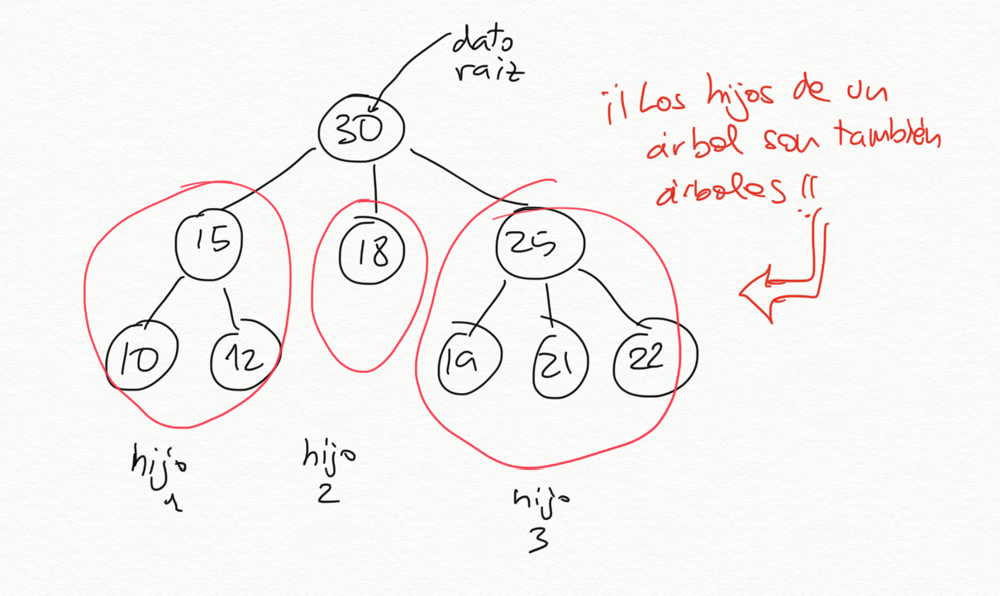
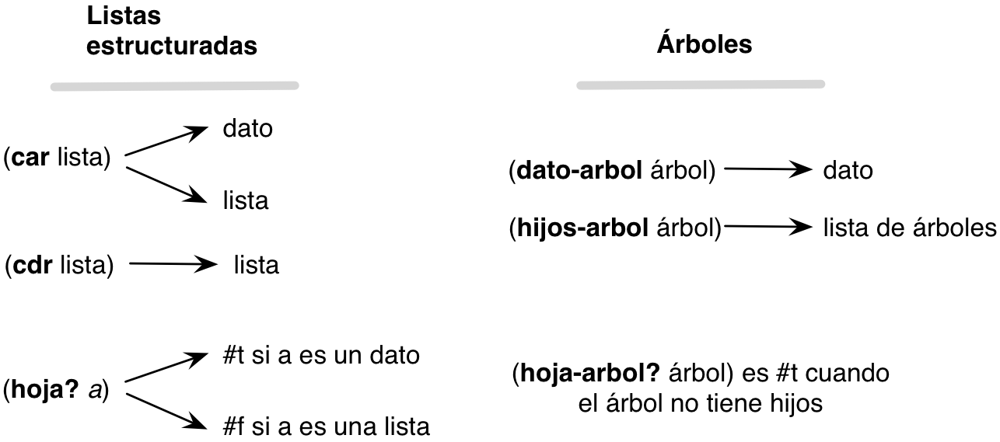

## Semana 7

Notas de clase de la semana 7 de LPP. 


## Tema 4: Estructuras de datos recursivas

- 1 Listas estructuradas
    - 1.1. Definición y ejemplos
    - 1.2. Funciones recursivas sobre listas estructuradas
- 2 **Árboles**
    - **2.1. Definición de árboles en Scheme**
    - **2.2. Funciones recursivas sobre árboles**
- 3 **Árboles binarios**
    - **3.1. Definición de árboles binarios en Scheme**
    - **3.2. Funciones recursivas sobre árboles binarios**
    
----

### Definición de árbol

- Un **árbol** es una estructura de datos definida por un valor raíz,
  que es el padre de toda la estructura, del que salen otros
  subárboles hijos
  ([Wikipedia](https://en.wikipedia.org/wiki/Tree_(data_structure))).
- Un **árbol** se puede definir recursivamente de la siguiente forma:
    - Una colección de un **dato** (el valor de la raíz del árbol) y
      una **lista de hijos** que también son árboles.
    - Una **hoja** será un árbol sin hijos (un dato con una lista de
      hijos vacía).

Un ejemplo de árbol:



El árbol anterior tiene como dato raíz el número 30 y tiene 3 árboles
hijos:

- El primer hijo es un árbol con raíz 15 y con dos hijos hoja, el 10 y
  el 12
- El segundo hijo es un árbol hoja, con valor 18
- El tercer hijo es un árbol con raíz 25 y con tres hijos hoja, el 19,
  21 y 22.

---

### Representación de árboles con listas

- En Scheme la lista es la estructura de datos principal.
- ¿Cómo construimos un árbol usando listas? Tenemos que guardar en la
  lista: el dato de la raíz y los hijos.

<p style="margin-bottom:3cm;"/>

- Podemos hacerlo de varias formas, pero escogemos la siguiente: usar
  **una lista de _n+1_ elementos** para representar un árbol con n
  hijos:
    - el primer elemento la lista será el dato de la raíz
    - el resto serán los árboles hijos

```text
arbol -> (dato hijo-1 hijo-2 ... hijo-n)
```

- Los nodos hoja (datos al final del árbol que no tienen ningún hijo)
son también árboles. Al no tener hijos se representan como listas con un único
elemento, el propio dato:
    

```text
Nodo hoja -> (dato)
```

- ¿Cómo representaríamos de esta forma el árbol anterior?


<p style="margin-bottom:4cm;"/>

```racket
(30 (15 (10) (12)) (18) (25 (19) (21) (22)))
```


Los elementos de esta lista son:

- El primer elemento es el número `30`, el dato valor de la raíz del
  árbol
- El segundo elemento es la lista `(15 (10) (12))`, que representa el
  árbol con dato `15` y dos hijos
- El tercer elemento es la lista `(18)` que representa el árbol hoja
  formado por un 18
- El tercer elemento es la lista `(15 (19) (21) (22))`, que representa el
  árbol con un dato `15` y tres hijos

Podríamos definir el árbol con la siguiente sentencia:

```racket
(define arbol1 '(30 (15 (10) (12)) (18) (25 (19) (21) (22))))
```

<p style="margin-bottom:3cm;"/>

Otro ejemplo más. ¿Cómo se implementa en Scheme el árbol de la siguiente figura?


<p style="margin-bottom:4cm;"/>

Se haría con la lista de la siguiente sentencia:

```racket
(define arbol2 '(40 (18 (3) (23 (29))) (52 (47))))
```

----

### Barrera de abstracción

- Definimos las funciones básicas para trabajar con árboles,
  las funciones para obtener el dato y los hijos a partir de la
  lista que define el árbol.
- Estas funciones proporcionan lo que se denomina **barrera de
  abstracción** del tipo datos *árbol*.
- Una **barrera de abstracción** es un conjunto de funciones que
  permiten trabajar con un tipo de datos escondiendo su
  implementación.
- Por convenio, en todas las funciones ponemos el mismo sufijo, el
  nombre del tipo de dato, en este caso **arbol**.
- Definimos dos conjuntos de funciones: **constructores** para construir un
  nuevo árbol y **selectores** para obtener los elementos del árbol. Vamos a
  empezar por los selectores.
  
----

### Selectores

Funciones que obtienen los elementos de un árbol:

```racket
(define (dato-arbol arbol) 
    (first arbol))

(define (hijos-arbol arbol) 
    (rest arbol))

(define (hoja-arbol? arbol) 
   (null? (hijos-arbol arbol)))
```

Es importante tener claro los tipos devueltos por las dos primeras funciones:

- `(dato-arbol arbol)`: devuelve **el dato** de la raíz del árbol.
- `(hijos-arbol arbol)`: devuelve **una lista de árboles** hijos. En
  algunas ocasiones llamaremos *bosque* a una lista de árboles.

---

### Ejemplo de selectores

Por ejemplo, si usamos el árbol `arbol1` 


Las funciones anteriores devuelven los siguientes valores:

```racket
(dato-arbol arbol1) ; ⇒ 30
(hijos-arbol arbol1) ; ⇒ ((15 (10) (12)) (18) (25 (19) (21) (22)))
(hoja-arbol? (first (hijos-arbol arbol1))) ; ⇒ #f
(hoja-arbol? (second (hijos-arbol arbol1))) ; ⇒ #t
```

---

### Tipos devueltos por las funciones
				   
Es muy importante considerar en cada caso con qué tipo de dato estamos
trabajando y usar la barrera de abstracción adecuada en cada caso:

- La función `hijos-arbol` siempre devuelve una lista de árboles, que
  podemos recorrer usando `first` y `rest`.
- El `first` de una lista de árboles (devuelta por `hijos-arbol`) siempre
  es un árbol y debemos de usar las funciones de su barrera de
  abstracción: `dato-arbol` e `hijos-arbol`.
- La función `dato-arbol` devuelve un dato de árbol, del tipo que
  guardemos en el árbol.

!!! Warning "¡Cuidado!"
    Para remarcar el uso correcto de la barrera de abstracción
    usaremos siempre `first` y `rest` cuando trabajemos con listas y
    `dato-arbol` y `hijos-arbol` cuando lo hagamos con árboles. Aunque
    la implementación de las funciones sea la misma, el hecho de
    darles nombres distintos nos permite entender mejor sobre qué tipo
    de datos estamos trabajando, una lista o un árbol.

- Ejemplo: ¿cómo obtendríamos el número 12 del `arbol1`?

<p style="margin-bottom:4cm;"/>

```racket
(dato-arbol (second (hijos-arbol (first (hijos-arbol arbol1)))))
; ⇒ 12
```


----

### Barreras de abstracción de árboles y listas estructuradas

- Es importante diferenciar la barrera de abstracción de los árboles
  de la de las listas estructuradas.
- Aunque un árbol se implementa en Scheme con una lista estructurada,
  a la hora de trabajar con árboles usaremos su barrera de abstracción
  propia, para resaltar trabajar con el nivel de abstracción correcto
  y esconder la implementación.
- El siguiente esquema resumen las características de la barrera de
  abstracción de listas y árboles:



- Es muy importante usar la barrera de abstracción al trabajar con
  árboles porque así separamos nuestro código de la implementación
  subyacente del tipo de dato.

----

**Constructores**

- Función constructora para construir un nuevo árbol:

```racket
(define (construye-arbol dato lista-arboles)
   (cons dato lista-arboles))
```

- La función `(construye-arbol dato lista-arboles)` recibe un dato y una
  lista de árboles y devuelve un árbol formado por el dato en su raíz
  y la lista de hijos.
- Si queremos construir un nodo hoja pasamos una lista vacía como
  `lista-arboles`. 


Por ejemplo, para definir un nodo hoja con el dato 2:

```racket
(define arbol3 (construye-arbol 2 '()))
```

Y para definir un árbol con 3 hijos:

```racket
(define arbol4 (construye-arbol 10 (list (construye-arbol 2 '())
                                         (construye-arbol 5 '()) 
										 (construye-arbol 9 '())))
```

El `arbol1`


Se puede construir con las siguientes llamadas a los constructores:

```racket
(define arbol-15 (construye-arbol 15 (list (construye-arbol 10 '())
                                           (construye-arbol 12 '()))))
(define arbol-18 (construye-arbol 18 '()))                                             
(define arbol-25 (construye-arbol 25 (list (construye-arbol 19 '())
                                           (construye-arbol 21 '())
                                           (construye-arbol 22 '()))))
(define arbol1b (construye-arbol 30 (list arbol-15 arbol-18 arbol-25)))
arbol1b ; ⇒ (30 (15 (10) (12)) (18) (25 (19) (21) (22)))
```

----


### Funciones recursivas sobre árboles

Vamos a diseñar las siguientes funciones recursivas:

- `(suma-datos-arbol arbol)`: devuelve la suma de todos los nodos
- `(to-list-arbol arbol)`: devuelve una lista con los datos del árbol
- `(cuadrado-arbol arbol)`: eleva al cuadrado todos los datos de un
  árbol manteniendo la estructura del árbol original
- `(map-arbol f arbol)`: devuelve un árbol con la estructura del árbol
  original aplicando la función f a subdatos.
- `(altura-arbol arbol)`: devuelve la altura de un árbol

Todas comparten un patrón similar de recursión mutua.

----

### Función `(suma-datos-arbol arbol)`

- Vamos a implementar una función recursiva que sume todos los datos
  de un árbol.
- Un árbol siempre va a tener un dato y una lista de hijos (que puede
  ser vacía) que obtenemos con las funciones `dato-arbol` e
  `hijos-arbol`.

Ejemplo:

```racket
(define arbol2 '(40 (18 (3) (23 (29))) (52 (47))))
(suma-datos-arbol arbol2) ; ⇒ 212
```

- Podemos plantear entonces el problema de sumar los datos de un árbol
  como:

> Para sumar los datos de un árbol sumamos el dato de su raíz a la
> suma que devuelva la llamada a una función auxiliar que sume los
> datos de su lista de hijos (un bosque):

```racket
(define (suma-datos-arbol arbol)
    (+ (dato-arbol arbol)
       (suma-datos-bosque (hijos-arbol arbol))))
```

- Esta función suma los datos de **un** árbol.
- La podemos utilizar para construir la función auxiliar que suma una
  lista de árboles:

> Para sumar los datos de una lista de árboles sumamos los datos del
> primero (con la función anterior) y añado lo que me devuelve la
> llamada recursiva que suma el resto de árboles:

```racket
(define (suma-datos-bosque bosque)
   (if (null? bosque)
       0
       (+ (suma-datos-arbol (first bosque)) 
          (suma-datos-bosque (rest bosque)))))
```

<p style="margin-bottom:4cm;"/>


- Tenemos una recursión mutua: para sumar los datos de una lista de
  árboles llamamos a la suma de un árbol individual que a su vez llama
  a la suma de sus hijos, etc. La recursión termina cuando calculamos
  la suma de un árbol hoja. Entonces se pasa a `suma-datos-bosque` una
  lista vacía y ésta devolverá 0.

----

### Versión alternativa con funciones de orden superior

- Al igual que hacíamos con las listas estructuradas, es posible
  conseguir una versión más concisa y elegante utilizando funciones de
  orden superior:

```racket
(define (suma-datos-arbol-fos arbol)
    (foldr + (dato-arbol arbol) 
        (map suma-datos-arbol-fos (hijos-arbol arbol))))
```	

<p style="margin-bottom:4cm;"/>


- Una traza de su funcionamiento sería la siguiente:

```racket
(suma-datos-arbol-fos '(1 (2 (3) (4)) (5) (6 (7)))) ;⇒
(foldr + 1 (map suma-datos-arbol-fos '((2 (3) (4)) 
                                                (5)
                                                (6 (7))))) ; ⇒
(foldr + 1 '(9 5 13)) ;⇒
28
```


----

### Función `(to-list-arbol arbol)`

- Queremos diseñar una función `(to-list-arbol arbol)` que devuelva una
  lista con los datos del árbol en un recorrido **preorden**.
- ¿Podríamos hacerlo usando el patrón anterior?

Ejemplo:

```racket
(to-list-arbol '(* (+ (5) (* (2) (3)) (10)) (- (12)))) 
; ⇒ (* + 5 * 2 3 10 - 12)
```

<p style="margin-bottom:4cm;"/>

```racket
(define (to-list-arbol arbol)
   (cons (dato-arbol arbol)
         (to-list-bosque (hijos-arbol arbol))))

(define (to-list-bosque bosque)
   (if (null? bosque)
       '()
       (append (to-list-arbol (first bosque))
               (to-list-bosque (rest bosque)))))
```


----

### Versión con funciones de orden superior:

Una definición alternativa usando funciones de orden superior:

```racket
(define (to-list-arbol-fos arbol)
    (cons (dato-arbol arbol)
          (foldr append '() 
               (map to-list-arbol-fos (hijos-arbol arbol)))))
```

----

### Función `(cuadrado-arbol arbol)`

- La función `(cuadrado-arbol arbol)` que toma un árbol de números y
  devuelve un árbol con la misma estructura y sus datos elevados al
  cuadrado.
- También usamos el patrón de recursión mutua, pero ahora para
  **construir** un árbol nuevo:

Ejemplo:

```racket
(cuadrado-arbol '(2 (3 (4) (5)) (6))) 
; ⇒ (4 (9 (16) (25)) (36))
```


```racket
; Construye un árbol nuevo elevado al cuadrado el que se pasa como parámetro
(define (cuadrado-arbol arbol) 
   (construye-arbol (cuadrado (dato-arbol arbol))
              (cuadrado-bosque (hijos-arbol arbol))))  

; Devuelve una lista de árboles elevados al cuadrado
(define (cuadrado-bosque bosque) 
   (if (null? bosque)
       '()
       (cons (cuadrado-arbol (first bosque))
             (cuadrado-bosque (rest bosque)))))
```

---

### Versión con funciones de orden superior:

```racket
(define (cuadrado-arbol-fos arbol)
   (construye-arbol (cuadrado (dato-arbol arbol))
   	          (map cuadrado-arbol-fos (hijos-arbol arbol))))
```

----

### `(map-arbol f arbol)`

La función `map-arbol` es una función de orden superior que generaliza
la función anterior. Definimos un parámetro adicional en el que se
pasa la función a aplicar a los elementos del árbol.

Ejemplos:

```racket
(map-arbol cuadrado '(2 (3 (4) (5)) (6)))
; ⇒ (4 (9 (16) (25)) (36))
(map-arbol (lambda (x) (+ x 1)) '(2 (3 (4) (5)) (6)))
; ⇒ (3 (4 (5) (6)) (7))
```

```racket
(define (map-arbol f arbol)
   (construye-arbol (f (dato-arbol arbol))
              (map-bosque f (hijos-arbol arbol))))  

(define (map-bosque f bosque)
   (if (null? bosque)
       '()
       (cons (map-arbol f (first bosque))
             (map-bosque f (rest bosque)))))
```

----

### Versión con funciones de orden superior:

```racket
(define (map-arbol-fos f arbol)
  (construye-arbol (f (dato-arbol arbol))
             (map (lambda (x)
                    (map-arbol-fos f x)) (hijos-arbol arbol))))
```

----

### Función `(altura-arbol arbol)`

Vamos por último a definir una función que devuelve la altura de un
árbol (el nivel del nodo de mayor nivel). Un nodo hoja tiene de altura
0.

Ejemplos:

```racket
(altura-arbol '(2)) ;  ⇒ 0
(altura-arbol '(4 (9 (16) (25)) (36))) ; ⇒ 2
```

```racket
(define (altura-arbol arbol)
   (if (hoja-arbol? arbol)
       0
       (+ 1 (altura-bosque (hijos-arbol arbol)))))  

(define (altura-bosque bosque)
    (if (null? bosque)
        0
        (max (altura-arbol (first bosque))
             (altura-bosque (rest bosque)))))
```

----

### Versión con funciones de orden superior:

La implementación con funciones de orden superior es similar a la que
vimos con listas estructuradas:

```racket
(define (altura-arbol-fos arbol)
  (if (hoja-arbol? arbol)
      0
      (+ 1 (foldr max 0
                  (map altura-arbol-fos (hijos-arbol arbol))))))
```
	
----

### Árboles binarios ###


Los árboles binarios son árboles cuyos nodos tienen 0, 1 o 2
hijos. Por ejemplo, el árbol mostrado en la siguiente figura es un
árbol binario.


A diferencia de los árboles genéricos vistos anteriormente un árbol
binario no puede tener más de dos hijos.


----

### Árboles binarios en Scheme ###

Representamos un árbol binario en Scheme utilizando una lista de tres elementos:

- Dato
- Hijo izquierdo (otro árbol binario)
- Hijo derecho (otro árbol binario)

En el caso en que no exista el hijo izquierdo o el derecho (o ambos)
utilizaremos una lista vacía para indicar un nodo vacío.

Ejemplo, nodo hoja con el dato 10:

```racket
'(10 () ())
```

Otro ejemplo, el árbol de la figura anterior:

```racket
'(40 (18 (3 () ())
         (23 ()
		     (29 () ())))
     (52 (47 () ())
	     ()))
```


----

### Barrera de abstracción ###

Definimos la siguiente barrera de abstracción para los árboles
binarios. Terminamos todos los nombres de las funciones con el sufijo
`-arbolb` (árbol binario).

**Selectores**

```racket
(define (dato-arbolb arbol)
   (first arbol))
   
(define (hijo-izq-arbolb arbol)
   (second arbol))

(define (hijo-der-arbolb arbol)
   (third arbol))
   
(define (vacio-arbolb? x)
   (null? x))

(define arbolb-vacio '())
```

**Constructor**

```racket
(define (construye-arbolb dato hijo-izq hijo-der)
    (list dato hijo-izq hijo-der))
```

Por ejemplo, para construir un árbol con 10 en la raíz y 8 en su hijo
izquierdo y 15 en su derecho utilizando el constructor de la barrera
de abstracción:

```racket
(define arbolb1
   (construye-arbolb 10 (construye-arbolb 8 arbolb-vacio arbolb-vacio)
                        (construye-arbolb 15 arbolb-vacio arbolb-vacio)))
```

Otro ejemplo, el árbol binario de la figura anterior utilizando el
constructor de la barrera de abstracción:

```racket
(define arbolb2
   (construye-arbolb 40 
                    (construye-arbolb 18
                                      (construye-arbolb 3 arbolb-vacio arbolb-vacio)
                                      (construye-arbolb 23 
                                                        arbolb-vacio
                                                        (construye-arbolb 29 
                                                                          arbolb-vacio
                                                                          arbolb-vacio)))
                    (construye-arbolb 52
                                      (construye-arbolb 47 arbolb-vacio arbolb-vacio)
                                      arbolb-vacio)))
```


----

### Funciones recursivas sobre árboles binarios

Veamos las siguientes funciones recursivas sobre árboles binarios:

* `(suma-datos-arbolb arbol)`: devuelve la suma de todos los nodos
* `(to-list-arbolb arbol)`: devuelve una lista con los datos del árbol
* `(cuadrado-arbolb arbol)`: eleva al cuadrado todos los datos de un
  árbol manteniendo la estructura del árbol original


**suma-datos-arbolb**


```racket
(define (suma-datos-arbolb arbol)
   (if (vacio-arbolb? arbol)
      0
      (+ (dato-arbolb arbol)
         (suma-datos-arbolb (hijo-izq-arbolb arbol))
         (suma-datos-arbolb (hijo-der-arbolb arbol)))))

(suma-datos-arbolb arbolb2) ; ⇒ 212
```


**to-list-arbolb**

```racket
(define (to-list-arbolb arbol)
   (if (vacio-arbolb? arbol)
      '()
      (cons (dato-arbolb arbol)
            (append (to-list-arbolb (hijo-izq-arbolb arbol))
                    (to-list-arbolb (hijo-der-arbolb arbol))))))

(to-list-arbolb arbolb2) ; ⇒ (40 18 3 23 29 52 47)
```


**cuadrado-arbolb**

```racket
(define (cuadrado-arbolb arbol)
   (if (vacio-arbolb? arbol)
      arbolb-vacio
      (construye-arbolb (cuadrado (dato-arbolb arbol))
                        (cuadrado-arbolb (hijo-izq-arbolb arbol))
                        (cuadrado-arbolb (hijo-der-arbolb arbol)))))

(cuadrado-arbolb arbolb1) ; ⇒ (100 (64 () ()) (225 () ()))
```

----
